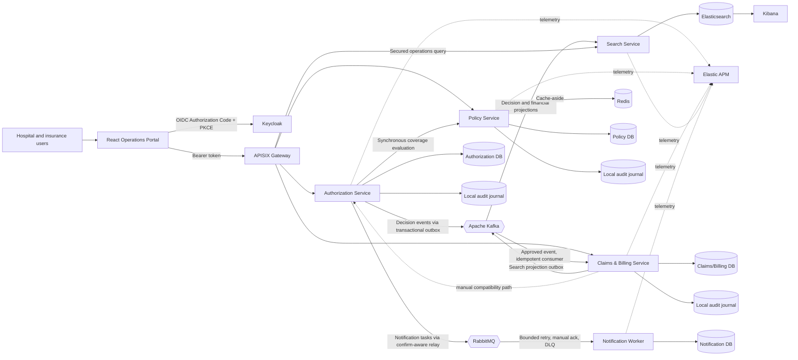
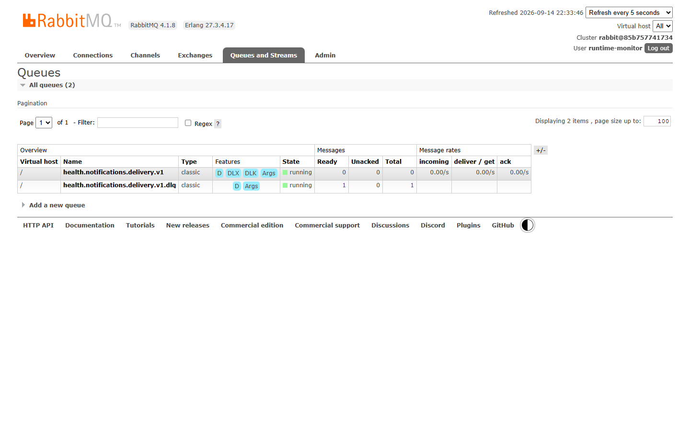
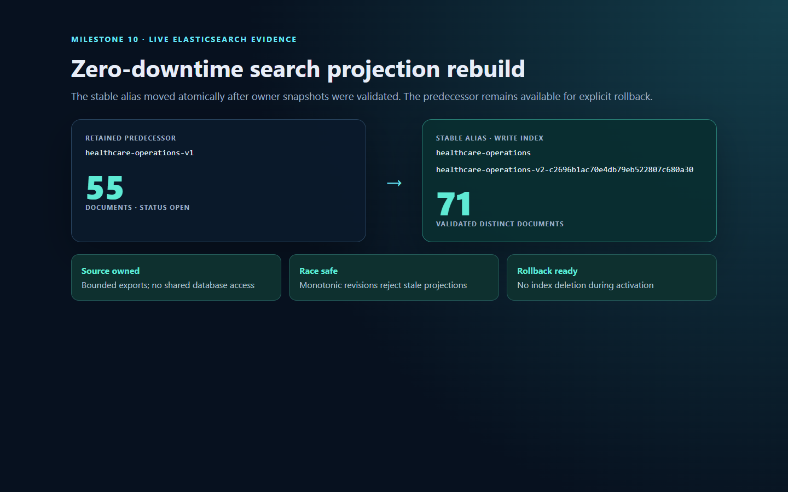

# Health Insurance Claims and Pre-Authorization Platform

A portfolio-grade healthcare insurance platform that demonstrates modern Java
full-stack engineering through a realistic business workflow. A healthcare
provider requests authorization for a member's service, an insurer verifies
policy coverage and decides the request, and an approved service proceeds to
claim adjudication, invoice reconciliation, payment, and settlement.

> **Current checkpoint:** Milestones 0–10 are implemented. Authorization,
> Policy, and Claims/Billing own minimized append-only audit journals and expose
> independently secured, bounded `SYSTEM_ADMIN` read APIs. The Operations
> Portal provides a service-aware audit view without joining service databases.
> Policy also uses a resilient
> Redis cache-aside adapter; Claims/Billing emits transactionally durable search
> projections; Search Service builds a provider-scoped Elasticsearch read model.
> Every Java runtime emits ECS JSON with correlation IDs, and the Compose stack
> includes Elasticsearch, Kibana, APM Server, and externally attached Elastic
> Java agents. Search projections can now be rebuilt online from bounded,
> service-owned snapshots through a versioned candidate index and atomic alias
> swap. Monotonic source revisions reject stale writes, while bounded Kafka DLT
> and RabbitMQ DLQ tools support explicit inspect/classify/replay workflows.
> APISIX is the only host-published business API boundary and
> applies OIDC/JWKS validation, traffic limits, correlation IDs, defensive
> headers, and RFC 9457 gateway errors. Compose and Testcontainers exercise the
> real infrastructure paths.

## Why this project exists

The project connects professional hospital-information-system experience with
the Java/Spring and React/TypeScript ecosystem. It is deliberately more than a
CRUD portfolio sample: aggregate state transitions, monetary invariants,
provider ownership, concurrency, database ownership, and service failure are
part of the model.

The business problem is split into four bounded contexts and one operational
worker:

| Bounded context | Owns | Does not own |
| --- | --- | --- |
| Authorization | Pre-authorization request, requested service/amount, provider, decision | Policy rules, claims, invoices, payments |
| Policy | Policy validity/status and coverage definitions/limits | Authorization decisions or limit reservation |
| Claims and Billing | Claim adjudication, invoice reconciliation, payments, settlement | Authorization or policy source data |
| Notification Worker | Technical delivery lifecycle and idempotency evidence | Contact, member, policy, clinical, authorization, or claim source data |
| Search | Denormalized operational claim/pre-authorization projections | Aggregate truth, commands, policy rules, or financial transactions |

The Operations Portal exposes the pre-authorization workflow, cross-context
search, and a `SYSTEM_ADMIN` audit view. Policy and Claims/Billing command
workflows remain available through secured APIs and the synthetic demo script.

## Implemented capabilities

### Milestone 0 — Build and runtime baseline

- Java 21 across Maven, Dockerfiles, and GitHub Actions.
- Spring Boot 4.1.1 services built through Maven Wrapper.
- Multi-stage container images with non-root runtime users.
- Docker Compose for Keycloak, APISIX, Kafka, RabbitMQ, four PostgreSQL databases, four
  API services, and the Notification Worker.
- Actuator health endpoints and database health-gated startup.
- Secret-safe configuration through ignored `.env` files and committed examples.

### Milestone 1 — Authorization Service

- Clean Architecture with domain, application, infrastructure, and presentation
  boundaries enforced by ArchUnit.
- Rich `PreAuthorization` aggregate and `Money` value object.
- Submission, detail, approval, rejection, and a provider-scoped paginated work
  queue with filtering and sorting.
- Lightweight CQRS through separate command/query input and output models.
- Transaction decorators keep Spring out of application use cases.
- Optimistic concurrency prevents two specialists from deciding the same request.
- RFC 9457 Problem Details for validation, authorization, conflict, not-found,
  and dependency failures.

### Milestone 2 — React Operations Portal

- Vite, React, and strict TypeScript foundation.
- Feature-Sliced dependency direction:
  `app -> pages -> widgets -> features -> entities -> shared`.
- Keycloak Authorization Code + PKCE login/logout and role-aware UI.
- TanStack Query server-state management and typed API client.
- React Hook Form + Zod validation.
- Dashboard, work queue, filters, sorting, pagination, submission, detail, and
  specialist decision interfaces.
- Loading, error, empty, unauthorized, and not-found states.
- Vitest, Testing Library, architecture checks, linting, and production build.

### Milestone 3 — Policy Service

- Policy aggregate with member ownership, status, inclusive validity dates, and
  one or more coverage definitions.
- Coverage rules for service code, requested amount, currency, and maximum limit.
- Synchronous coverage verification before Authorization accepts a request.
- Fail-closed dependency behavior: a denied or unavailable policy evaluation
  does not create a pending pre-authorization.
- Private PostgreSQL schema and Liquibase migrations.

Coverage evaluation currently answers eligibility only; it does **not** reserve
or consume shared benefit limits across requests. This is an explicit future
domain concern.

### Milestone 4 — Claims and Billing Service

- Claim and Invoice modeled as separate aggregate roots in one bounded context.
- A claim can only start from an approved, provider-owned pre-authorization.
- Claim lifecycle: `SUBMITTED -> UNDER_REVIEW -> APPROVED|REJECTED`.
- Invoice lifecycle: `ISSUED -> MATCHED|DISPUTED -> SETTLED`, or `VOID` after
  claim rejection when unpaid.
- Partial payments, dispute resolution, agreed payable amount, and automatic
  settlement when fully paid.
- Invariants against negative amounts, wrong currencies, over-approval,
  overpayment, illegal transitions, and duplicate payment references.
- Database-level uniqueness and optimistic locking for local idempotency and
  concurrent-update protection.

### Milestone 5 — Transactional Outbox and Kafka

- Approval/rejection integration events are inserted into Authorization's
  PostgreSQL outbox in the same transaction as the decision.
- A scheduled relay publishes versioned JSON to
  `health.authorization.pre-authorization.v1` with the aggregate ID as key.
- Failed broker sends remain unpublished and are retried by the next poll.
- Claims/Billing consumes approval events and automatically starts a claim and
  invoice in one local transaction.
- `processed_messages` and business uniqueness constraints make duplicate
  delivery a no-op.
- Consumer failures receive three total fixed-backoff attempts, then the
  original record is published to the `.DLT` topic.
- Real PostgreSQL and Apache Kafka Testcontainers tests verify duplicate delivery
  and poison-message routing.

### Milestone 6 — Notification Worker

- Framework-independent notification delivery aggregate and use case.
- Provider-reference recipient model that excludes contact and health data.
- Sender and repository output ports with `taskId` as the downstream idempotency
  key.
- Duplicate delivered tasks are application-level no-ops.
- Reusing a `taskId` for different notification intent is rejected as a contract
  conflict rather than silently treated as a duplicate.
- Clean Architecture rules protect the new worker core.
- Private PostgreSQL persistence with a Liquibase-managed delivery table,
  database constraints, and operational indexes.
- A real PostgreSQL 17 Testcontainer proves migration, Hibernate schema
  validation, and `RECEIVED`/`DELIVERED` round trips.
- PostgreSQL 17 and RabbitMQ 4.1 Testcontainers prove the real persistence,
  broker-routing, duplicate-delivery, acknowledgement, and DLQ paths.
- Authorization stores a minimal, versioned notification task in a dedicated
  outbox in the same transaction as its decision and Kafka integration event.
- A full Spring/PostgreSQL integration test proves all three writes commit
  together and all roll back when notification intent persistence fails.
- A scheduled AMQP relay locks an ordered batch, publishes persistent JSON with
  `taskId`/`causationId` message metadata, and marks the row published only
  after a positive correlated publisher confirm.
- Mandatory publishing plus publisher returns prevents a broker acknowledgement
  for an unroutable message from being mistaken for successful task delivery.
- Durable direct exchange, delivery queue, dead-letter exchange, and DLQ names
  are explicit and covered by topology tests.
- The relay is feature-gated by `NOTIFICATION_OUTBOX_ENABLED`; Compose enables it
  and supplies RabbitMQ connection settings from the ignored `.env`.
- The Authorization Java 21 verification suite now has 59 passing tests,
  including positive confirm, negative confirm, unroutable return, safe wire
  payload, and topology checks.
- The worker maps the v1 JSON envelope into an application command and rejects
  unsupported contract versions before invoking the use case.
- A Spring transaction decorator commits delivery persistence before the
  listener sends manual `basicAck`; a lost acknowledgement can therefore cause
  only an idempotent redelivery.
- Only explicit transient delivery failures receive three total attempts with
  bounded exponential backoff. Permanent contract/invariant failures are tried
  once. Exhausted/permanent work is negatively acknowledged without requeue and
  routed to the durable DLQ.
- Retry wraps the transaction decorator, so every attempt starts a new
  transaction; a successful commit occurs before `basicAck`.
- A local log sender demonstrates the output-port boundary without contact data
  or external provider credentials; it is not presented as email/SMS delivery.

- The repeatable synthetic demo verifies three decision notifications as
  `DELIVERED` while also completing Kafka-driven claims and billing flows.

### Milestone 7 — Redis, search, and observability

- Policy Service uses an explicit cache output port and Redis cache-aside adapter
  with a 30-second TTL, privacy-safe hashed keys, per-policy invalidation, and
  fail-open behavior when Redis is unavailable.
- PostgreSQL remains authoritative; Authorization still fails closed if an
  authoritative coverage decision cannot be obtained.
- Claims/Billing persists each search projection in a dedicated PostgreSQL
  outbox in the same transaction as the financial state transition.
- Search Service consumes Authorization decisions and Claims/Billing projections,
  then idempotently indexes deterministic documents in Elasticsearch 9.5.3.
- The secured search API supports text, type, status, provider and pagination.
  Hospital users are forced to the trusted JWT `provider_id`; insurer roles can
  search across providers.
- The React portal exposes a paginated Healthcare Search page through a separate
  typed API boundary while preserving FSD dependency direction.
- `X-Correlation-ID` is generated by the portal, validated and echoed by HTTP
  filters, propagated by REST clients, and derived from Kafka/RabbitMQ identifiers
  in consumers. MDC is cleared after every request/message.
- All five Java runtimes use Spring Boot ECS structured console logging. Docker
  images attach Elastic APM Java Agent 1.56.0 externally; APM Server and Kibana
  use the same Elastic Stack 9.5.3 version as Elasticsearch.
- Unit and real Testcontainers tests cover cache failure behavior, transactional
  search outbox writes, projection mapping, provider scope, Elasticsearch queries,
  and correlation handling.

### Milestone 8 — APISIX gateway and centralized edge security

- Apache APISIX 3.18 runs in declarative, file-driven standalone mode; the Admin
  API and etcd are absent from the local data plane.
- Port `9080` is the only host-published business API entry point. Authorization,
  Policy, Claims/Billing and Search ports remain internal to Compose.
- Keycloak bearer tokens receive gateway-level RS256 signature, issuer, expiry and
  `health-insurance-api` audience validation through OIDC discovery/JWKS, followed
  by Spring Security validation.
- Shared edge policy provides correlation IDs, explicit CORS, 120 requests per
  minute per source address, a 1 MiB body limit, upstream timeouts, no-store and
  defensive response headers.
- A bounded APISIX infrastructure adapter converts gateway-native failures to
  RFC 9457 `application/problem+json`; upstream business Problem Details pass
  through unchanged.
- The portal and synthetic demo use one API origin. A repeatable verification
  script proves missing/invalid token and wrong-audience rejection, authorized routing, correlation,
  CORS, payload limiting and rate limiting.

### Milestone 9 — Audit and data governance

- [ADR-011](docs/adr/011-service-owned-append-only-audit.md) defines a local,
  service-owned audit journal instead of a synchronous central audit dependency.
- Authorization submission/decision, Policy issuance, and Claims/Billing state
  transitions append minimized audit evidence in the same PostgreSQL transaction
  as their aggregate and any relevant outboxes.
- The typed audit contract contains actor subject/roles, provider scope,
  correlation ID, controlled action/reason codes and status delta. It excludes
  member, policy, diagnosis, service, amount, decision text and request bodies.
- Each owning database has a Liquibase-managed `audit_records` journal.
  PostgreSQL triggers reject `UPDATE`, `DELETE`, and `TRUNCATE`; JSON constraints
  limit change documents to `fromStatus` and `toStatus`.
- Every service exposes its own paginated audit query through an application
  input port. Controller and use-case checks both require `SYSTEM_ADMIN`;
  aggregate identifiers and service-local allowlisted actions are the only
  filters, page size is capped at 100, and ordering is deterministic.
- The portal's administrator-only Audit Trail page queries one owning service at
  a time through APISIX. It deliberately does not create a central audit store
  or cross-database join.
- Integration tests prove transaction rollback when required audit persistence
  fails and prove database-level mutation rejection. The synthetic demo verifies
  expected audit evidence for authorization, policy, claim, invoice, and payment
  transitions.
- The data-governance threat model classifies sensitive fields and storage
  surfaces, documents minimization rules and retention classes, and records
  residual risks. Legal retention approval and automated disposal remain later
  operational work; this portfolio does not claim regulatory compliance.

### Milestone 10 — Search and messaging recovery

- [ADR-012](docs/adr/012-versioned-search-rebuild-and-controlled-message-recovery.md)
  defines service-owned projection export, versioned physical indices, stable
  alias activation, stale-write protection, rollback, and controlled broker
  recovery.
- Authorization and Claims/Billing expose `SYSTEM_ADMIN`-only, page-size-capped
  snapshot APIs backed exclusively by their own databases. Stable ordering and
  transport-specific DTOs preserve database-per-service and Clean Architecture
  boundaries.
- Every projection carries an owner-defined monotonic `sourceRevision`.
  Elasticsearch conditional upsert accepts an equal/newer revision and turns an
  older event into a no-op; pre-M10 documents safely map to baseline revision 1.
- Search Service creates an isolated versioned candidate, validates bounded
  ingestion, refreshes and compares the distinct document count, then performs
  an atomic compare-and-swap of the `healthcare-operations` alias. The prior
  index is retained for explicit rollback.
- `demo/rebuild-search-index.ps1` coordinates current snapshots through APISIX
  with a runtime-only token. It detects duplicate deterministic IDs and never
  writes projection payloads or credentials to disk.
- Recovery status reports safe outbox age/attempt counts, Kafka group lag, and
  RabbitMQ queue depth. DLT/DLQ tools expose only digests and bounded metadata;
  replay requires a transient classification, an explicit confirmation flag,
  an allowlisted route, and a maximum recovery attempt.
- Real PostgreSQL and Elasticsearch integration tests prove owner exports,
  stale-revision rejection, legacy-document compatibility, count-gated
  activation, retained predecessor, atomic alias swap, and rollback. A live
  Compose rehearsal activated a 70-document candidate without deleting the
  55-document predecessor.
- The local coordinator is intentionally not a durable production workflow:
  run state is in memory and broker operations use local operator access. The
  [recovery runbook](docs/operations/search-and-messaging-recovery.md) records
  these limits and the safe failure procedure.

## Architecture overview



Each backend service applies the same dependency rule:

```text
Presentation/API -> Application -> Domain
Infrastructure --------^----------^
```

- **Domain** contains plain Java aggregates, value objects, rules, and domain
  exceptions. It has no Spring, JPA, HTTP, Keycloak, or messaging dependency.
- **Application** contains input/output ports, commands, queries, DTOs, security
  context, and orchestration. It depends on the domain, not adapters.
- **Infrastructure** implements JPA repositories, HTTP clients, OAuth2/security,
  transaction decorators, and Spring bean composition.
- **Presentation** maps HTTP/JWT input to input ports and maps results/errors back
  to transport representations.

See the complete [documentation index](docs/README.md),
[C4 container view](docs/architecture/c4-container.md), and
[technical walkthrough](docs/project-technical-walkthrough.md).

## Key workflows

### Pre-authorization

1. A hospital user signs in through Keycloak.
2. The API derives the provider UUID from the trusted `provider_id` token claim.
3. Authorization asks Policy to evaluate member, policy, service, date, amount,
   and currency.
4. When covered, Authorization persists a `PENDING` request.
5. An insurance specialist approves or rejects it.
6. Domain state checks and JPA optimistic locking prevent duplicate/concurrent
   decisions.

### Claim, invoice, and payment

1. Authorization commits an approval and its outbox event atomically.
2. The relay publishes the event at least once; Claims/Billing consumes it and
   atomically creates a submitted claim, issued invoice, and processed marker.
3. A claim approver starts review, then approves an amount or rejects the claim.
4. Approval reconciles the invoice: a full match becomes `MATCHED`; a difference
   becomes `DISPUTED` until an insurance specialist agrees the payable amount.
5. Positive, unique payments accumulate. The invoice becomes `SETTLED` exactly
   when the payable balance reaches zero.

Detailed message order and concurrent cases are in the
[workflow sequence diagrams](docs/architecture/workflow-sequences.md).

## Security model

Keycloak performs authentication; every backend is an OAuth2 resource server.
Authentication and authorization remain separate concerns.

| Realm role | Implemented permissions |
| --- | --- |
| `HOSPITAL_USER` | Submit and read provider-owned pre-authorizations/claims |
| `INSURANCE_SPECIALIST` | Decide pre-authorizations; reconcile invoices and record payments |
| `CLAIM_APPROVER` | Start claim review and approve/reject claims |
| `SYSTEM_ADMIN` | Administrative policy and cross-provider read/reconciliation authority |

Endpoint annotations provide an early role gate. Application use cases repeat
business authorization so rules remain effective outside HTTP. Hospital reads
and commands are also limited to the provider in the signed token; a request
body cannot impersonate another provider.

No credentials, tokens, client secrets, connection-string passwords, real
identities, or real health data belong in this repository. All demo UUIDs and
business values are synthetic.

The realm declares `providerId` as a managed user-profile attribute: users can
view it, only administrators can edit it, and the public client maps it to the
signed `provider_id` access-token claim. This explicit declaration matters
because Keycloak 26 ignores undeclared custom attributes by default.

## Technology inventory

### Used now

- Java 21, Spring Boot 4.1.1, Spring MVC, Spring Security OAuth2 Resource Server.
- Spring Kafka 4.1.1 and Apache Kafka 4.1.1.
- Spring Data JPA/Hibernate, PostgreSQL 17, Liquibase.
- JUnit, AssertJ, Mockito, ArchUnit, Testcontainers.
- React 19, TypeScript 6, Vite 8, React Router 8.
- TanStack Query, React Hook Form, Zod, Keycloak JS.
- Vitest, Testing Library, oxlint.
- Keycloak 26.4, Docker, Docker Compose, Kubernetes, and Kustomize.
- GitHub Actions.
- Apache APISIX 3.18 with OIDC, request ID, CORS, limit, validation and response policies.
- Redis 8.2, Elasticsearch/Kibana/APM Server 9.5.3, Elastic APM Java Agent 1.56.

### Planned, not implemented

Argo CD, Jenkins, SonarQube, Nexus, and Harbor.
Each will be introduced only with a documented need and trade-off.

## Repository layout

```text
apps/
  operations-portal/          React + TypeScript web application
services/
  authorization-service/     Pre-authorization bounded context
  policy-service/             Policy and coverage bounded context
  claims-billing-service/     Claims, invoices, and payments bounded context
  search-service/             Elasticsearch operational read model
  notification-worker/        RabbitMQ notification delivery worker
infra/
  apisix/                     Declarative gateway and security policies
  keycloak/                   Importable realm/client/role configuration
deploy/kubernetes/            Kustomize base, local overlay, and safe apply tooling
demo/                         Synthetic data catalogue and API seed script
docs/
  adr/                        Architecture decision records
  architecture/               C4, component, data, sequence, UI, deployment views
  demo/                       Repeatable demonstration guide
  screenshots/                Milestone UI evidence using synthetic data
  project-technical-walkthrough.md
.github/workflows/            Backend and frontend CI
compose.yaml                  Local runtime topology
```

## Run locally

### Prerequisites

- Docker Desktop with Compose support.
- Java 21 for running backend services outside containers.
- Node.js compatible with the portal dependencies.

### Kubernetes deployment package

Milestone 11 provides a production-oriented Kustomize base and a local overlay
for Authorization, Policy, Claims/Billing, Notification Worker, Search, the
operations portal and APISIX. Validate the package without changing a cluster:

```powershell
.\scripts\validate-kubernetes.ps1
```

The manifests enforce fixed non-root users, read-only root filesystems, dropped
capabilities, seccomp, resource bounds, health probes, graceful termination,
rolling updates, topology spread, PDBs, HPAs, dedicated token-free
ServiceAccounts and default-deny NetworkPolicies. Stateful infrastructure is an
external contract. When a disposable local cluster is already active, follow
the [Kubernetes deployment guide](docs/deployment/kubernetes.md); rendering alone
must not be reported as a successful rollout.

### Full backend stack

Create a local ignored environment file from the safe template and replace every
placeholder. Do not commit the resulting file.

```powershell
Copy-Item .env.example .env
docker compose up --build
```

| Component | Local URL/port |
| --- | --- |
| Keycloak | `http://localhost:8080` |
| APISIX business API | `http://localhost:9080` |
| Authorization, Policy, Claims/Billing, Search | Compose network only |
| Redis | `localhost:6379` |
| Elasticsearch | `http://localhost:9200` |
| Kibana | `http://localhost:5601` |
| Elastic APM Server | `http://localhost:8200` |
| Kafka | `localhost:9092` |
| RabbitMQ AMQP | `localhost:5672` |
| RabbitMQ Management | `http://localhost:15672` |
| Authorization PostgreSQL | `localhost:5433` |
| Policy PostgreSQL | `localhost:5434` |
| Claims/Billing PostgreSQL | `localhost:5435` |
| Notification PostgreSQL | `localhost:5436` |

The imported `health-insurance` realm defines roles and the public
`health-insurance-web` client. Create local users through the Keycloak admin UI.
A hospital user needs a synthetic UUID `providerId` attribute; the realm maps it
to the access token's `provider_id` claim. No demo passwords are committed.

### Operations portal

```powershell
Set-Location apps/operations-portal
npm install
npm run dev
```

Open `http://localhost:5173`. The web client uses Authorization Code + PKCE and
stores no client secret. Its default API origin is APISIX at port `9080`. Copy
`apps/operations-portal/.env.example` to its local
`.env` only when overriding URLs.

### Backend services outside containers

```powershell
docker compose up -d authorization-db policy-db claims-billing-db keycloak

Set-Location services/policy-service
.\mvnw.cmd spring-boot:run

Set-Location services/authorization-service
.\mvnw.cmd spring-boot:run

Set-Location services/claims-billing-service
.\mvnw.cmd spring-boot:run
```

Run each Maven command in its own terminal and provide the database/OIDC
environment variables described by that service's `application.yml`.

## Synthetic demo

The [demo scenario](docs/demo/demo-scenario.md) explains local users, roles,
happy paths, negative paths, and safe reset. After the stack is healthy, set
three runtime-only access-token environment variables and run:

```powershell
.\demo\seed-demo-data.ps1
```

The script creates:

- a covered synthetic policy;
- pending and rejected pre-authorizations;
- a fully settled approved claim/invoice with partial payments;
- a disputed invoice awaiting reconciliation.
- three `DELIVERED` provider notification records created through RabbitMQ.
- APISIX security verification evidence for 401, 413, 429, CORS and correlation.

It generates unique business references on each run, never stores or prints
tokens, and uses no real patient data. The source catalogue is
[demo/demo-data.json](demo/demo-data.json).

For a repeatable local-only Keycloak setup, set the three runtime variables
described in the demo guide and use
`demo/prepare-and-seed-local-demo.ps1`. It creates temporary users and an
uncommitted direct-grant seeder client; the browser still uses Code + PKCE.

## Tests and verification

Run every backend suite from its own service directory:

```powershell
Set-Location services/authorization-service
.\mvnw.cmd --batch-mode test

Set-Location ../policy-service
.\mvnw.cmd --batch-mode test

Set-Location ../claims-billing-service
.\mvnw.cmd --batch-mode test

Set-Location ../notification-worker
.\mvnw.cmd --batch-mode test

Set-Location ../search-service
.\mvnw.cmd --batch-mode test
```

The full suites use Testcontainers for real PostgreSQL persistence and
concurrency tests, so Docker must be running. On 8 September 2026, the Milestone
5 checkpoint contained **109 passing tests**: Authorization 50, Policy 21, and
Claims/Billing 38. The portal also passed oxlint, 6 Vitest tests in 5 files, and
its production build. Always rerun the commands; these counts are dated
evidence, not a substitute for verification.

Milestone 6 adds Authorization transaction/relay proof and a Notification Worker
suite. The producer test proves commit/rollback across the aggregate, Kafka
event outbox, and notification task outbox. Worker tests prove producer JSON
compatibility, version mapping, classified retry, one transaction per attempt,
commit-before-ack, idempotent duplicate handling, and real RabbitMQ dead-letter
routing. On 8 September 2026 the four backend suites passed **141 tests**:
Authorization 59, Policy 21, Claims/Billing 38, and Notification Worker 23.
Commands, not prose, remain the source of truth.

Milestone 7 raises the verified checkpoint to **157 backend tests** on 9
September 2026: Authorization 61, Policy 25, Claims/Billing 41, Notification
Worker 23, and Search Service 7. The portal passed 7 Vitest tests in 6 files,
oxlint, and its TypeScript/Vite production build. Real Redis and Elasticsearch
tests require Docker; run large Testcontainers suites serially on constrained
Docker Desktop installations to avoid infrastructure startup-time contention.

Milestone 8 changes no domain/application behavior, so the 157-test backend
baseline remains applicable and is rerun in full. Gateway CI starts the real
APISIX 3.18 image with the repository's declarative configuration and asserts an
RFC 9457 401 with a generated correlation ID. The Compose-backed verification
script additionally exercises valid routing, CORS, 1 MiB rejection and rate
limiting using runtime-only tokens.

Milestone 10 was verified on 10 September 2026 with **193 passing backend
tests**: Authorization 73, Policy 33, Claims/Billing 51, Notification Worker 23,
and Search Service 13. Search's five real-Elasticsearch integration tests cover
stale and legacy revisions plus activation/rollback. The portal passed oxlint,
9 Vitest tests in 8 files, and its production TypeScript/Vite build. These dated
counts are evidence, never a substitute for rerunning the commands.

Validate the living portfolio documentation separately. This command checks
local Markdown links, JSON and PowerShell syntax, the expected screenshot set,
and renders every Mermaid block:

```powershell
.\scripts\validate-documentation.ps1
```

Verify the portal:

```powershell
Set-Location apps/operations-portal
npm run lint
npm test
npm run build
```

Test coverage includes domain invariants, application orchestration, role and
provider authorization, controller contracts, bean/transaction wiring, Clean
Architecture and FSD import rules, Liquibase/JPA persistence, uniqueness, and
optimistic concurrency.

## API summary

All business endpoints require a valid Keycloak bearer token.
External callers prepend `http://localhost:9080`; individual service ports are
not published to the host.

| Method | Endpoint | Required responsibility |
| --- | --- | --- |
| `POST` | `/api/v1/pre-authorizations` | Hospital submission |
| `GET` | `/api/v1/pre-authorizations` | Provider-scoped or specialist work queue |
| `GET` | `/api/v1/pre-authorizations/{id}` | Authorized detail |
| `POST` | `/api/v1/pre-authorizations/{id}/approval` | Insurance decision |
| `POST` | `/api/v1/pre-authorizations/{id}/rejection` | Insurance decision |
| `POST` | `/api/v1/policies` | Policy administration |
| `POST` | `/api/v1/coverage-evaluations` | Synchronous eligibility check |
| `POST` | `/api/v1/claims` | Hospital claim creation |
| `GET` | `/api/v1/claims/{id}` | Authorized claim detail |
| `GET` | `/api/v1/claims/by-pre-authorization/{id}` | Observe event-created claim/invoice |
| `POST` | `/api/v1/claims/{id}/review` | Claim approver |
| `POST` | `/api/v1/claims/{id}/approval` | Claim approver |
| `POST` | `/api/v1/claims/{id}/rejection` | Claim approver |
| `GET` | `/api/v1/invoices/{id}` | Authorized invoice detail |
| `POST` | `/api/v1/invoices/{id}/dispute-resolution` | Insurance reconciliation |
| `POST` | `/api/v1/invoices/{id}/payments` | Insurance payment recording |
| `GET` | `/api/v1/search` | Provider-scoped or insurer operations search |
| `GET` | `/api/v1/admin/search-projections/pre-authorizations` | Bounded Authorization snapshot; system administrator |
| `GET` | `/api/v1/admin/search-projections/claims` | Bounded Claims/Billing snapshot; system administrator |
| `POST` | `/api/v1/admin/search-rebuilds` | Create versioned candidate; system administrator |
| `POST` | `/api/v1/admin/search-rebuilds/{runId}/records` | Ingest 1–200 projections; system administrator |
| `POST` | `/api/v1/admin/search-rebuilds/{runId}/activation` | Count-gated alias activation; system administrator |
| `POST` | `/api/v1/admin/search-rebuilds/{runId}/rollback` | Explicit retained-index rollback; system administrator |
| `GET` | `/actuator/health` | Public liveness/readiness information |

The pre-authorization collection accepts `status`, `memberId`, `policyNumber`,
`page`, `size`, `sortBy`, and `direction`. Supported sort fields are
`createdAt`, `requestedAmount`, and `status`; page size is limited to 100.

## Documentation and visual evidence






- [Engineering documentation index](docs/README.md)
- [Technical walkthrough and interview guide](docs/project-technical-walkthrough.md)
- [C4 context](docs/architecture/c4-context.md) and
  [container](docs/architecture/c4-container.md)
- [Clean Architecture](docs/architecture/clean-architecture.md)
- [Data ownership/ER model](docs/architecture/data-model.md)
- [Workflow sequences](docs/architecture/workflow-sequences.md)
- [Event-driven messaging](docs/architecture/event-driven-messaging.md)
- [Frontend architecture](docs/architecture/frontend-architecture.md)
- [Local deployment](docs/architecture/local-deployment.md)
- [Local troubleshooting](docs/development/troubleshooting.md)
- [Search and messaging recovery runbook](docs/operations/search-and-messaging-recovery.md)
- [Demo scenario](docs/demo/demo-scenario.md)
- [Screenshot catalogue](docs/screenshots/README.md)
- [ADRs](docs/adr/)

## Design decisions and trade-offs

- **Synchronous REST today:** coverage and approved-authorization checks require
  immediate answers and have clear owners. This is simple and traceable but
  creates availability coupling; calls fail closed.
- **Database per service:** prevents hidden coupling and establishes ownership,
  at the cost of cross-service joins and distributed consistency work.
- **Claims plus Billing together:** separate aggregates share one bounded context
  and local transaction while the domain is young. They can be split only after
  independent ownership or scaling needs emerge.
- **Lightweight CQRS:** command/query models are explicit without the operational
  cost of a second read store.
- **End-user token relay:** preserves current provider context across services.
  Workload identity/token exchange is a future production security decision.
- **At-least-once Kafka delivery:** avoids dual writes through a database outbox;
  duplicates are expected and neutralized by the consumer inbox.
- **RabbitMQ for operational work:** notification tasks use a competing-consumer
  queue while Kafka remains the durable business-event stream. Publisher
  confirms and mandatory returns protect the producer boundary; consumer
  idempotency handles inevitable redelivery.

See ADR-001 through ADR-009 in [docs/adr](docs/adr/) for full context,
alternatives, consequences, and rejected options.
Gateway ownership and defence-in-depth are recorded in ADR-010.

## Current limitations

- Policy benefit consumption and reservation across requests are not modeled.
- Policy and Claims/Billing do not yet have portal screens.
- Outbox retention/archival and a durable, audited recovery control plane are
  not implemented. Local bounded DLT/DLQ inspect/classify/copy-replay tools are
  available; no automatic or destructive replay exists.
- No production workload identity/token exchange exists between services.
- No circuit breaker is configured for synchronous dependencies.
- A real email/SMS provider and contact-resolution boundary and centralized log
  shipping remain outside the selected portfolio scope.
- Kubernetes manifests were rendered and Argo CD synchronized staging desired
  state to a disposable Minikube cluster. Production still needs external
  secret management, workload identity, trusted TLS, managed stateful services,
  and cluster metrics.
- The privacy threat model, minimized audit evidence, and retention classes are
  documented and enforced at current write/read boundaries. Lawful basis,
  consent, approved retention durations, automated disposal, encryption/key
  management, privileged-access controls, and regulatory sign-off require a
  real data controller and later production work.
- Search rebuild run state is local/in-memory, so restart-resumable checkpoints,
  cancellation, workload identity, index lifecycle cleanup, and multi-operator
  coordination remain production work.

## Roadmap

- [x] Milestone 0 — Java 21 build, Docker, CI, and configuration baseline
- [x] Milestone 1 — Clean Architecture Authorization Service
- [x] Milestone 2 — React/TypeScript operations portal foundation
- [x] Milestone 3 — Policy Service and coverage evaluation
- [x] Milestone 4 — Claims and Billing lifecycle
- [x] Milestone 5 — Transactional Outbox, Kafka, idempotent consumer, retry/DLQ
- [x] Milestone 6 — RabbitMQ notification worker
- [x] Milestone 7 — Redis, Elasticsearch, Kibana, Elastic APM, correlation IDs
- [x] Milestone 8 — APISIX gateway and centralized edge security policies
- [x] Milestone 9 — Append-only audit trail, KVKK and data governance
- [x] Milestone 10 — Elasticsearch and messaging recovery operations
- [x] Milestone 11 — Kubernetes and deployment security
- [x] Milestone 12 — CI/CD and software supply chain
- [ ] Milestone 13 — Portfolio and interview finalization

Milestone 12 is complete. Jenkins executes the Java 21 and React quality stages,
blocks publication on the SonarQube Quality Gate, publishes Maven snapshots to
Nexus Community Edition, publishes immutable full-Git-SHA OCI tags to the
private Harbor project, and hands the same image revision to the Argo CD
staging Application. The local proof ended with Argo CD `Synced`, operation
`Succeeded`, at Git revision `a56fff2a14405d3024b98f357b1c3b38edd8384b`.
See [ADR-014](docs/adr/014-local-ci-cd-software-supply-chain.md), the
[CI/CD architecture](docs/architecture/ci-cd-supply-chain.md), and the
[repeatable demo](docs/demo/milestone-12-ci-cd-demo.md). Trivy is intentionally
not a required gate: it is outside the vacancy scope and added disproportionate
cost to this local educational environment. At every later milestone, the
README, diagrams, ADRs, synthetic demo, scenario, screenshots, technical
walkthrough, test evidence, limitations, and roadmap are part of the definition
of done—not end-of-project cleanup.
