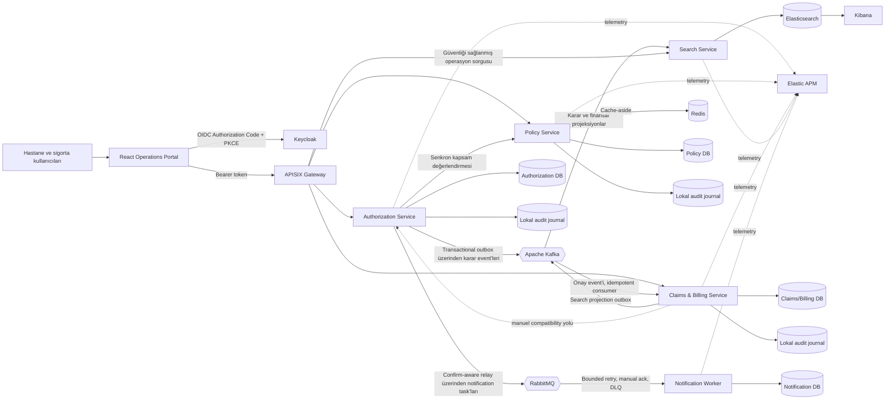
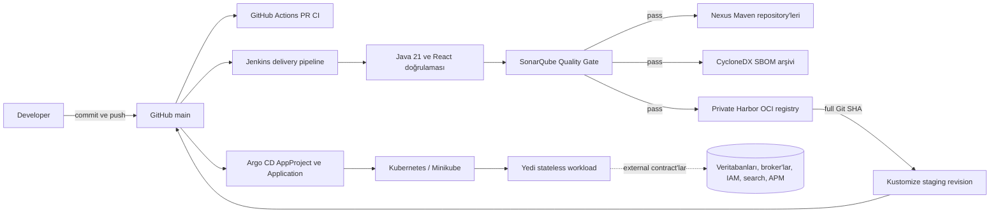

# Sağlık Sigortası Hasar ve Ön Provizyon Platformu

Gerçekçi bir iş akışı üzerinden modern Java full-stack mühendisliğini gösteren, portföy seviyesinde bir sağlık sigortası platformudur. Bir sağlık hizmeti sağlayıcısı, bir üyenin alacağı hizmet için provizyon talep eder; sigorta şirketi poliçe kapsamını doğrular ve talep hakkında karar verir; onaylanan hizmet daha sonra hasar değerlendirmesi, fatura mutabakatı, ödeme ve kapatma süreçlerine ilerler.

> **Mevcut kontrol noktası:** Milestone 0–12 tamamlanmıştır. Authorization,
> Policy ve Claims/Billing servisleri, minimize edilmiş yalnızca eklemeye açık
> (append-only) denetim günlüklarının sahibidir ve bağımsız olarak güvenliği
> sağlanmış, sınırlandırılmış `SYSTEM_ADMIN` okuma API'leri sunar. Operations
> Portal, servis veritabanlarını birleştirmeden servis farkındalığına sahip bir
> denetim görünümü sağlar. Policy dayanıklı bir Redis cache-aside adaptörü
> kullanır; Claims/Billing işlemsel olarak kalıcı arama projeksiyonları üretir;
> Search Service ise hizmet sağlayıcı kapsamlı bir Elasticsearch okuma modeli
> oluşturur. Her Java çalışma zamanı correlation ID'leri ile ECS JSON logları
> üretir; Compose yığını Elasticsearch, Kibana, APM Server ve dışarıdan bağlanan
> Elastic Java agent'larını içerir. Arama projeksiyonları, servislerin sahip olduğu
> sınırlandırılmış snapshot'lardan sürümlenmiş aday indeks ve atomik alias değişimi
> kullanılarak çevrim içi yeniden oluşturulabilir. Monotonik kaynak revizyonları
> eski yazmaları reddederken, sınırlandırılmış Kafka DLT ve RabbitMQ DLQ araçları
> açık inspect/classify/replay iş akışlarını destekler. APISIX host üzerinde
> yayınlanan tek business API sınırıdır ve OIDC/JWKS doğrulaması, trafik limitleri,
> correlation ID'leri, savunmacı header'lar ve RFC 9457 gateway hataları uygular.
> Milestone 11 ile yedi stateless workload için Kustomize tabanlı Kubernetes
> deployment paketi, Restricted Pod Security, non-root container'lar, read-only
> root filesystem, default-deny NetworkPolicy'ler, probe'lar, resource limitleri,
> PDB ve HPA kontrolleri eklenmiştir; stateful platformlar bilinçli olarak
> operator-owned external dependency olarak tutulur. Milestone 12 ile Jenkins,
> Java/React kalite aşamalarını ve blocking SonarQube Quality Gate'i çalıştırır;
> Maven artifact'larını Nexus'a, immutable full-Git-SHA OCI image'larını private
> Harbor project'ine yayınlar ve aynı image revision'ı Kustomize üzerinden GitOps
> desired state'e taşır. Argo CD bu review edilmiş state'i disposable Kubernetes
> cluster'ına senkronize eder. Compose, Testcontainers ve doğrulanmış lokal CI/CD
> checkpoint'leri gerçek altyapı ve software supply-chain yollarını çalıştırır.

## Bu proje neden var?

Bu proje, profesyonel Hastane Bilgi Yönetim Sistemi deneyimini Java/Spring ve React/TypeScript ekosistemiyle birleştirir. Bilinçli olarak basit bir CRUD portföy örneğinden daha fazlasıdır: aggregate durum geçişleri, parasal invariant'lar, hizmet sağlayıcı sahipliği, concurrency, veritabanı sahipliği ve servis arızaları modelin bir parçasıdır.

İş problemi dört bounded context ve bir operasyonel worker'a ayrılmıştır:

| Bounded context | Sahip olduğu alan | Sahip olmadığı alan |
| --- | --- | --- |
| Authorization | Ön provizyon talebi, talep edilen hizmet/tutar, hizmet sağlayıcı, karar | Poliçe kuralları, hasarlar, faturalar, ödemeler |
| Policy | Poliçe geçerliliği/durumu ve kapsam tanımları/limitleri | Provizyon kararları veya limit rezervasyonu |
| Claims and Billing | Hasar değerlendirmesi, fatura mutabakatı, ödemeler, kapatma | Authorization veya Policy kaynak verileri |
| Notification Worker | Teknik teslimat yaşam döngüsü ve idempotency kanıtı | İletişim, üye, poliçe, klinik, provizyon veya hasar kaynak verileri |
| Search | Denormalize operasyonel hasar/ön provizyon projeksiyonları | Aggregate gerçeği, command'lar, poliçe kuralları veya finansal işlemler |

Operations Portal; ön provizyon iş akışını, context'ler arası aramayı ve `SYSTEM_ADMIN` denetim görünümünü sunar. Policy ve Claims/Billing command iş akışları güvenliği sağlanmış API'ler ve sentetik demo script'i üzerinden kullanılabilir durumda kalır.

## Uygulanan yetenekler

### Milestone 0 — Build ve çalışma zamanı temeli

- Maven, Dockerfile'lar ve GitHub Actions genelinde Java 21.
- Maven Wrapper ile build edilen Spring Boot 4.1.1 servisleri.
- Root olmayan çalışma zamanı kullanıcılarına sahip multi-stage container image'ları.
- Keycloak, APISIX, Kafka, RabbitMQ, dört PostgreSQL veritabanı, dört API servisi ve Notification Worker için Docker Compose.
- Actuator health endpoint'leri ve veritabanı sağlık durumuna bağlı başlangıç.
- Ignore edilen `.env` dosyaları ve commit edilen örnekler ile secret-safe yapılandırma.

### Milestone 1 — Authorization Service

- Domain, application, infrastructure ve presentation sınırları ArchUnit ile zorlanan Clean Architecture.
- Zengin `PreAuthorization` aggregate'i ve `Money` value object'i.
- Gönderim, detay, onay, ret ve filtreleme/sıralama destekli provider kapsamlı sayfalı iş kuyruğu.
- Ayrı command/query input ve output modelleri ile lightweight CQRS.
- Transaction decorator'ları Spring'i application use case'lerinin dışında tutar.
- Optimistic concurrency iki uzmanın aynı talep hakkında eş zamanlı karar vermesini engeller.
- Validation, authorization, conflict, not-found ve dependency hataları için RFC 9457 Problem Details.

### Milestone 2 — React Operations Portal

- Vite, React ve strict TypeScript temeli.
- Feature-Sliced bağımlılık yönü:
  `app -> pages -> widgets -> features -> entities -> shared`.
- Keycloak Authorization Code + PKCE login/logout ve role-aware UI.
- TanStack Query server-state yönetimi ve typed API client.
- React Hook Form + Zod doğrulaması.
- Dashboard, iş kuyruğu, filtreleme, sıralama, pagination, gönderim, detay ve uzman karar arayüzleri.
- Loading, error, empty, unauthorized ve not-found durumları.
- Vitest, Testing Library, mimari kontroller, lint ve production build.

### Milestone 3 — Policy Service

- Üye sahipliği, durum, kapsayıcı geçerlilik tarihleri ve bir veya daha fazla coverage tanımı içeren Policy aggregate'i.
- Hizmet kodu, talep edilen tutar, para birimi ve maksimum limit için coverage kuralları.
- Authorization bir talebi kabul etmeden önce senkron kapsam doğrulaması.
- Fail-closed dependency davranışı: reddedilen veya erişilemeyen poliçe değerlendirmesi pending bir ön provizyon oluşturmaz.
- Özel PostgreSQL şeması ve Liquibase migration'ları.

Coverage değerlendirmesi şu anda yalnızca uygunluğu yanıtlar; talepler arasında paylaşılan hak/benefit limitlerini **rezerve etmez veya tüketmez**. Bu, geleceğe bırakılmış açık bir domain konusudur.

### Milestone 4 — Claims and Billing Service

- Claim ve Invoice aynı bounded context içinde ayrı aggregate root'lar olarak modellenmiştir.
- Bir claim yalnızca onaylanmış ve ilgili provider'a ait ön provizyondan başlayabilir.
- Claim yaşam döngüsü: `SUBMITTED -> UNDER_REVIEW -> APPROVED|REJECTED`.
- Invoice yaşam döngüsü: `ISSUED -> MATCHED|DISPUTED -> SETTLED`; ödeme yapılmamış ret durumunda `VOID`.
- Kısmi ödemeler, uyuşmazlık çözümü, mutabık kalınan ödenecek tutar ve tam ödeme sonrası otomatik settlement.
- Negatif tutar, yanlış para birimi, fazla onay, fazla ödeme, yasadışı durum geçişleri ve yinelenen ödeme referanslarına karşı invariant'lar.
- Lokal idempotency ve eş zamanlı güncelleme koruması için veritabanı seviyesinde uniqueness ve optimistic locking.

### Milestone 5 — Transactional Outbox ve Kafka

- Onay/ret integration event'leri, karar ile aynı transaction içinde Authorization PostgreSQL outbox'ına eklenir.
- Zamanlanmış relay, aggregate ID'yi key olarak kullanarak sürümlenmiş JSON'u
  `health.authorization.pre-authorization.v1` topic'ine yayınlar.
- Başarısız broker gönderimleri unpublished kalır ve bir sonraki poll'da tekrar denenir.
- Claims/Billing onay event'lerini tüketir ve tek bir lokal transaction içinde otomatik olarak claim ve invoice başlatır.
- `processed_messages` ve business uniqueness constraint'leri yinelenen teslimatı no-op haline getirir.
- Consumer hataları toplam üç fixed-backoff denemesi alır; ardından orijinal kayıt `.DLT` topic'ine yayınlanır.
- Gerçek PostgreSQL ve Apache Kafka Testcontainers testleri duplicate delivery ve poison-message routing davranışını doğrular.

### Milestone 6 — Notification Worker

- Framework bağımsız notification delivery aggregate'i ve use case'i.
- İletişim ve sağlık verisini dışlayan provider-reference alıcı modeli.
- Downstream idempotency key olarak `taskId` kullanan sender ve repository output port'ları.
- Daha önce teslim edilmiş duplicate task'lar application seviyesinde no-op'tur.
- Aynı `taskId`'nin farklı notification intent için yeniden kullanılması sessizce duplicate sayılmak yerine contract conflict olarak reddedilir.
- Clean Architecture kuralları yeni worker core'unu korur.
- Liquibase yönetimli delivery tablosu, veritabanı constraint'leri ve operasyonel indeksler ile özel PostgreSQL persistence.
- Gerçek PostgreSQL 17 Testcontainer; migration, Hibernate schema validation ve `RECEIVED`/`DELIVERED` round-trip'lerini doğrular.
- PostgreSQL 17 ve RabbitMQ 4.1 Testcontainers gerçek persistence, broker routing, duplicate delivery, acknowledgement ve DLQ yollarını doğrular.
- Authorization, karar ve Kafka integration event ile aynı transaction içinde özel bir outbox'a minimal, sürümlenmiş notification task yazar.
- Tam Spring/PostgreSQL integration testi üç yazmanın birlikte commit olduğunu ve notification intent persistence başarısız olduğunda tamamının rollback edildiğini kanıtlar.
- Zamanlanmış AMQP relay sıralı bir batch'i kilitler, `taskId`/`causationId` message metadata ile persistent JSON yayınlar ve satırı yalnızca pozitif correlated publisher confirm sonrasında published olarak işaretler.
- Mandatory publishing ve publisher return'leri, route edilemeyen bir mesaj için broker acknowledgement'ın başarılı task teslimatı sanılmasını engeller.
- Durable direct exchange, delivery queue, dead-letter exchange ve DLQ adları açıktır ve topology testleriyle kapsanır.
- Relay, `NOTIFICATION_OUTBOX_ENABLED` feature flag'i ile kontrol edilir; Compose bunu etkinleştirir ve ignore edilen `.env` üzerinden RabbitMQ bağlantı ayarlarını sağlar.
- Authorization Java 21 doğrulama paketi; positive confirm, negative confirm, unroutable return, güvenli wire payload ve topology kontrolleri dahil 59 başarılı teste sahiptir.
- Worker, v1 JSON envelope'u application command'a map eder ve desteklenmeyen contract sürümlerini use case'i çağırmadan reddeder.
- Spring transaction decorator, listener manuel `basicAck` göndermeden önce delivery persistence'ı commit eder; bu nedenle kaybolan acknowledgement yalnızca idempotent bir redelivery oluşturabilir.
- Yalnızca açık transient delivery hataları bounded exponential backoff ile toplam üç kez denenir. Kalıcı contract/invariant hataları bir kez denenir. Tükenen/kalıcı işler requeue edilmeden negative acknowledgement alır ve durable DLQ'ya yönlendirilir.
- Retry, transaction decorator'ı sarar; böylece her deneme yeni bir transaction başlatır ve başarılı commit `basicAck`'ten önce gerçekleşir.
- Lokal log sender, iletişim verisi veya harici provider credential'ları olmadan output-port sınırını gösterir; email/SMS teslimatı olarak sunulmaz.
- Tekrarlanabilir sentetik demo, Kafka ile ilerleyen claims ve billing akışlarını tamamlarken üç karar notification'ını `DELIVERED` olarak doğrular.

### Milestone 7 — Redis, arama ve observability

- Policy Service; 30 saniye TTL, privacy-safe hash'lenmiş key'ler, policy bazlı invalidation ve Redis erişilemezken fail-open davranışı olan açık bir cache output port ve Redis cache-aside adaptörü kullanır.
- PostgreSQL authoritative kaynak olmaya devam eder; authoritative coverage kararı alınamazsa Authorization yine fail-closed davranır.
- Claims/Billing her arama projeksiyonunu finansal state transition ile aynı transaction içindeki özel PostgreSQL outbox'ına yazar.
- Search Service, Authorization kararlarını ve Claims/Billing projeksiyonlarını tüketir; ardından deterministic dokümanları Elasticsearch 9.5.3'e idempotent olarak indeksler.
- Güvenliği sağlanmış search API text, type, status, provider ve pagination destekler. Hastane kullanıcıları trusted JWT `provider_id` değerine zorlanır; sigorta rolleri provider'lar arasında arama yapabilir.
- React portal, FSD bağımlılık yönünü korurken ayrı bir typed API boundary üzerinden sayfalı Healthcare Search ekranı sunar.
- `X-Correlation-ID` portal tarafından üretilir, HTTP filter'ları tarafından doğrulanıp echo edilir, REST client'lar ile propagate edilir ve consumer'larda Kafka/RabbitMQ identifier'larından türetilir. Her request/message sonrasında MDC temizlenir.
- Beş Java runtime'ın tamamı Spring Boot ECS structured console logging kullanır. Docker image'ları Elastic APM Java Agent 1.56.0'ı dışarıdan bağlar; APM Server ve Kibana Elasticsearch ile aynı Elastic Stack 9.5.3 sürümünü kullanır.
- Unit ve gerçek Testcontainers testleri; cache failure davranışı, transactional search outbox yazmaları, projection mapping, provider scope, Elasticsearch sorguları ve correlation işleme davranışını kapsar.

### Milestone 8 — APISIX gateway ve merkezi edge security

- Apache APISIX 3.18 declarative, dosya tabanlı standalone modda çalışır; Admin API ve etcd lokal data plane'de yoktur.
- `9080` portu host üzerinde yayınlanan tek business API giriş noktasıdır. Authorization, Policy, Claims/Billing ve Search portları Compose içinde kalır.
- Keycloak bearer token'ları; OIDC discovery/JWKS üzerinden gateway seviyesinde RS256 imza, issuer, expiry ve `health-insurance-api` audience doğrulamasından geçer; ardından Spring Security doğrulaması uygulanır.
- Ortak edge policy correlation ID'leri, açık CORS, source address başına dakikada 120 request, 1 MiB body limiti, upstream timeout'ları, no-store ve savunmacı response header'ları sağlar.
- Sınırlandırılmış APISIX infrastructure adapter, gateway-native hataları RFC 9457 `application/problem+json` formatına dönüştürür; upstream business Problem Details değiştirilmeden geçer.
- Portal ve sentetik demo tek bir API origin kullanır. Tekrarlanabilir doğrulama script'i; eksik/geçersiz token ve yanlış-audience reddini, yetkili routing'i, correlation, CORS, payload limiting ve rate limiting davranışını doğrular.

### Milestone 9 — Audit ve data governance

- [ADR-011](docs/adr/011-service-owned-append-only-audit.md), senkron merkezi audit bağımlılığı yerine servis sahipli lokal audit journal tanımlar.
- Authorization submission/decision, Policy issuance ve Claims/Billing state transition'ları; aggregate ve ilgili outbox'larla aynı PostgreSQL transaction içinde minimize edilmiş audit evidence ekler.
- Typed audit contract actor subject/roles, provider scope, correlation ID, kontrollü action/reason code'ları ve status delta içerir. Üye, poliçe, tanı, hizmet, tutar, karar metni ve request body'lerini içermez.
- Her sahip veritabanında Liquibase yönetimli `audit_records` journal vardır. PostgreSQL trigger'ları `UPDATE`, `DELETE` ve `TRUNCATE` işlemlerini reddeder; JSON constraint'leri değişiklik dokümanlarını `fromStatus` ve `toStatus` ile sınırlar.
- Her servis application input port üzerinden kendi sayfalı audit sorgusunu sunar. Controller ve use-case kontrollerinin ikisi de `SYSTEM_ADMIN` gerektirir; aggregate identifier'ları ve servis-lokal allowlist edilmiş action'lar tek filtrelerdir, page size 100 ile sınırlandırılır ve ordering deterministiktir.
- Portal'ın yalnızca administrator'a açık Audit Trail sayfası APISIX üzerinden aynı anda tek bir owner servisi sorgular. Bilinçli olarak merkezi audit store veya cross-database join oluşturmaz.
- Integration testleri zorunlu audit persistence başarısız olduğunda transaction rollback'i ve veritabanı seviyesinde mutation reddini kanıtlar. Sentetik demo authorization, policy, claim, invoice ve payment transition'ları için beklenen audit evidence'ı doğrular.
- Data-governance threat model hassas alanları ve storage surface'lerini sınıflandırır, minimization kurallarını ve retention class'larını dokümante eder ve residual risk'leri kaydeder. Yasal retention onayı ve otomatik disposal daha sonraki operasyonel çalışmalardır; bu portföy düzenleyici uyumluluk iddiasında bulunmaz.

### Milestone 10 — Arama ve mesajlaşma recovery

- [ADR-012](docs/adr/012-versioned-search-rebuild-and-controlled-message-recovery.md), servis sahipli projection export, sürümlenmiş fiziksel indeksler, stable alias activation, stale-write protection, rollback ve kontrollü broker recovery tanımlar.
- Authorization ve Claims/Billing, yalnızca `SYSTEM_ADMIN` erişimli ve page-size sınırlandırılmış snapshot API'leri sunar; bunlar sadece kendi veritabanlarıyla desteklenir. Stable ordering ve transport-specific DTO'lar database-per-service ve Clean Architecture sınırlarını korur.
- Her projection owner tarafından tanımlanan monotonik `sourceRevision` taşır. Elasticsearch conditional upsert eşit veya daha yeni revizyonu kabul eder ve eski bir event'i no-op'a dönüştürür; M10 öncesi dokümanlar güvenle baseline revision 1'e map edilir.
- Search Service izole sürümlenmiş aday oluşturur, bounded ingestion'ı doğrular, refresh yapıp distinct document count'u karşılaştırır ve ardından `healthcare-operations` alias'ında atomik compare-and-swap gerçekleştirir. Önceki index açık rollback için korunur.
- `demo/rebuild-search-index.ps1`, runtime-only token ile APISIX üzerinden mevcut snapshot'ları koordine eder. Duplicate deterministic ID'leri algılar ve projection payload'larını veya credential'ları diske yazmaz.
- Recovery status güvenli outbox age/attempt count'larını, Kafka group lag'i ve RabbitMQ queue depth'i raporlar. DLT/DLQ araçları yalnızca digest ve bounded metadata sunar; replay için transient classification, explicit confirmation flag, allowlist edilmiş route ve maksimum recovery attempt gerekir.
- Gerçek PostgreSQL ve Elasticsearch integration testleri owner export'ları, stale-revision reddi, legacy document compatibility, count-gated activation, retained predecessor, atomic alias swap ve rollback'i doğrular. Canlı Compose provasında 55 dokümanlı predecessor silinmeden 70 dokümanlı candidate aktive edilmiştir.
- Lokal coordinator bilinçli olarak durable production workflow değildir: run state bellektedir ve broker operasyonları lokal operator erişimi kullanır. [Recovery runbook](docs/operations/search-and-messaging-recovery.md) bu sınırları ve güvenli failure prosedürünü kaydeder.

### Milestone 11 — Kubernetes ve deployment security

- Kustomize base, bu repository'nin sahip olduğu yedi stateless workload'u paketler: beş Spring uygulaması, React/Nginx portal ve APISIX.
- PostgreSQL, Kafka, RabbitMQ, Redis, Elasticsearch, Keycloak ve APM açık operator-owned service contract'lar olarak kalır. Repository, basit lokal StatefulSet'lerle production-grade stateful operasyon iddiasında bulunmaz.
- `health-insurance` namespace Restricted Pod Security Standard'ı uygular. Container'lar sabit non-root identity, read-only root filesystem, RuntimeDefault seccomp, drop edilmiş Linux capability'leri, kapatılmış privilege escalation ve bounded writable temporary volume'lar kullanır.
- Her workload'un token automount'u kapalı ve gereksiz RBAC permission'ları olmayan özel ServiceAccount'u vardır. Default-deny NetworkPolicy'ler yalnızca dokümante edilmiş caller ve dependency yollarını açar.
- Startup, readiness ve liveness probe'ları; resource request/limit'leri; graceful shutdown; rolling update; topology spread; PDB ve konservatif HPA'lar availability davranışını açık hale getirir. Notification Worker'da yalnızca CPU tabanlı HPA bilinçli olarak yoktur çünkü queue-depth scaling dış metrik gerektirir.
- Namespace ResourceQuota/LimitRange policy'leri kontrolsüz kaynak tüketimini sınırlar ve APISIX mutable tag yerine doğrulanmış registry digest'e pin edilir.
- Secret'lar isimleriyle referans edilir ve Kustomize tarafından asla render edilmez. Guard edilmiş lokal helper ignore edilen environment değerlerini okuyup Secret YAML'ı diske yazmadan doğrudan Kubernetes API'ye gönderir.
- Production odaklı base ve tek replica'lı local overlay'in ikisi de render edilir ve repository policy validation'dan geçer. Milestone 12 ayrıca paketi Argo CD üzerinden disposable Minikube cluster'a uygulamıştır.

Bkz. [ADR-013](docs/adr/013-kustomize-and-secure-stateless-workloads.md) ve
[Kubernetes deployment rehberi](docs/deployment/kubernetes.md).

### Milestone 12 — CI/CD ve software supply chain

- Jenkins vacancy-aligned ana orchestrator'dır. GitHub `main` branch'ini checkout eder, Java 21/Maven Wrapper ve Node kullanır ve herhangi bir publication öncesinde backend ve frontend kalite stage'lerini çalıştırır.
- SonarQube analizi blocking Quality Gate ile takip edilir. Gate başarısızsa publication ilerleyemez.
- Maven snapshot artifact'ları least-privilege Jenkins publisher üzerinden Nexus Community Edition'a yayınlanır. Nexus EULA kabulü otomatik script varsayılanı değil, açık administrator aksiyonudur.
- Beş Java servisi ve operations portal için CycloneDX JSON SBOM'ları üretilip arşivlenir.
- Altı OCI image private Harbor project'e immutable full Git SHA tag'leriyle yayınlanır. Publication contract içinde `latest` yasaktır ve push/pull operasyonlarını least-privilege Harbor robot account gerçekleştirir.
- Kustomize aynı immutable image revision'ı Git'te kaydeder. Argo CD, staging desired state'i Kubernetes'e senkronize etmek için restricted AppProject ve pull-based Application kullanır.
- Doğrulanmış checkpoint; yedi Ready Argo CD control-plane pod'u ve desired-state revision `c9c1baa496df1c0126648573c5f25a75f6967a5c` üzerinde `Synced` durumda, `Succeeded` operation'a sahip `health-insurance-staging` Application içerir.
- Registry failure'ları resumable publication failure'dır: başarılı testler ve Quality Gate'ler sadece Nexus veya Harbor retry için tekrarlanmaz. Trivy vacancy scope dışında olduğu ve laptop tabanlı bu eğitim ortamı için orantısız olduğu için opsiyonel kalır.

Build #10, source revision
`6c07fa81df22330699c58574059b89e58777f0ed` için son tamamen başarılı pipeline kanıtıdır: Java/React doğrulaması, SonarQube Quality Gate, provenance içeren Nexus publication, SBOM üretimi ve altı Harbor image publication'ın tamamı başarılı olmuştur. Bu kanıttan sonra Jenkins build çalıştırılmamıştır.

Mevcut Jenkins/SonarQube stack, 15 Eylül 2026'da `--no-build` ile yeniden başlatılmıştır. Üç kalite container'ının tamamı healthy durumdaydı, Jenkins-to-Sonar network erişimi ve webhook geçerliydi ve SonarQube Build #10'un tam Git revision'ı için Quality Gate sonucunu `OK` olarak raporladı. Overall coverage `80.3%`, new violation sayısı ise sıfırdı. Authenticated evidence [Jenkins ve SonarQube doğrulama rehberinde](docs/development/jenkins-sonarqube-local-verification.md) kaydedilmiştir.

Persist edilmiş Nexus instance da build, pull veya republish yapılmadan yeniden doğrulanmıştır. Altı Maven snapshot component scoped publisher role üzerinden erişilebilirdi. Anonymous repository access kapalıydı ve `403` ile doğrulandı; authenticated artifact download başarılı olmaya devam etti. Build #10 ayrıca Git SHA, build URL ve JAR SHA-256 içeren beş provenance classifier yayınlamıştır; kanıt [Nexus doğrulama rehberinde](docs/development/nexus-local-verification.md) kaydedilmiştir.

Harbor daha sonra herhangi bir application image yeniden build edilmeden mevcut 2.15.2 image'larından restore edilmiştir. Private project anonymous erişimi reddeder, 90 günlük least-privilege robot başarılı şekilde push/pull gerçekleştirmiştir ve altı repository'nin tamamı kaydedilmiş manifest digest'lerle aynı full Git SHA tag'ini sunar. Docker Desktop mount düzeltmeleri ve runtime evidence [Harbor doğrulama rehberinde](docs/development/harbor-local-verification.md) yer alır.

Bkz. [ADR-014](docs/adr/014-local-ci-cd-software-supply-chain.md),
[CI/CD mimarisi](docs/architecture/ci-cd-supply-chain.md) ve
[CI/CD demosu](docs/demo/milestone-12-ci-cd-demo.md).

## Mimariye genel bakış



Deployment ve software-supply-chain görünümü:



GitHub Actions repository-hosted pull-request doğrulama örneği olarak kalır.
Jenkins, vacancy-aligned lokal delivery ve publication zincirini gösterir.
Hiçbir sistem commit edilmiş credential saklamaz; publication identity'leri runtime-only credential store'lara bootstrap edilir.

GitHub workflow'ları read-only permission'lar, path-scoped trigger'lar, bounded timeout'lar, ref başına concurrency cancellation ve full Git SHA run summary'leri kullanır.

Backend beş servisli Java 21 matrix olarak çalışır; frontend lint, test ve production bundle budget uygular; Gateway CI digest-pinned APISIX image'ını başlatır. En güncel kanıt ve dürüstçe sınıflandırılmış tarihsel bir matrix failure [GitHub Actions doğrulama rehberinde](docs/development/github-actions-verification.md) kaydedilmiştir.

Her backend servisi aynı dependency rule'u uygular:

```text
Presentation/API -> Application -> Domain
Infrastructure --------^----------^
```

- **Domain** plain Java aggregate, value object, rule ve domain exception'larını içerir. Spring, JPA, HTTP, Keycloak veya messaging bağımlılığı yoktur.
- **Application** input/output port'ları, command'lar, query'ler, DTO'lar, security context ve orchestration içerir. Adapter'lara değil domain'e bağımlıdır.
- **Infrastructure** JPA repository'leri, HTTP client'ları, OAuth2/security, transaction decorator'ları ve Spring bean composition'ı uygular.
- **Presentation** HTTP/JWT input'unu input port'larına map eder ve result/error'ları transport representation'larına geri map eder.

Tam [dokümantasyon indeksi](docs/README.md),
[C4 container görünümü](docs/architecture/c4-container.md) ve
[teknik walkthrough](docs/project-technical-walkthrough.md) için ilgili dokümanlara bakın.

## Temel iş akışları

### Ön provizyon

1. Hastane kullanıcısı Keycloak üzerinden oturum açar.
2. API, provider UUID'sini trusted `provider_id` token claim'inden türetir.
3. Authorization; üye, poliçe, hizmet, tarih, tutar ve para birimi için Policy'den değerlendirme ister.
4. Kapsam uygunsa Authorization `PENDING` talebi persist eder.
5. Sigorta uzmanı talebi onaylar veya reddeder.
6. Domain state kontrolleri ve JPA optimistic locking duplicate/concurrent kararları engeller.

### Hasar, fatura ve ödeme

1. Authorization onayı ve outbox event'ini atomik olarak commit eder.
2. Relay event'i en az bir kez yayınlar; Claims/Billing bunu tüketir ve submitted claim, issued invoice ve processed marker'ı atomik olarak oluşturur.
3. Claim approver incelemeyi başlatır, ardından bir tutarı onaylar veya claim'i reddeder.
4. Onay invoice'u reconcile eder: tam eşleşme `MATCHED`, fark ise sigorta uzmanı payable amount üzerinde anlaşana kadar `DISPUTED` olur.
5. Pozitif ve unique ödemeler birikir. Invoice, payable balance tam olarak sıfıra ulaştığında `SETTLED` olur.

Detaylı message order ve concurrent durumlar
[workflow sequence diagramlarında](docs/architecture/workflow-sequences.md) yer alır.

## Güvenlik modeli

Keycloak authentication gerçekleştirir; her backend OAuth2 resource server'dır.
Authentication ve authorization ayrı concern'ler olarak kalır.

| Realm rolü | Uygulanan yetkiler |
| --- | --- |
| `HOSPITAL_USER` | Provider'a ait ön provizyon/claim gönderme ve okuma |
| `INSURANCE_SPECIALIST` | Ön provizyon kararı; invoice mutabakatı ve payment kaydı |
| `CLAIM_APPROVER` | Claim incelemesini başlatma ve claim onaylama/reddetme |
| `SYSTEM_ADMIN` | Yönetimsel policy ve provider'lar arası okuma/mutabakat yetkisi |

Endpoint annotation'ları erken bir role gate sağlar. Application use case'leri business authorization'ı tekrar uygular; böylece kurallar HTTP dışında da geçerlidir. Hastane read ve command'ları signed token içindeki provider ile de sınırlandırılır; request body başka bir provider'ı taklit edemez.

Credential, token, client secret, connection-string password, gerçek kimlik veya gerçek sağlık verisi bu repository'de bulunmamalıdır. Tüm demo UUID'leri ve business değerleri sentetiktir.

Realm, `providerId` alanını managed user-profile attribute olarak tanımlar: kullanıcılar görebilir, yalnızca administrator'lar düzenleyebilir ve public client bunu signed access token içindeki `provider_id` claim'ine map eder. Bu açık tanım önemlidir çünkü Keycloak 26 varsayılan olarak tanımlanmamış custom attribute'ları yok sayar.

## Teknoloji envanteri

### Şu anda kullanılanlar

- Java 21, Spring Boot 4.1.1, Spring MVC, Spring Security OAuth2 Resource Server.
- Spring Kafka 4.1.1 ve Apache Kafka 4.1.1.
- Spring Data JPA/Hibernate, PostgreSQL 17, Liquibase.
- JUnit, AssertJ, Mockito, ArchUnit, Testcontainers.
- React 19, TypeScript 6, Vite 8, React Router 8.
- TanStack Query, React Hook Form, Zod, Keycloak JS.
- Vitest, Testing Library, oxlint.
- Keycloak 26.4, Docker, Docker Compose, Kubernetes, Minikube ve Kustomize.
- Git, GitHub, GitHub Actions, Jenkins 2.568.3 ve SonarQube Community.
- Nexus Repository Community Edition 3.84.1 ve Harbor 2.15.2.
- Restricted AppProject/Application GitOps kaynaklarıyla Argo CD 3.5.2.
- OIDC, request ID, CORS, limit, validation ve response policy'leriyle Apache APISIX 3.18.
- Redis 8.2, Elasticsearch/Kibana/APM Server 9.5.3, Elastic APM Java Agent 1.56.

### Bilinçli olarak eklenmeyenler

- Helm: Kustomize mevcut environment-overlay ihtiyacını zaten karşılıyor.
- Terraform ve Ansible: bu repository herhangi bir cloud infrastructure veya machine fleet sahibi değildir.
- TFS/Azure DevOps Server: uygulanmış Git/Jenkins stage'leri, yalnızca isim olarak başka araç kurmak yerine taşınabilir eşdeğerler olarak dokümante edilmiştir.
- Zorunlu release gate olarak Trivy: opsiyonel scanning vacancy requirement veya kabul edilmiş lokal portföy scope'unun parçası değildir.

## Repository yapısı

```text
apps/
  operations-portal/          React + TypeScript web uygulaması
services/
  authorization-service/     Ön provizyon bounded context'i
  policy-service/             Policy ve coverage bounded context'i
  claims-billing-service/     Claims, invoice ve payment bounded context'i
  search-service/             Elasticsearch operasyonel read model
  notification-worker/        RabbitMQ notification delivery worker
infra/
  apisix/                     Declarative gateway ve security policy'leri
  cicd/                       Jenkins, SonarQube, Nexus ve Harbor lokal araçları
  keycloak/                   Import edilebilir realm/client/role yapılandırması
deploy/kubernetes/            Kustomize base, local overlay ve güvenli apply araçları
deploy/gitops/                Argo CD project, application ve staging revision
demo/                         Sentetik veri kataloğu ve API seed script'i
docs/
  adr/                        Architecture Decision Record'ları
  architecture/               C4, component, data, sequence, UI, deployment görünümleri
  demo/                       Tekrarlanabilir demo rehberi
  screenshots/                Sentetik veri kullanan milestone UI kanıtları
  project-technical-walkthrough.md
.github/workflows/            Backend ve frontend CI
Jenkinsfile                   Quality, publication, SBOM ve registry pipeline
compose.yaml                  Lokal runtime topology
```

## Lokal çalıştırma

### Ön koşullar

- Compose desteğine sahip Docker Desktop.
- Container dışından backend servislerini çalıştırmak için Java 21.
- Portal dependency'leriyle uyumlu Node.js.

### Kubernetes deployment paketi

Milestone 11; Authorization, Policy, Claims/Billing, Notification Worker, Search, operations portal ve APISIX için production-oriented Kustomize base ve local overlay sağlar. Cluster'ı değiştirmeden paketi doğrulayın:

```powershell
.\scripts\validate-kubernetes.ps1
```

Manifest'ler sabit non-root kullanıcılar, read-only root filesystem'ler, drop edilmiş capability'ler, seccomp, resource bound'ları, health probe'ları, graceful termination, rolling update, topology spread, PDB, HPA, dedicated token-free ServiceAccount ve default-deny NetworkPolicy uygular. Stateful infrastructure external contract'tır. Disposable bir lokal cluster zaten aktifse [Kubernetes deployment rehberini](docs/deployment/kubernetes.md) izleyin; yalnızca rendering başarılı rollout olarak raporlanmamalıdır.

### Lokal CI/CD ve GitOps

Milestone 12 kalite, artifact publication, image publication ve deployment'ı ayırır. Lokal stack'ler resource-limited'dır ve named volume kullanır; bu nedenle yeniden başlatmak her image veya repository'yi yeniden oluşturmayı gerektirmez.

İlk kalite ve artifact kurulumu:

```powershell
.\infra\cicd\start-quality-stack.ps1
.\infra\cicd\bootstrap-quality-stack.ps1

.\infra\cicd\start-artifact-stack.ps1
# Yasal opt-in: yalnızca Nexus CE EULA'yı inceleyip kabul ettikten sonra çalıştırın.
.\infra\cicd\accept-nexus-eula.ps1 -AcceptEula
.\infra\cicd\bootstrap-artifact-stack.ps1

.\infra\cicd\harbor\start-local-harbor.ps1
.\infra\cicd\harbor\bootstrap-local-harbor.ps1
```

Varsayılan olarak publication olmadan Jenkins kalite pipeline'ını çalıştırın veya Nexus ve Harbor publication'ı açıkça etkinleştirin:

```powershell
.\infra\cicd\run-local-pipeline.ps1
.\infra\cicd\run-local-pipeline.ps1 -PublishArtifacts
```

| CI/CD bileşeni | Lokal endpoint | Sorumluluk |
| --- | --- | --- |
| Jenkins | `http://localhost:8086` | Pipeline orchestration |
| SonarQube | `http://localhost:9000` | Analiz ve blocking Quality Gate |
| Nexus | `http://localhost:8087` | Maven snapshot/release repository'leri |
| Harbor | `http://localhost:8088` | Private OCI registry |
| Minikube | context `portfolio-ci` | Disposable Kubernetes kanıtı |
| Argo CD | namespace `argocd` | Pull-based GitOps reconciliation |

Ignore edilen `infra/cicd/.env` lokal bootstrap değerlerini tutar. Jenkins least-privilege Nexus ve Harbor credential'larını credential store üzerinden alır; secret'lar Jenkinsfile, Kustomize, screenshot veya Git history içine asla kopyalanmamalıdır.

Disposable GitOps kanıtı için:

```powershell
minikube start -p portfolio-ci --driver=docker --cpus=2 --memory=8192 `
  --kubernetes-version=v1.35.1 `
  --insecure-registry=host.minikube.internal:8088

.\deploy\gitops\install-local-argocd.ps1 -Context portfolio-ci
kubectl --context portfolio-ci get pods -n argocd
kubectl --context portfolio-ci get application health-insurance-staging -n argocd
```

Argo CD Application bilinçli olarak koşulsuz automated sync içermez. Render edilen revision'ı inceleyin ve [CI/CD demosundaki](docs/demo/milestone-12-ci-cd-demo.md) manuel promotion prosedürünü kullanın. `Synced`, desired state'in uygulandığını kanıtlar. Operator-owned veritabanları, broker'lar, IAM, observability endpoint'leri veya Secret'lar disposable cluster'da provision edilmediyse workload health'in `Progressing` veya `Degraded` olması beklenir.

Traceability; Jenkins, Nexus provenance attachment, Harbor tag ve OCI revision label, Kustomize source-revision annotation ve Kubernetes runtime image digest genelinde tek bir full Git SHA kullanır. Böylece bir interviewer çalışan pod'dan tam image, artifact, pipeline run ve source commit'e geri gidebilir.

### Tam backend stack

Güvenli template'ten lokal ignore edilen environment dosyası oluşturun ve tüm placeholder'ları değiştirin. Oluşan dosyayı commit etmeyin.

```powershell
Copy-Item .env.example .env
docker compose up --build
```

| Bileşen | Lokal URL/port |
| --- | --- |
| Keycloak | `http://localhost:8080` |
| APISIX business API | `http://localhost:9080` |
| Authorization, Policy, Claims/Billing, Search | Yalnızca Compose ağı |
| Redis | `localhost:6379` |
| Elasticsearch | `http://localhost:9200` |
| Kibana | `http://localhost:5601` |
| Elastic APM Server | `http://localhost:8200` |
| Kafka | `localhost:9092` |
| RabbitMQ AMQP | `localhost:5672` |
| RabbitMQ Management | `http://localhost:15672` |
| Authorization PostgreSQL | `localhost:5433` |
| Policy PostgreSQL | `localhost:5434` |
| Claims/Billing PostgreSQL | `localhost:5435` |
| Notification PostgreSQL | `localhost:5436` |

Compose healthcheck'leri her HTTP servisinin Spring Boot readiness endpoint'ini çağırır. APISIX ve senkron servis dependency'leri yalnızca container'ın başlamasını değil `service_healthy` durumunu bekler. Notification Worker bilinçli olarak HTTP listener içermez; bu nedenle container healthcheck PID 1 JVM process'ini doğrularken RabbitMQ ve PostgreSQL dependency'si kendi readiness kontrollerini korur.

Import edilen `health-insurance` realm roller ile public `health-insurance-web` client'ını tanımlar. Lokal kullanıcıları Keycloak admin UI üzerinden oluşturun. Hastane kullanıcısının sentetik UUID `providerId` attribute'una ihtiyacı vardır; realm bunu access token içindeki `provider_id` claim'ine map eder. Demo password'leri commit edilmez.

### Operations portal

```powershell
Set-Location apps/operations-portal
npm install
npm run dev
```

`http://localhost:5173` adresini açın. Web client Authorization Code + PKCE kullanır ve client secret saklamaz. Varsayılan API origin APISIX'in `9080` portudur. Yalnızca URL'leri override edecekseniz `apps/operations-portal/.env.example` dosyasını lokal `.env` dosyasına kopyalayın.

### Container dışında backend servisleri

```powershell
docker compose up -d authorization-db policy-db claims-billing-db keycloak

Set-Location services/policy-service
.\mvnw.cmd spring-boot:run

Set-Location services/authorization-service
.\mvnw.cmd spring-boot:run

Set-Location services/claims-billing-service
.\mvnw.cmd spring-boot:run
```

Her Maven komutunu ayrı terminalde çalıştırın ve ilgili servisin `application.yml` dosyasında tanımlanan database/OIDC environment variable'larını sağlayın.

## Sentetik demo

[Demo senaryosu](docs/demo/demo-scenario.md) lokal kullanıcıları, rolleri, happy path'leri, negative path'leri ve güvenli reset işlemini açıklar. Stack healthy olduktan sonra runtime-only üç access-token environment variable belirleyin ve çalıştırın:

```powershell
.\demo\seed-demo-data.ps1
```

Script şunları oluşturur:

- kapsam dahilinde sentetik bir poliçe;
- pending ve rejected ön provizyonlar;
- kısmi ödemeleri olan tamamen settled onaylı claim/invoice;
- mutabakat bekleyen disputed invoice;
- RabbitMQ üzerinden oluşturulan üç `DELIVERED` provider notification kaydı;
- 401, 413, 429, CORS ve correlation için APISIX security verification kanıtı.

Her çalıştırmada unique business reference'lar üretir, token'ları saklamaz veya yazdırmaz ve gerçek hasta verisi kullanmaz. Kaynak katalog [demo/demo-data.json](demo/demo-data.json) dosyasındadır.

Tekrarlanabilir local-only Keycloak kurulumu için demo rehberinde açıklanan üç runtime variable'ı ayarlayın ve `demo/prepare-and-seed-local-demo.ps1` kullanın. Bu script geçici kullanıcılar ve commit edilmeyen direct-grant seeder client oluşturur; browser yine Code + PKCE kullanır.

## Testler ve doğrulama

Her backend test paketini kendi servis dizininden çalıştırın:

```powershell
Set-Location services/authorization-service
.\mvnw.cmd --batch-mode test

Set-Location ../policy-service
.\mvnw.cmd --batch-mode test

Set-Location ../claims-billing-service
.\mvnw.cmd --batch-mode test

Set-Location ../notification-worker
.\mvnw.cmd --batch-mode test

Set-Location ../search-service
.\mvnw.cmd --batch-mode test
```

Tam paketler gerçek PostgreSQL persistence ve concurrency testleri için Testcontainers kullanır; bu nedenle Docker çalışıyor olmalıdır. 8 Eylül 2026'da Milestone 5 checkpoint'inde **109 başarılı test** vardı: Authorization 50, Policy 21, Claims/Billing 38. Portal ayrıca oxlint, 5 dosyadaki 6 Vitest testi ve production build'den geçti. Komutları her zaman yeniden çalıştırın; bu sayılar tarihli kanıttır, doğrulamanın yerine geçmez.

Milestone 6 Authorization transaction/relay kanıtı ve Notification Worker test paketi ekler. Producer testi aggregate, Kafka event outbox ve notification task outbox genelinde commit/rollback davranışını kanıtlar. Worker testleri producer JSON compatibility, version mapping, classified retry, attempt başına bir transaction, commit-before-ack, idempotent duplicate handling ve gerçek RabbitMQ dead-letter routing'i doğrular. 8 Eylül 2026'da dört backend paketi **141 testten** geçti: Authorization 59, Policy 21, Claims/Billing 38, Notification Worker 23. Gerçeğin kaynağı prose değil komutlardır.

Milestone 7 doğrulanmış checkpoint'i 9 Eylül 2026'da **157 backend testine** çıkarır: Authorization 61, Policy 25, Claims/Billing 41, Notification Worker 23, Search Service 7. Portal 6 dosyadaki 7 Vitest testi, oxlint ve TypeScript/Vite production build'den geçti. Gerçek Redis ve Elasticsearch testleri Docker gerektirir; infrastructure startup-time contention'ını önlemek için kısıtlı Docker Desktop ortamlarında büyük Testcontainers paketlerini seri çalıştırın.

Milestone 8 domain/application davranışını değiştirmez; bu nedenle 157 testlik backend baseline geçerliliğini korur ve tamamı yeniden çalıştırılır. Gateway CI repository'nin declarative configuration'ıyla gerçek APISIX 3.18 image'ını başlatır ve üretilmiş correlation ID ile RFC 9457 401 doğrular. Compose-backed verification script ayrıca runtime-only token'larla geçerli routing, CORS, 1 MiB reddi ve rate limiting'i çalıştırır.

Milestone 10, 10 Eylül 2026'da **193 başarılı backend testiyle** doğrulanmıştır: Authorization 73, Policy 33, Claims/Billing 51, Notification Worker 23, Search Service 13. Search'ün beş gerçek-Elasticsearch integration testi stale ve legacy revision'lar ile activation/rollback davranışını kapsar. Portal oxlint, 8 dosyadaki 9 Vitest testi ve production TypeScript/Vite build'den geçti. Bu tarihli sayılar kanıttır; komutları yeniden çalıştırmanın yerine geçmez.

Milestone 11 domain davranışı yerine deployment packaging'i değiştirir. Odaklı kontroller production base ve local overlay'i render eder, yedi workload'u doğrular, security context, probe, resource, ServiceAccount, NetworkPolicy, PDB ve HPA'ları uygular ve credential'ların commit edilmiş değerler değil reference olduğunu doğrular:

```powershell
.\scripts\validate-kubernetes.ps1
kubectl kustomize deploy/kubernetes/base
kubectl kustomize deploy/kubernetes/overlays/local
```

Milestone 12, gerçek pipeline execution'ın yerine geçmeden supply-chain contract kontrolleri ekler:

```powershell
.\scripts\validate-ci-pipeline.ps1
.\scripts\validate-supply-chain.ps1
```

Gerçek lokal checkpoint Jenkins Build #10'u uçtan uca doğruladı: Java/React kalite, SonarQube Quality Gate, Nexus artifact'ları ve provenance, CycloneDX arşivleri, eşleşen OCI revision label'larına sahip altı Harbor image, yedi Ready Argo CD pod'u ve aynı immutable image revision'ın başarılı GitOps sync'i.

Yaşayan portföy dokümantasyonunu ayrıca doğrulayın. Bu komut lokal Markdown link'lerini, JSON ve PowerShell syntax'ını, beklenen screenshot set'ini kontrol eder ve tüm Mermaid bloklarını render eder:

```powershell
.\scripts\validate-documentation.ps1
```

Portal'ı doğrulayın:

```powershell
Set-Location apps/operations-portal
npm run lint
npm test
npm run build
```

Test coverage; domain invariant'ları, application orchestration, role ve provider authorization, controller contract'ları, bean/transaction wiring, Clean Architecture ve FSD import kuralları, Liquibase/JPA persistence, uniqueness ve optimistic concurrency'yi kapsar.

## API özeti

Tüm business endpoint'leri geçerli Keycloak bearer token gerektirir.
External caller'lar `http://localhost:9080` prefix'ini kullanır; bireysel servis portları host'a yayınlanmaz.

| Method | Endpoint | Gerekli sorumluluk |
| --- | --- | --- |
| `POST` | `/api/v1/pre-authorizations` | Hastane gönderimi |
| `GET` | `/api/v1/pre-authorizations` | Provider kapsamlı veya specialist iş kuyruğu |
| `GET` | `/api/v1/pre-authorizations/{id}` | Yetkili detay |
| `POST` | `/api/v1/pre-authorizations/{id}/approval` | Sigorta kararı |
| `POST` | `/api/v1/pre-authorizations/{id}/rejection` | Sigorta kararı |
| `POST` | `/api/v1/policies` | Poliçe yönetimi |
| `POST` | `/api/v1/coverage-evaluations` | Senkron uygunluk kontrolü |
| `POST` | `/api/v1/claims` | Hastane claim oluşturma |
| `GET` | `/api/v1/claims/{id}` | Yetkili claim detayı |
| `GET` | `/api/v1/claims/by-pre-authorization/{id}` | Event ile oluşturulan claim/invoice'u gözlemleme |
| `POST` | `/api/v1/claims/{id}/review` | Claim approver |
| `POST` | `/api/v1/claims/{id}/approval` | Claim approver |
| `POST` | `/api/v1/claims/{id}/rejection` | Claim approver |
| `GET` | `/api/v1/invoices/{id}` | Yetkili invoice detayı |
| `POST` | `/api/v1/invoices/{id}/dispute-resolution` | Sigorta mutabakatı |
| `POST` | `/api/v1/invoices/{id}/payments` | Sigorta payment kaydı |
| `GET` | `/api/v1/search` | Provider kapsamlı veya sigorta operasyon araması |
| `GET` | `/api/v1/admin/search-projections/pre-authorizations` | Sınırlandırılmış Authorization snapshot; system administrator |
| `GET` | `/api/v1/admin/search-projections/claims` | Sınırlandırılmış Claims/Billing snapshot; system administrator |
| `POST` | `/api/v1/admin/search-rebuilds` | Sürümlenmiş candidate oluşturma; system administrator |
| `POST` | `/api/v1/admin/search-rebuilds/{runId}/records` | 1–200 projection ingest etme; system administrator |
| `POST` | `/api/v1/admin/search-rebuilds/{runId}/activation` | Count-gated alias activation; system administrator |
| `POST` | `/api/v1/admin/search-rebuilds/{runId}/rollback` | Korunan index'e açık rollback; system administrator |
| `GET` | `/actuator/health` | Public liveness/readiness bilgisi |

Ön provizyon collection `status`, `memberId`, `policyNumber`, `page`, `size`, `sortBy` ve `direction` kabul eder. Desteklenen sort field'ları `createdAt`, `requestedAmount` ve `status`'tur; page size 100 ile sınırlandırılır.

## Dokümantasyon ve görsel kanıtlar


Authorization infrastructure kanıtları
[PostgreSQL](docs/screenshots/20-authorization-postgresql-runtime.png),
[Kafka](docs/screenshots/21-authorization-kafka-runtime.png) ve
[RabbitMQ](docs/screenshots/22-authorization-rabbitmq-runtime.png) için ayrı ayrı kaydedilmiştir.

Claims/Billing canlı kanıtları
[PostgreSQL finansal yaşam döngüsünü](docs/screenshots/23-claims-billing-postgresql-runtime.png)
ve [Kafka idempotent consumer'ı](docs/screenshots/24-claims-billing-kafka-consumer-runtime.png) kapsar.

- [Mühendislik dokümantasyonu indeksi](docs/README.md)
- [Teknik walkthrough ve mülakat rehberi](docs/project-technical-walkthrough.md)
- [C4 context](docs/architecture/c4-context.md) ve
  [container](docs/architecture/c4-container.md)
- [Clean Architecture](docs/architecture/clean-architecture.md)
- [Veri sahipliği/ER modeli](docs/architecture/data-model.md)
- [İş akışı sequence'ları](docs/architecture/workflow-sequences.md)
- [Event-driven messaging](docs/architecture/event-driven-messaging.md)
- [Frontend mimarisi](docs/architecture/frontend-architecture.md)
- [Lokal deployment](docs/architecture/local-deployment.md)
- [Kubernetes deployment ve security](docs/deployment/kubernetes.md)
- [CI/CD ve software supply chain](docs/architecture/ci-cd-supply-chain.md)
- [Lokal troubleshooting](docs/development/troubleshooting.md)
- [Policy Service lokal öğrenme ve doğrulama](docs/development/policy-service-local-verification.md)
- [Authorization Service lokal öğrenme ve doğrulama](docs/development/authorization-service-local-verification.md)
- [Claims and Billing Service lokal öğrenme ve doğrulama](docs/development/claims-billing-service-local-verification.md)
- [Backend uçtan uca lokal doğrulama](docs/development/backend-end-to-end-local-verification.md)
- [Operations Portal lokal öğrenme ve doğrulama](docs/development/operations-portal-local-verification.md)
- [Operations Portal iş analizi](docs/business/operations-portal-business-analysis.md)
- [Claims and Billing Service iş analizi](docs/business/claims-billing-service-business-analysis.md)
- [Search ve messaging recovery runbook](docs/operations/search-and-messaging-recovery.md)
- [Demo senaryosu](docs/demo/demo-scenario.md)
- [Milestone 12 CI/CD demosu](docs/demo/milestone-12-ci-cd-demo.md)
- [Screenshot kataloğu](docs/screenshots/README.md)
- [ADR'ler](docs/adr/)

## Tasarım kararları ve trade-off'lar

- **Günümüzde senkron REST:** coverage ve approved-authorization kontrolleri anlık cevap gerektirir ve açık owner'lara sahiptir. Bu yaklaşım basit ve izlenebilirdir ancak availability coupling oluşturur; çağrılar fail-closed davranır.
- **Servis başına veritabanı:** gizli coupling'i engeller ve sahipliği netleştirir; karşılığında cross-service join ve distributed consistency çalışması gerektirir.
- **Claims ile Billing birlikte:** domain henüz gençken ayrı aggregate'ler aynı bounded context ve lokal transaction'ı paylaşır. Yalnızca bağımsız ownership veya scaling ihtiyacı doğduğunda ayrılabilirler.
- **Lightweight CQRS:** ikinci bir read store'un operasyonel maliyeti olmadan command/query modelleri açıkça ayrılır.
- **End-user token relay:** servisler arasında mevcut provider context'ini korur. Workload identity/token exchange gelecekte verilecek production security kararıdır.
- **At-least-once Kafka delivery:** database outbox ile dual write'ı önler; duplicate'ler beklenir ve consumer inbox tarafından etkisiz hale getirilir.
- **Operasyonel işler için RabbitMQ:** notification task'ları competing-consumer queue kullanırken Kafka durable business-event stream olarak kalır. Publisher confirm ve mandatory return producer sınırını korur; consumer idempotency kaçınılmaz redelivery'yi yönetir.
- **Helm yerine Kustomize:** plain Kubernetes resource'ları ve overlay'ler mevcut environment variation ihtiyacını karşılar ve doğrudan Argo CD tarafından tüketilebilir.
- **Harici stateful servisler:** Kubernetes stateless application scheduling'in sahibidir; sahte tek node production veritabanı veya broker'ların değil.
- **Fail-closed publication:** Jenkins, Nexus veya Harbor artifact almadan önce SonarQube Quality Gate'i bekler.
- **Immutable GitOps promotion:** Harbor ve Kustomize aynı full Git SHA'yı paylaşır; Argo CD imperative push kabul etmek yerine review edilmiş desired state'i çeker.
- **Resumable publication:** Nexus, Harbor veya Argo failure ilgili sınırda retry edilir ve değişmemiş commit için başarılı testleri geçersiz kılmaz.

Tam context, alternatifler, sonuçlar ve reddedilen seçenekler için [docs/adr](docs/adr/) içindeki ADR-001–ADR-009'a bakın.
Gateway ownership ve defence-in-depth ADR-010'da kaydedilmiştir.

## Mevcut sınırlamalar

- Talepler arasında policy benefit tüketimi ve rezervasyonu modellenmemiştir.
- Policy ve Claims/Billing için henüz portal ekranları yoktur.
- Outbox retention/archival ve durable, audited recovery control plane uygulanmamıştır. Lokal bounded DLT/DLQ inspect/classify/copy-replay araçları vardır; otomatik veya destructive replay yoktur.
- Servisler arasında production workload identity/token exchange yoktur.
- Senkron dependency'ler için circuit breaker yapılandırılmamıştır.
- Gerçek email/SMS provider, contact-resolution boundary ve centralized log shipping seçilen portföy scope'unun dışındadır.
- Kubernetes manifest'leri render edilmiş ve Argo CD staging desired state'i disposable Minikube cluster'a senkronize etmiştir. Production için hâlâ external secret management, workload identity, trusted TLS, managed stateful service'ler ve cluster metric'leri gerekir.
- Privacy threat model, minimize edilmiş audit evidence ve retention class'ları dokümante edilmiş ve mevcut write/read sınırlarında uygulanmıştır. Lawful basis, consent, onaylı retention duration'ları, automated disposal, encryption/key management, privileged-access control'leri ve regulatory sign-off gerçek data controller ve sonraki production çalışması gerektirir.
- Search rebuild run state lokal/in-memory'dir; restart-resumable checkpoint'ler, cancellation, workload identity, index lifecycle cleanup ve multi-operator coordination production çalışması olarak kalır.

## Yol haritası

- [x] Milestone 0 — Java 21 build, Docker, CI ve configuration baseline
- [x] Milestone 1 — Clean Architecture Authorization Service
- [x] Milestone 2 — React/TypeScript operations portal temeli
- [x] Milestone 3 — Policy Service ve coverage evaluation
- [x] Milestone 4 — Claims ve Billing yaşam döngüsü
- [x] Milestone 5 — Transactional Outbox, Kafka, idempotent consumer, retry/DLQ
- [x] Milestone 6 — RabbitMQ notification worker
- [x] Milestone 7 — Redis, Elasticsearch, Kibana, Elastic APM, correlation ID'leri
- [x] Milestone 8 — APISIX gateway ve merkezi edge security policy'leri
- [x] Milestone 9 — Append-only audit trail, KVKK ve data governance
- [x] Milestone 10 — Elasticsearch ve messaging recovery operasyonları
- [x] Milestone 11 — Kubernetes ve deployment security
- [x] Milestone 12 — CI/CD ve software supply chain
- [ ] Milestone 13 — Portföy ve mülakat finalizasyonu

Milestone 12 tamamlanmıştır. Jenkins Java 21 ve React quality stage'lerini çalıştırır, publication'ı SonarQube Quality Gate üzerinde bloklar, Maven snapshot'larını Nexus Community Edition'a yayınlar, immutable full-Git-SHA OCI tag'lerini private Harbor project'e yayınlar ve aynı image revision'ı Argo CD staging Application'a aktarır. Lokal kanıt yedi Argo CD pod'unun tamamı Ready, Application'ın `Synced`, operation'ın `Succeeded` olduğu Git revision `c9c1baa496df1c0126648573c5f25a75f6967a5c` üzerinde tamamlandı; altı Deployment specification'ın tamamı Build #10 source/image revision `6c07fa81df22330699c58574059b89e58777f0ed` kullanır.

Bkz. [ADR-014](docs/adr/014-local-ci-cd-software-supply-chain.md),
[CI/CD mimarisi](docs/architecture/ci-cd-supply-chain.md) ve
[tekrarlanabilir demo](docs/demo/milestone-12-ci-cd-demo.md). Trivy bilinçli olarak required gate değildir: vacancy scope dışındadır ve bu lokal eğitim ortamına orantısız maliyet eklemiştir. Sonraki her milestone'da README, diagram'lar, ADR'ler, sentetik demo, senaryo, screenshot'lar, technical walkthrough, test evidence, limitation'lar ve roadmap; projenin sonunda yapılacak temizlik değil, definition of done'ın parçasıdır.
