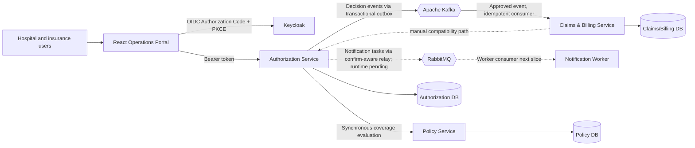

# Health Insurance Claims and Pre-Authorization Platform

A portfolio-grade healthcare insurance platform that demonstrates modern Java
full-stack engineering through a realistic business workflow. A healthcare
provider requests authorization for a member's service, an insurer verifies
policy coverage and decides the request, and an approved service proceeds to
claim adjudication, invoice reconciliation, payment, and settlement.

> **Current checkpoint:** Milestones 0–5 are implemented. Milestone 6 is in
> progress: the Notification Worker domain/application core and delivery
> idempotency contract now have a PostgreSQL/Liquibase adapter. Authorization
> records minimal notification tasks atomically with each decision and now has
> a confirm-aware RabbitMQ outbox relay plus durable queue/DLQ topology. The
> worker consumer and Compose-backed RabbitMQ runtime are not implemented yet.
> Planned technologies are never presented as delivered.

## Why this project exists

The project connects professional hospital-information-system experience with
the Java/Spring and React/TypeScript ecosystem. It is deliberately more than a
CRUD portfolio sample: aggregate state transitions, monetary invariants,
provider ownership, concurrency, database ownership, and service failure are
part of the model.

The business problem is split into three implemented bounded contexts:

| Bounded context | Owns | Does not own |
| --- | --- | --- |
| Authorization | Pre-authorization request, requested service/amount, provider, decision | Policy rules, claims, invoices, payments |
| Policy | Policy validity/status and coverage definitions/limits | Authorization decisions or limit reservation |
| Claims and Billing | Claim adjudication, invoice reconciliation, payments, settlement | Authorization or policy source data |

The Operations Portal currently exposes the pre-authorization workflow. Policy
and Claims/Billing behavior is available through secured APIs and the synthetic
demo script.

## Implemented capabilities

### Milestone 0 — Build and runtime baseline

- Java 21 across Maven, Dockerfiles, and GitHub Actions.
- Spring Boot 4.1.1 services built through Maven Wrapper.
- Multi-stage container images with non-root runtime users.
- Docker Compose for Keycloak, three PostgreSQL databases, and three services.
- Actuator health endpoints and database health-gated startup.
- Secret-safe configuration through ignored `.env` files and committed examples.

### Milestone 1 — Authorization Service

- Clean Architecture with domain, application, infrastructure, and presentation
  boundaries enforced by ArchUnit.
- Rich `PreAuthorization` aggregate and `Money` value object.
- Submission, detail, approval, rejection, and a provider-scoped paginated work
  queue with filtering and sorting.
- Lightweight CQRS through separate command/query input and output models.
- Transaction decorators keep Spring out of application use cases.
- Optimistic concurrency prevents two specialists from deciding the same request.
- RFC 9457 Problem Details for validation, authorization, conflict, not-found,
  and dependency failures.

### Milestone 2 — React Operations Portal

- Vite, React, and strict TypeScript foundation.
- Feature-Sliced dependency direction:
  `app -> pages -> widgets -> features -> entities -> shared`.
- Keycloak Authorization Code + PKCE login/logout and role-aware UI.
- TanStack Query server-state management and typed API client.
- React Hook Form + Zod validation.
- Dashboard, work queue, filters, sorting, pagination, submission, detail, and
  specialist decision interfaces.
- Loading, error, empty, unauthorized, and not-found states.
- Vitest, Testing Library, architecture checks, linting, and production build.

### Milestone 3 — Policy Service

- Policy aggregate with member ownership, status, inclusive validity dates, and
  one or more coverage definitions.
- Coverage rules for service code, requested amount, currency, and maximum limit.
- Synchronous coverage verification before Authorization accepts a request.
- Fail-closed dependency behavior: a denied or unavailable policy evaluation
  does not create a pending pre-authorization.
- Private PostgreSQL schema and Liquibase migrations.

Coverage evaluation currently answers eligibility only; it does **not** reserve
or consume shared benefit limits across requests. This is an explicit future
domain concern.

### Milestone 4 — Claims and Billing Service

- Claim and Invoice modeled as separate aggregate roots in one bounded context.
- A claim can only start from an approved, provider-owned pre-authorization.
- Claim lifecycle: `SUBMITTED -> UNDER_REVIEW -> APPROVED|REJECTED`.
- Invoice lifecycle: `ISSUED -> MATCHED|DISPUTED -> SETTLED`, or `VOID` after
  claim rejection when unpaid.
- Partial payments, dispute resolution, agreed payable amount, and automatic
  settlement when fully paid.
- Invariants against negative amounts, wrong currencies, over-approval,
  overpayment, illegal transitions, and duplicate payment references.
- Database-level uniqueness and optimistic locking for local idempotency and
  concurrent-update protection.

### Milestone 5 — Transactional Outbox and Kafka

- Approval/rejection integration events are inserted into Authorization's
  PostgreSQL outbox in the same transaction as the decision.
- A scheduled relay publishes versioned JSON to
  `health.authorization.pre-authorization.v1` with the aggregate ID as key.
- Failed broker sends remain unpublished and are retried by the next poll.
- Claims/Billing consumes approval events and automatically starts a claim and
  invoice in one local transaction.
- `processed_messages` and business uniqueness constraints make duplicate
  delivery a no-op.
- Consumer failures receive three total fixed-backoff attempts, then the
  original record is published to the `.DLT` topic.
- Real PostgreSQL and Apache Kafka Testcontainers tests verify duplicate delivery
  and poison-message routing.

### Milestone 6 — Notification Worker (in progress)

- Framework-independent notification delivery aggregate and use case.
- Provider-reference recipient model that excludes contact and health data.
- Sender and repository output ports with `taskId` as the downstream idempotency
  key.
- Duplicate delivered tasks are application-level no-ops.
- Reusing a `taskId` for different notification intent is rejected as a contract
  conflict rather than silently treated as a duplicate.
- Clean Architecture rules protect the new worker core.
- Private PostgreSQL persistence with a Liquibase-managed delivery table,
  database constraints, and operational indexes.
- A real PostgreSQL 17 Testcontainer proves migration, Hibernate schema
  validation, and `RECEIVED`/`DELIVERED` round trips.
- The current Java 21 verification suite has 11 passing domain, application,
  persistence, and architecture tests.
- Authorization stores a minimal, versioned notification task in a dedicated
  outbox in the same transaction as its decision and Kafka integration event.
- A full Spring/PostgreSQL integration test proves all three writes commit
  together and all roll back when notification intent persistence fails.
- A scheduled AMQP relay locks an ordered batch, publishes persistent JSON with
  `taskId`/`causationId` message metadata, and marks the row published only
  after a positive correlated publisher confirm.
- Mandatory publishing plus publisher returns prevents a broker acknowledgement
  for an unroutable message from being mistaken for successful task delivery.
- Durable direct exchange, delivery queue, dead-letter exchange, and DLQ names
  are explicit and covered by topology tests.
- The relay is feature-gated by `NOTIFICATION_OUTBOX_ENABLED` and remains off in
  the current Compose stack until RabbitMQ and the worker listener are wired.
- The Authorization Java 21 verification suite now has 59 passing tests,
  including positive confirm, negative confirm, unroutable return, safe wire
  payload, and topology checks.

The worker listener, manual acknowledgement, bounded consumer retry/rejection,
and Compose-backed RabbitMQ integration proof are the next Milestone 6 slices.

## Architecture overview



Each backend service applies the same dependency rule:

```text
Presentation/API -> Application -> Domain
Infrastructure --------^----------^
```

- **Domain** contains plain Java aggregates, value objects, rules, and domain
  exceptions. It has no Spring, JPA, HTTP, Keycloak, or messaging dependency.
- **Application** contains input/output ports, commands, queries, DTOs, security
  context, and orchestration. It depends on the domain, not adapters.
- **Infrastructure** implements JPA repositories, HTTP clients, OAuth2/security,
  transaction decorators, and Spring bean composition.
- **Presentation** maps HTTP/JWT input to input ports and maps results/errors back
  to transport representations.

See the complete [documentation index](docs/README.md),
[C4 container view](docs/architecture/c4-container.md), and
[technical walkthrough](docs/project-technical-walkthrough.md).

## Key workflows

### Pre-authorization

1. A hospital user signs in through Keycloak.
2. The API derives the provider UUID from the trusted `provider_id` token claim.
3. Authorization asks Policy to evaluate member, policy, service, date, amount,
   and currency.
4. When covered, Authorization persists a `PENDING` request.
5. An insurance specialist approves or rejects it.
6. Domain state checks and JPA optimistic locking prevent duplicate/concurrent
   decisions.

### Claim, invoice, and payment

1. Authorization commits an approval and its outbox event atomically.
2. The relay publishes the event at least once; Claims/Billing consumes it and
   atomically creates a submitted claim, issued invoice, and processed marker.
3. A claim approver starts review, then approves an amount or rejects the claim.
4. Approval reconciles the invoice: a full match becomes `MATCHED`; a difference
   becomes `DISPUTED` until an insurance specialist agrees the payable amount.
5. Positive, unique payments accumulate. The invoice becomes `SETTLED` exactly
   when the payable balance reaches zero.

Detailed message order and concurrent cases are in the
[workflow sequence diagrams](docs/architecture/workflow-sequences.md).

## Security model

Keycloak performs authentication; every backend is an OAuth2 resource server.
Authentication and authorization remain separate concerns.

| Realm role | Implemented permissions |
| --- | --- |
| `HOSPITAL_USER` | Submit and read provider-owned pre-authorizations/claims |
| `INSURANCE_SPECIALIST` | Decide pre-authorizations; reconcile invoices and record payments |
| `CLAIM_APPROVER` | Start claim review and approve/reject claims |
| `SYSTEM_ADMIN` | Administrative policy and cross-provider read/reconciliation authority |

Endpoint annotations provide an early role gate. Application use cases repeat
business authorization so rules remain effective outside HTTP. Hospital reads
and commands are also limited to the provider in the signed token; a request
body cannot impersonate another provider.

No credentials, tokens, client secrets, connection-string passwords, real
identities, or real health data belong in this repository. All demo UUIDs and
business values are synthetic.

The realm declares `providerId` as a managed user-profile attribute: users can
view it, only administrators can edit it, and the public client maps it to the
signed `provider_id` access-token claim. This explicit declaration matters
because Keycloak 26 ignores undeclared custom attributes by default.

## Technology inventory

### Used now

- Java 21, Spring Boot 4.1.1, Spring MVC, Spring Security OAuth2 Resource Server.
- Spring Kafka 4.1.1 and Apache Kafka 4.1.1.
- Spring Data JPA/Hibernate, PostgreSQL 17, Liquibase.
- JUnit, AssertJ, Mockito, ArchUnit, Testcontainers.
- React 19, TypeScript 6, Vite 8, React Router 8.
- TanStack Query, React Hook Form, Zod, Keycloak JS.
- Vitest, Testing Library, oxlint.
- Keycloak 26.4, Docker, Docker Compose, GitHub Actions.

### Planned, not implemented

RabbitMQ notification delivery, Redis, Elasticsearch/Kibana,
Elastic APM, APISIX, Kubernetes, Argo CD, Jenkins, SonarQube, Nexus, and Harbor.
Each will be introduced only with a documented need and trade-off.

## Repository layout

```text
apps/
  operations-portal/          React + TypeScript web application
services/
  authorization-service/     Pre-authorization bounded context
  policy-service/             Policy and coverage bounded context
  claims-billing-service/     Claims, invoices, and payments bounded context
infra/
  keycloak/                   Importable realm/client/role configuration
demo/                         Synthetic data catalogue and API seed script
docs/
  adr/                        Architecture decision records
  architecture/               C4, component, data, sequence, UI, deployment views
  demo/                       Repeatable demonstration guide
  screenshots/                Milestone UI evidence using synthetic data
  project-technical-walkthrough.md
.github/workflows/            Backend and frontend CI
compose.yaml                  Local runtime topology
```

## Run locally

### Prerequisites

- Docker Desktop with Compose support.
- Java 21 for running backend services outside containers.
- Node.js compatible with the portal dependencies.

### Full backend stack

Create a local ignored environment file from the safe template and replace every
placeholder. Do not commit the resulting file.

```powershell
Copy-Item .env.example .env
docker compose up --build
```

| Component | Local URL/port |
| --- | --- |
| Keycloak | `http://localhost:8080` |
| Authorization Service | `http://localhost:8081` |
| Policy Service | `http://localhost:8082` |
| Claims and Billing Service | `http://localhost:8083` |
| Kafka | `localhost:9092` |
| Authorization PostgreSQL | `localhost:5433` |
| Policy PostgreSQL | `localhost:5434` |
| Claims/Billing PostgreSQL | `localhost:5435` |

The imported `health-insurance` realm defines roles and the public
`health-insurance-web` client. Create local users through the Keycloak admin UI.
A hospital user needs a synthetic UUID `providerId` attribute; the realm maps it
to the access token's `provider_id` claim. No demo passwords are committed.

### Operations portal

```powershell
Set-Location apps/operations-portal
npm install
npm run dev
```

Open `http://localhost:5173`. The web client uses Authorization Code + PKCE and
stores no client secret. Copy `apps/operations-portal/.env.example` to its local
`.env` only when overriding URLs.

### Backend services outside containers

```powershell
docker compose up -d authorization-db policy-db claims-billing-db keycloak

Set-Location services/policy-service
.\mvnw.cmd spring-boot:run

Set-Location services/authorization-service
.\mvnw.cmd spring-boot:run

Set-Location services/claims-billing-service
.\mvnw.cmd spring-boot:run
```

Run each Maven command in its own terminal and provide the database/OIDC
environment variables described by that service's `application.yml`.

## Synthetic demo

The [demo scenario](docs/demo/demo-scenario.md) explains local users, roles,
happy paths, negative paths, and safe reset. After the stack is healthy, set
three runtime-only access-token environment variables and run:

```powershell
.\demo\seed-demo-data.ps1
```

The script creates:

- a covered synthetic policy;
- pending and rejected pre-authorizations;
- a fully settled approved claim/invoice with partial payments;
- a disputed invoice awaiting reconciliation.

It generates unique business references on each run, never stores or prints
tokens, and uses no real patient data. The source catalogue is
[demo/demo-data.json](demo/demo-data.json).

For a repeatable local-only Keycloak setup, set the three runtime variables
described in the demo guide and use
`demo/prepare-and-seed-local-demo.ps1`. It creates temporary users and an
uncommitted direct-grant seeder client; the browser still uses Code + PKCE.

## Tests and verification

Run every backend suite from its own service directory:

```powershell
Set-Location services/authorization-service
.\mvnw.cmd --batch-mode test

Set-Location ../policy-service
.\mvnw.cmd --batch-mode test

Set-Location ../claims-billing-service
.\mvnw.cmd --batch-mode test
```

The full suites use Testcontainers for real PostgreSQL persistence and
concurrency tests, so Docker must be running. On 8 September 2026, the Milestone
5 checkpoint contained **109 passing tests**: Authorization 50, Policy 21, and
Claims/Billing 38. The portal also passed oxlint, 6 Vitest tests in 5 files, and
its production build. Always rerun the commands; these counts are dated
evidence, not a substitute for verification.

The current Milestone 6 checkpoint separately verifies 59 Authorization tests
and 11 Notification Worker tests. The new Authorization transaction test uses
real PostgreSQL and proves commit/rollback across the aggregate, Kafka event
outbox, and notification task outbox. Five additional unit tests verify AMQP
publisher confirms/returns, safe persistent message metadata, and durable
delivery/DLQ topology without requiring a running broker.

Validate the living portfolio documentation separately. This command checks
local Markdown links, JSON and PowerShell syntax, the expected screenshot set,
and renders every Mermaid block:

```powershell
.\scripts\validate-documentation.ps1
```

Verify the portal:

```powershell
Set-Location apps/operations-portal
npm run lint
npm test
npm run build
```

Test coverage includes domain invariants, application orchestration, role and
provider authorization, controller contracts, bean/transaction wiring, Clean
Architecture and FSD import rules, Liquibase/JPA persistence, uniqueness, and
optimistic concurrency.

## API summary

All business endpoints require a valid Keycloak bearer token.

| Method | Endpoint | Required responsibility |
| --- | --- | --- |
| `POST` | `/api/v1/pre-authorizations` | Hospital submission |
| `GET` | `/api/v1/pre-authorizations` | Provider-scoped or specialist work queue |
| `GET` | `/api/v1/pre-authorizations/{id}` | Authorized detail |
| `POST` | `/api/v1/pre-authorizations/{id}/approval` | Insurance decision |
| `POST` | `/api/v1/pre-authorizations/{id}/rejection` | Insurance decision |
| `POST` | `/api/v1/policies` | Policy administration |
| `POST` | `/api/v1/coverage-evaluations` | Synchronous eligibility check |
| `POST` | `/api/v1/claims` | Hospital claim creation |
| `GET` | `/api/v1/claims/{id}` | Authorized claim detail |
| `GET` | `/api/v1/claims/by-pre-authorization/{id}` | Observe event-created claim/invoice |
| `POST` | `/api/v1/claims/{id}/review` | Claim approver |
| `POST` | `/api/v1/claims/{id}/approval` | Claim approver |
| `POST` | `/api/v1/claims/{id}/rejection` | Claim approver |
| `GET` | `/api/v1/invoices/{id}` | Authorized invoice detail |
| `POST` | `/api/v1/invoices/{id}/dispute-resolution` | Insurance reconciliation |
| `POST` | `/api/v1/invoices/{id}/payments` | Insurance payment recording |
| `GET` | `/actuator/health` | Public liveness/readiness information |

The pre-authorization collection accepts `status`, `memberId`, `policyNumber`,
`page`, `size`, `sortBy`, and `direction`. Supported sort fields are
`createdAt`, `requestedAmount`, and `status`; page size is limited to 100.

## Documentation and visual evidence


- [Engineering documentation index](docs/README.md)
- [Technical walkthrough and interview guide](docs/project-technical-walkthrough.md)
- [C4 context](docs/architecture/c4-context.md) and
  [container](docs/architecture/c4-container.md)
- [Clean Architecture](docs/architecture/clean-architecture.md)
- [Data ownership/ER model](docs/architecture/data-model.md)
- [Workflow sequences](docs/architecture/workflow-sequences.md)
- [Event-driven messaging](docs/architecture/event-driven-messaging.md)
- [Frontend architecture](docs/architecture/frontend-architecture.md)
- [Local deployment](docs/architecture/local-deployment.md)
- [Demo scenario](docs/demo/demo-scenario.md)
- [Screenshot catalogue](docs/screenshots/README.md)
- [ADRs](docs/adr/)

## Design decisions and trade-offs

- **Synchronous REST today:** coverage and approved-authorization checks require
  immediate answers and have clear owners. This is simple and traceable but
  creates availability coupling; calls fail closed.
- **Database per service:** prevents hidden coupling and establishes ownership,
  at the cost of cross-service joins and distributed consistency work.
- **Claims plus Billing together:** separate aggregates share one bounded context
  and local transaction while the domain is young. They can be split only after
  independent ownership or scaling needs emerge.
- **Lightweight CQRS:** command/query models are explicit without the operational
  cost of a second read store.
- **End-user token relay:** preserves current provider context across services.
  Workload identity/token exchange is a future production security decision.
- **At-least-once Kafka delivery:** avoids dual writes through a database outbox;
  duplicates are expected and neutralized by the consumer inbox.
- **RabbitMQ for operational work:** notification tasks use a competing-consumer
  queue while Kafka remains the durable business-event stream. Publisher
  confirms and mandatory returns protect the producer boundary; consumer
  idempotency handles inevitable redelivery.

See ADR-001 through ADR-008 in [docs/adr](docs/adr/) for full context,
alternatives, consequences, and rejected options.

## Current limitations

- Policy benefit consumption and reservation across requests are not modeled.
- Policy and Claims/Billing do not yet have portal screens.
- Outbox retention/archival and automated DLT replay/quarantine are not yet
  operationalized.
- No production workload identity/token exchange exists between services.
- No circuit breaker is configured for synchronous dependencies.
- Notification consumption/delivery, audit trail, correlation IDs, structured
  observability, search, caching, gateway, and Kubernetes delivery remain future
  slices.
- Production PHI/privacy, consent, encryption/key management, retention, and
  regulatory requirements need explicit threat modeling and governance.

## Roadmap

- [x] Milestone 0 — Java 21 build, Docker, CI, and configuration baseline
- [x] Milestone 1 — Clean Architecture Authorization Service
- [x] Milestone 2 — React/TypeScript operations portal foundation
- [x] Milestone 3 — Policy Service and coverage evaluation
- [x] Milestone 4 — Claims and Billing lifecycle
- [x] Milestone 5 — Transactional Outbox, Kafka, idempotent consumer, retry/DLQ
- [ ] Milestone 6 — RabbitMQ notification worker (core in progress)
- [ ] Milestone 7 — Redis, Elasticsearch, Kibana, Elastic APM, correlation IDs
- [ ] Milestone 8 — APISIX gateway and completed security policies
- [ ] Milestone 9 — Kubernetes and extended CI/CD toolchain
- [ ] Milestone 10 — Final portfolio and interview package

Milestone 6 is being implemented incrementally. At every later milestone, the
README, diagrams, ADRs, synthetic demo, scenario, screenshots, technical
walkthrough, test evidence, limitations, and roadmap are part of the definition
of done—not end-of-project cleanup.
