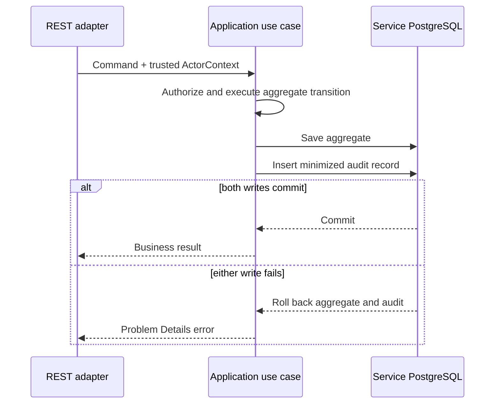

# ADR-011: Servis sahipli append-only audit journal'ları

- Durum: Kabul edildi
- Tarih: 2026-09-09

## Bağlam

Platform bir business record'u kimin değiştirdiğini, hangi transition'ın
gerçekleştiğini, ne zaman olduğunu ve neden izin verildiğini yanıtlayabilmelidir.
Mevcut aggregate state, application log'ları, Kafka event'leri ve Elastic APM
trace'leri farklı problemleri çözer:

- aggregate current business truth saklar; tam actor history saklamaz;
- log'lar diagnostic output'tur ve sample, rotate veya redact edilebilir;
- integration event'leri diğer bounded context'ler için contract'tır, compliance
  journal değildir;
- trace'ler request execution'ı anlatır, durable business evidence değildir.

Her servisin senkron çağırdığı merkezi audit database database-per-service
ownership'i ihlal eder ve business availability'yi audit service'e bağlar veya
servis erişilemezken unaudited write'a izin verir. Audit'i yalnızca commit sonrası
publish etmek de business state ile evidence arasında boşluk bırakır.

## Karar

State sahibi her servis mevcut PostgreSQL database'inde append-only audit journal
sahibidir. Business mutation ile audit insert aynı local transaction içinde
commit edilir. Application layer audit intent'i tanımlar; infrastructure adapter
persist eder. Domain object'leri JPA, Spring Security, HTTP ve audit storage'dan
bağımsız kalır.

İlk rollout şunları kapsar:

- Authorization: submission ve `PENDING -> APPROVED|REJECTED` transition'ları;
- Policy: policy issuance;
- Claims/Billing: claim lifecycle, invoice reconciliation/dispute resolution,
  payment recording, settlement ve voiding;
- Notification Worker: delivery lifecycle operational evidence olarak kalır ve
  ayrı sınıflandırılır; business audit yerine geçmez.

Her audit record yalnızca şu bounded contract'ı içerir:

| Alan | Amaç |
| --- | --- |
| `audit_id` | Global unique immutable record identity |
| `aggregate_type`, `aggregate_id` | Owner business record'a stable reference |
| `action` | `PRE_AUTHORIZATION_APPROVED` gibi controlled action name |
| `actor_subject` | Keycloak subject veya controlled system principal |
| `actor_roles` | Decision için kullanılan normalized application role'leri |
| `provider_id` | Actor varsa trusted provider scope |
| `correlation_id` | Diagnostic linkage; identity kanıtı değildir |
| `occurred_at` | Server-side UTC timestamp |
| `reason_code` | Controlled, non-sensitive explanation category |
| `changes` | `fromStatus` ve `toStatus` gibi allowlisted state delta |
| `retention_class` | Hard-coded legal duration değil policy key |

Audit record member identifier, diagnosis code, policy number, invoice/payment
reference, access token, contact detail, full request/response body veya free-text
clinical/decision content'i duplicate etmemelidir. Yetkili user business detail
meşru olarak gerektiğinde aggregate reference üzerinden owner servise gidebilir.

Audit table'ları yalnızca insert ve read operation açar. Hiçbir application
repository method record update veya delete etmez. PostgreSQL protection,
application path için `UPDATE` ve `DELETE` işlemlerini reddeder; integration
testleri hem atomic write hem immutability rule'larını kanıtlar. Bu append-only
enforcement'tır; database administrator'a karşı cryptographic tamper evidence
iddiası değildir.

Audit query'leri direct repository exposure değil application use case'leridir.
Her service-local read API yalnızca `SYSTEM_ADMIN` erişimine açıktır, maksimum
100 page size ile paginate edilir, deterministically order edilir ve yalnızca
aggregate UUID ile allowlisted action üzerinden filter edilebilir. Dedicated
auditor role veya time-range filter eklemek mevcut contract'ı sessizce
genişletmek yerine gelecekteki security-model kararıdır.

## Transaction ve failure davranışı

Audit persistence fail-closed'dur: auditable state mutation journal insert
başarısız olduğunda rollback olmalıdır. Read-only query'ler business audit row
üretmez; audit read security access logging recursive audit creation'ı önlemek
için ayrı follow-up olarak ele alınır.

## Sonuçlar

- Başarılı transaction sonrasında business state ile local audit evidence ayrışamaz.
- Hiçbir servis başka servisin database'ine yazmaz.
- Audit availability senkron network dependency getirmez.
- Platform-wide audit timeline ileride service-owned record'lardan project edilirse
  eventually consistent olur.
- Schema ve adapter'lar servisler arasında küçük ve bilinçli audit contract'ı tekrarlar.
- Local database administrator'lar trusted kalır; daha güçlü tamper evidence için
  immutable backup, signature veya external write-once storage gerekir.
- Data controller ve legal stakeholder somut period ve disposal rule'larını
  onaylayana kadar retention policy key'lerle temsil edilir.

## Değerlendirilen alternatifler

- **Senkron çağrılan central audit service:** distributed consistency ve
  availability coupling getirdiği için reddedildi.
- **Audit sistemi olarak Kafka event'leri:** mevcut integration event'leri
  purpose-specific, minimized contract olduğu ve transactionally queryable
  compliance record olmadığı için reddedildi.
- **Audit olarak application log'ları:** access, rotation, redaction ve integrity
  semantics farklı olduğu için reddedildi.
- **Tam before/after JSON snapshot'ları:** special-category health data'yı duplicate
  ettiği ve minimization, schema evolution ve erasure'ı zorlaştırdığı için reddedildi.
- **Her business meaning'i çıkaran database trigger'ları:** trigger row görür ancak
  authenticated actor veya use-case intent'i görmez; bu nedenle sole producer
  olarak reddedildi. Database control'leri immutability enforcement için yine kullanılır.
