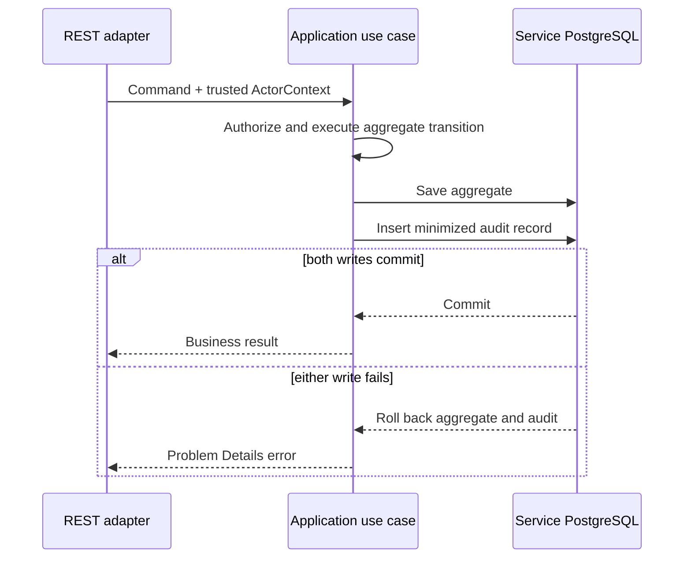

# ADR-011: Service-owned append-only audit journals

- Status: Accepted
- Date: 2026-09-09

## Context

The platform must answer who changed a business record, which transition was
performed, when it happened, and why it was allowed. Existing aggregate state,
application logs, Kafka events, and Elastic APM traces solve different problems:

- an aggregate stores current business truth, not a complete actor history;
- logs are diagnostic output and may be sampled, rotated, or redacted;
- integration events are contracts for other bounded contexts, not a compliance
  journal;
- traces describe request execution, not durable business evidence.

A central audit database called synchronously from every service would violate
database-per-service ownership and would either couple business availability to
the audit service or permit unaudited writes when that service is unavailable.
Publishing audit only after commit would also leave a gap between business state
and its evidence.

## Decision

Each state-owning service owns an append-only audit journal in its existing
PostgreSQL database. The business mutation and audit insert commit in the same
local transaction. The application layer defines the audit intent; an
infrastructure adapter persists it. Domain objects remain independent of JPA,
Spring Security, HTTP, and audit storage.

The initial rollout covers:

- Authorization: submission and `PENDING -> APPROVED|REJECTED` transitions;
- Policy: policy issuance;
- Claims/Billing: claim lifecycle, invoice reconciliation/dispute resolution,
  payment recording, settlement, and voiding;
- Notification Worker: delivery lifecycle remains operational evidence and will
  be classified separately; it is not a substitute for business audit.

Every audit record contains only this bounded contract:

| Field | Purpose |
| --- | --- |
| `audit_id` | Globally unique immutable record identity |
| `aggregate_type`, `aggregate_id` | Stable reference to the owning business record |
| `action` | Controlled action name such as `PRE_AUTHORIZATION_APPROVED` |
| `actor_subject` | Keycloak subject, or a controlled system principal |
| `actor_roles` | Normalized application roles used for the decision |
| `provider_id` | Trusted provider scope when the actor has one |
| `correlation_id` | Diagnostic linkage; not proof of identity |
| `occurred_at` | Server-side UTC timestamp |
| `reason_code` | Controlled, non-sensitive explanation category |
| `changes` | Allowlisted state delta such as `fromStatus` and `toStatus` |
| `retention_class` | Policy key, not a hard-coded legal duration |

The audit record must not duplicate member identifiers, diagnosis codes, policy
numbers, invoice/payment references, access tokens, contact details, full
request/response bodies, or free-text clinical/decision content. An authorized
user can follow the aggregate reference to the owning service when business
detail is legitimately required.

Audit tables expose insert and read operations only. No application repository
method updates or deletes a record. PostgreSQL protection will reject `UPDATE`
and `DELETE` for the application path, and integration tests will prove both the
atomic write and immutability rules. This is append-only enforcement, not a claim
of cryptographic tamper evidence against a database administrator.

Audit queries are application use cases, not direct repository exposure. Each
service-local read API is restricted to `SYSTEM_ADMIN`, paginated with a maximum
size of 100, deterministically ordered, and filterable only by aggregate UUID and
an allowlisted action. Adding a dedicated auditor role or time-range filter is a
future security-model decision rather than silently broadening the current
contract.

## Transaction and failure behavior

Audit persistence is fail-closed: an auditable state mutation must roll back when
its journal insert fails. Read-only queries do not generate business audit rows;
security access logging for audit reads is treated as a separate follow-up to
avoid recursive audit creation.

## Consequences

- Business state and its local audit evidence cannot diverge after a successful
  transaction.
- No service writes another service's database.
- Audit availability does not introduce a synchronous network dependency.
- A platform-wide audit timeline is eventually consistent if later projected
  from service-owned records.
- Schemas and adapters repeat a small intentional audit contract across services.
- Local database administrators remain trusted; immutable backups, signatures,
  or external write-once storage would be needed for stronger tamper evidence.
- Retention is represented by policy keys until the data controller and legal
  stakeholders approve concrete periods and disposal rules.

## Alternatives considered

- **Central audit service called synchronously:** rejected because it introduces
  distributed consistency and availability coupling.
- **Kafka events as the audit system:** rejected because current integration
  events are purpose-specific, minimized contracts and are not transactionally
  queryable compliance records.
- **Application logs as audit:** rejected because logs have different access,
  rotation, redaction, and integrity semantics.
- **Full before/after JSON snapshots:** rejected because they duplicate special
  category health data and make minimization, schema evolution, and erasure more
  difficult.
- **Database triggers that infer every business meaning:** rejected as the sole
  producer because a trigger sees rows but not the authenticated actor or use-case
  intent. Database controls are still used to enforce immutability.
