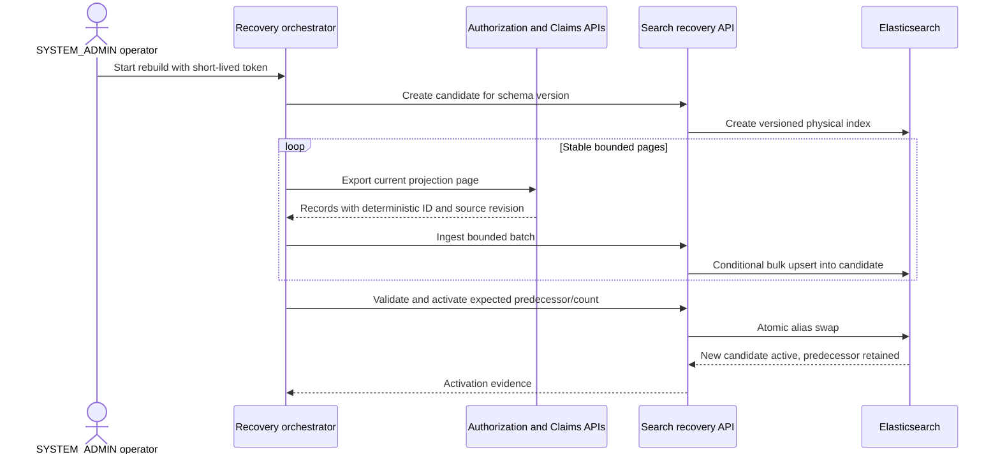

# ADR-012: Sürümlenmiş search rebuild ve kontrollü message recovery

- Durum: Kabul edildi
- Tarih: 2026-09-09

## Bağlam

Elasticsearch türetilmiş operations read model'dir. Mevcut physical index
`healthcare-operations-v1` doğrudan yazılır ve query edilir. Bu index silinirse,
corrupt olursa veya incompatible mapping change gerekirse PostgreSQL system of
record'lardan tüm current record'ları yeniden oluşturacak executable yöntem
yoktur. Yalnızca Kafka replay yeterli değildir; topic retention sonludur ve
Authorization şu anda her pre-authorization state'in complete snapshot'ı yerine
decision event'leri üretir.

Kafka DLT ve RabbitMQ DLQ routing poison message'ların healthy traffic'i
bloklamasını engeller ancak dead-letter destination recovery process değildir.
Blind replay permanent contract error'ı tekrarlayabilir, retry storm oluşturabilir
veya operator authorization/evidence requirement'larını bypass edebilir.
Recovery başlamadan önce outbox row ve consumer lag için de bounded operational
visibility gerekir.

Recovery design database-per-service ownership, least privilege, idempotency,
sensitive-data minimization ve replacement hazırlanırken current search view'ın
availability'sini korumalıdır.

## Karar

### Source-owned projection export'ları

Authorization ve Claims/Billing yalnızca kendi PostgreSQL database'leriyle
backed paginated projection-export use case'leri sunar. JPA entity veya arbitrary
table data değil mevcut search contract'ını döndürür. Presentation ve application
layer'ların ikisi de `SYSTEM_ADMIN` gerektirir; page size sınırlandırılır,
ordering stable'dır ve API'ler APISIX arkasında kalır. Search ve operational
tooling hiçbir zaman başka servisin database'ine bağlanmaz.

İlk local recovery orchestrator operator-run PowerShell script'tir. Runtime'da
sağlanan short-lived `SYSTEM_ADMIN` token kullanır, owner API'leri çağırır ve
Search Service'e bounded batch'ler gönderir. Token veya payload'ları diskte
saklamaz. Gelecekteki production deployment application projection contract'larını
değiştirmeden user-token relay yerine workload identity kullanabilir.

### Sürümlenmiş physical index'ler ve stable alias

Search read ve normal projection write'ları stable `healthcare-operations`
alias kullanır. Rebuild validated schema version ve opaque run identifier'dan
adlandırılmış physical index oluşturur; örneğin
`healthcare-operations-v2-20260909t220000z`. Candidate explicit mapping alır ve
activation öncesinde normal user'lar tarafından query edilmez.

Activation yalnızca orchestrator şunları doğruladıktan sonra mümkündür:

- tüm owner page'leri hatasız tamamlandı;
- indexed document count owner'lar tarafından export edilen distinct deterministic
  document ID sayısına eşit;
- her document current mapping ve domain validation'dan geçti;
- alias hâlâ expected predecessor'ı gösteriyor; böylece concurrent rebuild'ler
  birbirini sessizce replace edemez.

Elasticsearch atomic alias update predecessor'dan alias'ı kaldırır ve candidate'a
tek cluster-state operation içinde ekler. Predecessor explicit bounded rollback
için korunur. Index deletion activation parçası değildir ve ayrı retention
kararı gerektirir.

### Concurrent event'ler ve stale-write protection

Deterministic ID duplicate'i engeller ancak older event'in newer snapshot'ı
overwrite etmesini engellemez. Online rebuild activation öncesinde her projection
owner-defined monotonic `sourceRevision` taşır. Normal event handling ve rebuild
ingestion conditional upsert semantics kullanır: document yalnızca incoming
revision stored revision'dan büyükse replace edilir. Equal revision idempotent
no-op'tur; böylece divergent duplicate arrival order ile kazanamaz.

Authorization revision'ı aggregate version'dan türetir. Claims/Billing combined
Claim/Invoice view için tek monotonic projection revision tanımlar; event contract
version ile business-state revision'ı karıştırmamalıdır. Böylece rebuild sırasında
queue'lanan event'ler alias activation sonrasında yeni PostgreSQL snapshot'ı
geriletmeden catch up olabilir.

### Kontrollü DLT ve DLQ recovery

Recovery açık bir `inspect -> classify -> replay or quarantine` workflow'udur:

1. Inspection varsayılan olarak yalnızca safe broker metadata ve payload digest açar.
2. Permanent contract/schema failure'lar compatible code deploy edilene veya
   review edilmiş transformation oluşana kadar quarantine'de kalır.
3. Transient failure yalnızca dependency recovery kanıtlandıktan sonra replay edilebilir.
4. Replay downstream idempotency için original message/task ID'yi korur, yeni
   recovery/correlation ID ekler, source destination ve attempt'i kaydeder ve
   maximum replay count uygular.
5. `Inspect` ve `Quarantine` non-publishing view'lardır; quarantine original
   mesajın dead-letter destination'da retained kalması anlamına gelir.
6. Local replay explicit `Transient` classification, confirmation flag,
   allowlisted destination ve bir ile üç arasında attempt gerektirir.
   Automatic infinite replay ve destructive discard yasaktır.

Kafka consumer lag, RabbitMQ queue depth ve outbox backlog diagnostic signal'dır,
business truth değildir. Operational view count, oldest age, maximum attempt
count ve safe error category raporlar; payload, token, member identifier, policy
number, diagnosis data veya contact detail göstermez.

## Recovery sequence

## Failure ve rollback davranışı

- Owner/API/Elasticsearch failure current alias'ı değiştirmez.
- Kısmen doldurulmuş candidate hiçbir zaman otomatik activate edilmez.
- Aynı export'u tekrarlamak document ID ve revision deterministik olduğu için idempotent'tır.
- Alias compare-and-swap mismatch activation'ı reddeder ve operator'ı concurrent
  rebuild'i inspect etmeye zorlar.
- Rollback retained predecessor'a explicit alias swap'tır. Rollback sonrası
  alınan event'ler yine source-revision ordering'e uyar.
- Candidate cleanup rollback'ten ayrıdır ve derived-data retention policy'yi
  izler; recovery PostgreSQL source record'larını asla silmez.

## Sonuçlar

- Elasticsearch shared database access veya complete Kafka history bağımlılığı
  olmadan authoritative owner'lardan rebuild edilebilir.
- Candidate oluşturulurken search old alias üzerinden available kalır.
- Source service'ler narrow administrative export surface kazanır ve role
  enforcement ile data minimization'ı test etmelidir.
- Monotonic projection revision ek contract ve persistence işi getirir ancak
  deterministic ID'nin tek başına çözemediği stale-event race'i kapatır.
- Local orchestrator bilinçli olarak durable workflow engine değildir. Çok büyük
  veya multi-hour production rebuild workload identity, checkpoint persistence,
  cancellation ve resumable job coordination gerektirir.
- Search rebuild/rollback run state'i memory'de tutar. Service restart index'leri
  korur ancak eski run'ı API üzerinden resume etmek yerine manual alias inspection gerekir.
- Local broker tool'ları Docker access ve runtime RabbitMQ credential kullanır;
  production operations API workload identity, approval/audit evidence ve durable
  case state eklemelidir.
- Predecessor index'leri tutmak storage tüketir ve açık cleanup/retention policy gerektirir.

## Değerlendirilen alternatifler

- **Kafka consumer offset reset:** topic retention ve incomplete event coverage
  complete current snapshot garanti edemediği için authoritative rebuild path
  olarak reddedildi. Bounded consumer recovery testlerinde hâlâ yararlıdır.
- **Search veya script'ten service database'lerini doğrudan okumak:** database
  ownership'i ihlal ettiği, recovery'yi private schema'ya bağladığı ve credential
  exposure'ı genişlettiği için reddedildi.
- **Tek fixed physical index kullanmak:** destructive mapping change ve partial
  rebuild live search'ü anında etkileyip rollback'i zorlaştıracağı için reddedildi.
- **Her DLT/DLQ mesajını otomatik replay etmek:** permanent poison message ve
  incompatible contract human classification gerektirdiği için reddedildi.
- **Source service'lerin tüm rebuild'i Kafka üzerinden publish etmesi:** ertelendi.
  High-scale için geçerli evolution'dır ancak mevcut portföy ihtiyaç duymadan
  broker dependency ve distributed job coordination ekler.
