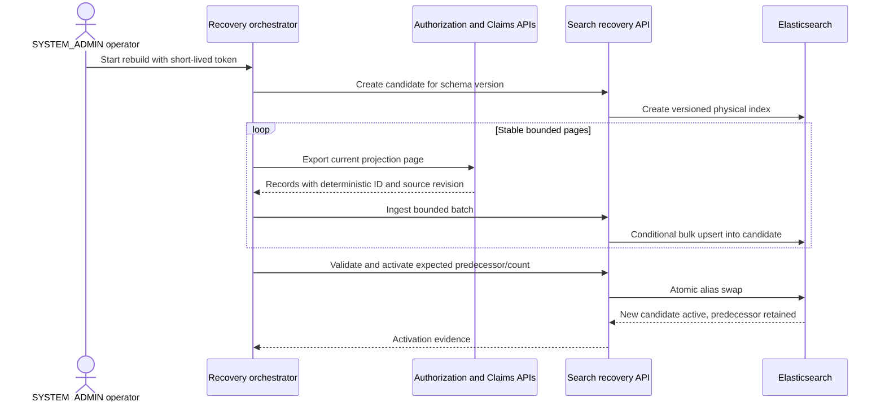

# ADR-012: Versioned search rebuild and controlled message recovery

- Status: Accepted
- Date: 2026-09-09

## Context

Elasticsearch is a derived operations read model. Its current physical index,
`healthcare-operations-v1`, is written and queried directly. If that index is
deleted, corrupted, or requires an incompatible mapping change, there is no
executable way to reconstruct all current records from the PostgreSQL systems of
record. Replaying Kafka alone is insufficient because topic retention is finite
and Authorization currently emits decisions rather than a complete snapshot of
every pre-authorization state.

Kafka DLT and RabbitMQ DLQ routing prevent poison messages from blocking healthy
traffic, but a dead-letter destination is not a recovery process. Blind replay
can repeat a permanent contract error, create a retry storm, or bypass an
operator's authorization and evidence requirements. Outbox rows and consumer lag
also need bounded operational visibility before recovery begins.

The recovery design must preserve database-per-service ownership, least
privilege, idempotency, sensitive-data minimization, and availability of the
current search view while a replacement is prepared.

## Decision

### Source-owned projection exports

Authorization and Claims/Billing will expose paginated projection-export use
cases backed only by their own PostgreSQL databases. They return the existing
search contract, not JPA entities or arbitrary table data. Both presentation and
application layers require `SYSTEM_ADMIN`, page sizes are capped, ordering is
stable, and the APIs remain behind APISIX. Search and operational tooling never
connect to another service's database.

The initial local recovery orchestrator is an operator-run PowerShell script. It
uses a short-lived `SYSTEM_ADMIN` token supplied at runtime, calls the owner APIs,
and submits bounded batches to Search Service. It never stores tokens or payloads
on disk. A future production deployment can replace user-token relay with a
workload identity without changing the application projection contracts.

### Versioned physical indices and stable alias

Search reads and normal projection writes use a stable
`healthcare-operations` alias. A rebuild creates a physical index named from a
validated schema version and opaque run identifier, for example
`healthcare-operations-v2-20260909t220000z`. The candidate receives explicit
mappings and is never queried by normal users before activation.

Activation is allowed only after the orchestrator proves:

- all owner pages completed without error;
- indexed document count equals the number of distinct deterministic document
  IDs exported by the owners;
- every document passed the current mapping and domain validation;
- the alias still points to the expected predecessor, preventing concurrent
  rebuilds from silently replacing each other.

Elasticsearch's atomic alias update removes the alias from the predecessor and
adds it to the candidate in one cluster-state operation. The predecessor remains
available for an explicit bounded rollback. Index deletion is never part of
activation and requires a separate retention decision.

### Concurrent events and stale-write protection

Deterministic IDs prevent duplicates but do not prevent an older event from
overwriting a newer snapshot. Before online rebuild activation, every projection
will carry an owner-defined monotonic `sourceRevision`. Normal event handling and
rebuild ingestion use conditional upsert semantics: a document is replaced only
when the incoming revision is greater than or equal to the stored revision.

Authorization derives the revision from its aggregate version. Claims/Billing
defines one monotonic projection revision for the combined Claim/Invoice view;
it must not confuse the event contract version with business-state revision.
This allows events queued during a rebuild to catch up after alias activation
without regressing a newer PostgreSQL snapshot.

### Controlled DLT and DLQ recovery

Recovery is an explicit `inspect -> classify -> replay or quarantine` workflow:

1. Inspection exposes only safe broker metadata and a payload digest by default.
2. Permanent contract/schema failures remain quarantined until compatible code
   is deployed or a reviewed transformation exists.
3. Transient failures may be replayed only after dependency recovery is proven.
4. Replay preserves the original message/task ID for downstream idempotency,
   adds a new recovery/correlation ID, records source destination and attempt,
   and enforces a maximum replay count.
5. Dry-run performs validation and routing checks without publishing.
6. Replay and discard operations require `SYSTEM_ADMIN` and append minimized
   operational audit evidence; automatic infinite replay is prohibited.

Kafka consumer lag, RabbitMQ queue depth, and outbox backlog are diagnostic
signals, not business truth. The operational view will report counts, oldest age,
maximum attempt count, and safe error categories without exposing payloads,
tokens, member identifiers, policy numbers, diagnosis data, or contact details.

## Recovery sequence

## Failure and rollback behavior

- Owner/API/Elasticsearch failure leaves the current alias untouched.
- A partially populated candidate is never automatically activated.
- Repeating the same export is idempotent because document IDs and revisions are
  deterministic.
- An alias compare-and-swap mismatch rejects activation and forces the operator
  to inspect a concurrent rebuild.
- Rollback is an explicit alias swap to the retained predecessor. Events received
  after rollback still obey source-revision ordering.
- Candidate cleanup is separate from rollback and follows derived-data retention
  policy; recovery never deletes PostgreSQL source records.

## Consequences

- Elasticsearch can be rebuilt from authoritative owners without shared database
  access or dependence on complete Kafka history.
- Search remains available from the old alias during candidate construction.
- Source services gain narrow administrative export surfaces and must test both
  role enforcement and data minimization.
- Monotonic projection revisions add contract and persistence work but close the
  stale-event race that deterministic IDs alone cannot solve.
- The local orchestrator is intentionally not a durable workflow engine. Very
  large or multi-hour production rebuilds would require workload identity,
  checkpoint persistence, cancellation, and resumable job coordination.
- Keeping predecessor indices consumes storage and therefore requires an explicit
  later cleanup/retention policy.

## Alternatives considered

- **Reset Kafka consumer offsets:** rejected as the authoritative rebuild path
  because topic retention and incomplete event coverage cannot guarantee a full
  current snapshot. It remains useful for bounded consumer recovery tests.
- **Read service databases directly from Search or a script:** rejected because
  it violates database ownership, couples recovery to private schemas, and
  expands credential exposure.
- **Use one fixed physical index:** rejected because destructive mapping changes
  and partial rebuilds would affect live search immediately and make rollback
  difficult.
- **Automatically replay every DLT/DLQ message:** rejected because permanent
  poison messages and incompatible contracts require human classification.
- **Source services publish an entire rebuild through Kafka:** deferred. It is a
  viable high-scale evolution, but adds broker dependency and distributed job
  coordination before the current portfolio needs them.
