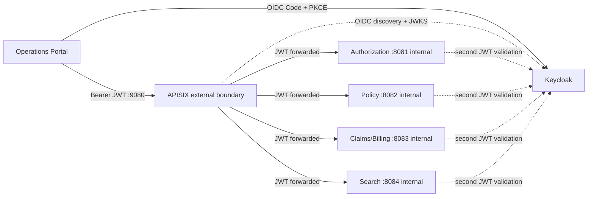
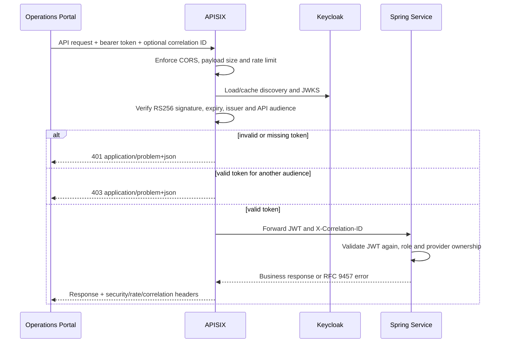

# API Gateway and Security Boundary

## Runtime boundary

The browser knows one business API origin. APISIX owns edge authentication and
traffic policy; Spring owns role, provider and business-state authorization.
Service-to-service REST calls use internal DNS and do not traverse the gateway.

## Request processing

## Policy ownership

| Concern | APISIX | Spring service |
| --- | --- | --- |
| Route selection | Owns | Does not own |
| Token signature/issuer/expiry | First validation | Second validation |
| `health-insurance-api` audience | Required at external boundary | Not yet repeated |
| Rate, request size, CORS, timeout | Owns edge policy | May keep defensive defaults |
| Realm-role permission | Token is authenticated | Owns endpoint/use-case decision |
| `provider_id` ownership | Does not decide | Owns trusted business scope |
| Aggregate state transition | Does not know | Aggregate/application owns |
| Correlation ID | Creates/preserves | Validates, logs and propagates |
| Gateway-generated error | RFC 9457 adapter | Not involved |
| Business error | Passes through | RFC 9457 owner |

## Local route table

| External path | Internal upstream |
| --- | --- |
| `/api/v1/pre-authorizations*` | `authorization-service:8081` |
| `/api/v1/policies*`, `/api/v1/coverage-evaluations*` | `policy-service:8082` |
| `/api/v1/claims*`, `/api/v1/invoices*` | `claims-billing-service:8083` |
| `/api/v1/search*` | `search-service:8084` |

The Admin API is disabled. Configuration changes are reviewed as code and hot
loaded from `infra/apisix/apisix.yaml`. Production must add trusted TLS, a shared
rate-limit store for multiple gateway replicas and controlled deployment of
configuration revisions.
