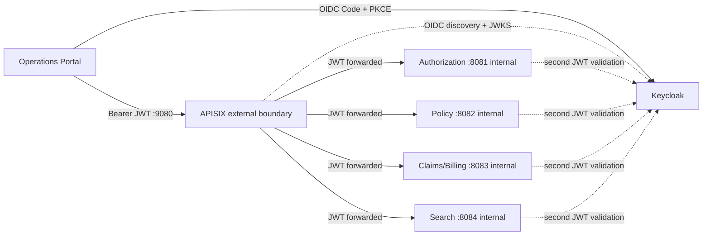
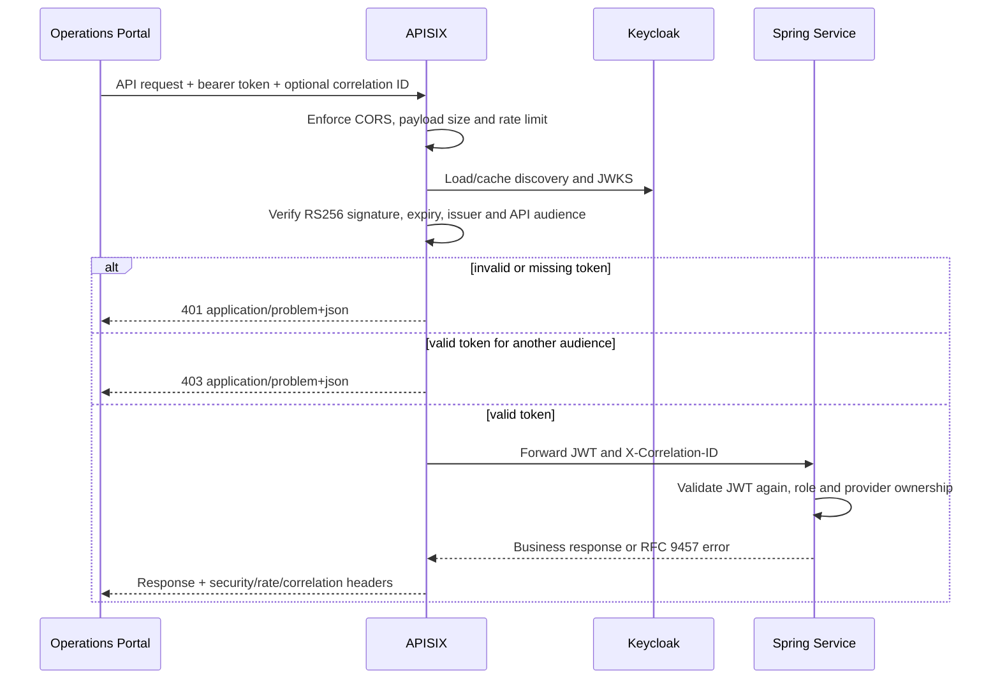

# API Gateway ve Güvenlik Sınırı

## Çalışma zamanı sınırı

Tarayıcı tek bir business API origin bilir. APISIX edge authentication ve trafik
policy'sinin sahibidir; Spring ise role, provider ve business-state authorization'ın
sahibidir. Service-to-service REST çağrıları internal DNS kullanır ve gateway'den geçmez.

## Request işleme

## Policy sahipliği

| Concern | APISIX | Spring service |
| --- | --- | --- |
| Route seçimi | Sahibi | Sahibi değil |
| Token signature/issuer/expiry | İlk doğrulama | İkinci doğrulama |
| `health-insurance-api` audience | External boundary'de zorunlu | Henüz tekrar edilmiyor |
| Rate, request size, CORS, timeout | Edge policy'nin sahibi | Defensive default'ları koruyabilir |
| Realm-role permission | Token authenticate edilir | Endpoint/use-case decision'ın sahibi |
| `provider_id` ownership | Karar vermez | Trusted business scope'un sahibi |
| Aggregate state transition | Bilmez | Aggregate/application sahibi |
| Correlation ID | Oluşturur/korur | Doğrular, loglar ve propagate eder |
| Gateway-generated error | RFC 9457 adapter | Dahil değildir |
| Business error | Değiştirmeden geçirir | RFC 9457 sahibi |

## Lokal route tablosu

| External path | Internal upstream |
| --- | --- |
| `/api/v1/pre-authorizations*` | `authorization-service:8081` |
| `/api/v1/policies*`, `/api/v1/coverage-evaluations*` | `policy-service:8082` |
| `/api/v1/claims*`, `/api/v1/invoices*` | `claims-billing-service:8083` |
| `/api/v1/search*` | `search-service:8084` |

Admin API kapalıdır. Configuration değişiklikleri code olarak review edilir ve
`infra/apisix/apisix.yaml` dosyasından hot-load edilir. Production; trusted TLS,
birden fazla gateway replica için shared rate-limit store ve configuration
revision'larının kontrollü deployment'ını eklemelidir.
