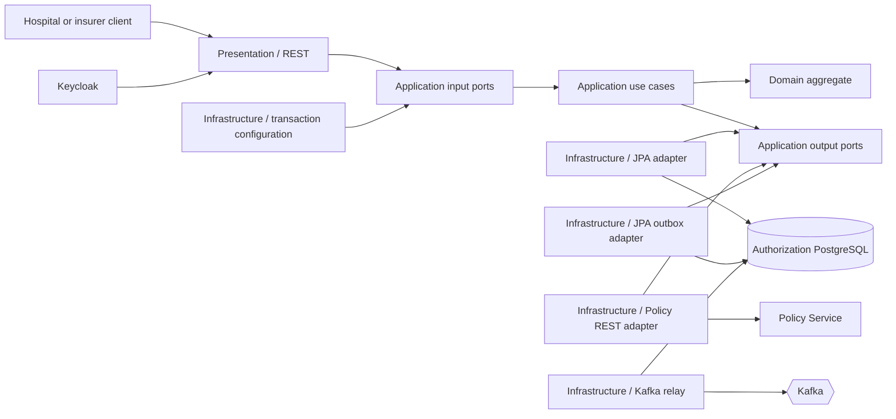
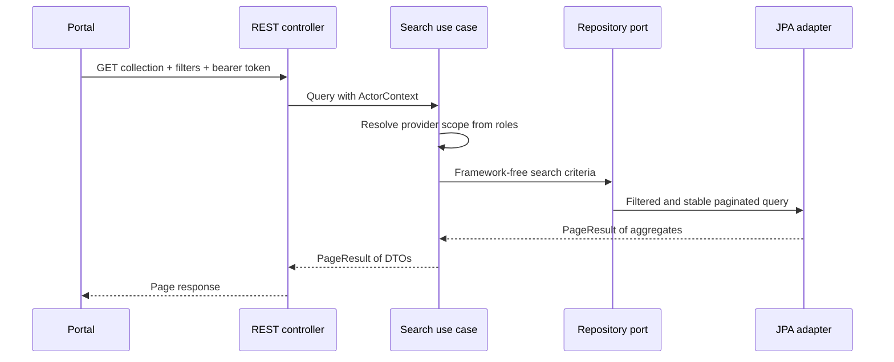
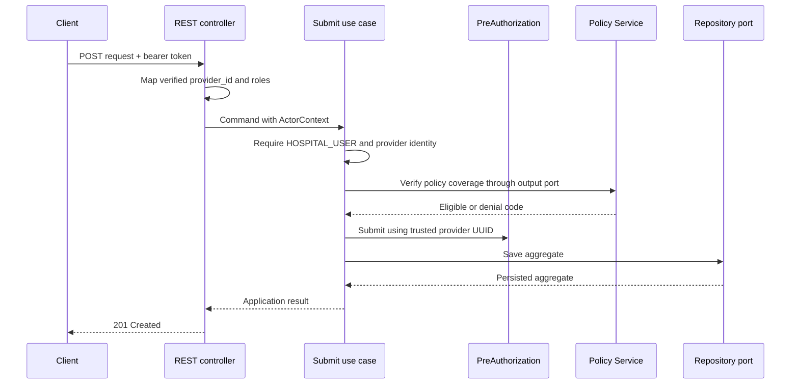

# Authorization Service components

The Authorization Service uses Clean Architecture inside its bounded context.

## Package responsibilities

- `domain.model`: aggregate state and business invariants.
- `domain.exception`: domain-specific rule violations.
- `application.port.in`: operations exposed by the application core.
- `application.port.out`: capabilities required from infrastructure.
- `application.usecase`: orchestration, ownership, and authorization policies.
- `application.command` and `application.query`: explicit use-case inputs.
- `application.dto`: framework-independent use-case results.
- `infrastructure.persistence`: JPA entities, Spring Data, and repository adapter.
- `infrastructure.messaging`: outbox persistence and at-least-once Kafka relay.
- `infrastructure.security`: OAuth2 resource-server configuration.
- `infrastructure.configuration`: dependency wiring and transaction boundaries.
- `presentation.rest`: HTTP requests, responses, validation, and Problem Details.

The application service remains framework-free. An infrastructure decorator
wraps its input ports in Spring-managed transactions: commands use read/write
transactions and queries use read-only transactions.

## Paginated work queue

The list operation uses application-owned `SearchPreAuthorizationsQuery`,
`PreAuthorizationSearchCriteria`, and `PageResult` types. Spring Data `Page`,
`Pageable`, and `Specification` remain inside the persistence adapter.

Hospital users always receive a provider-scoped query. Insurance specialists
and system administrators can search across providers. Sort fields are
explicitly allow-listed, and `id` is added as a deterministic tie-breaker so
records do not move unpredictably between pages when primary sort values match.

## Concurrent decisions

The JPA entity has a version column. If two specialists load the same pending
request, the first decision increments that version and the second update no
longer matches the database row. The persistence adapter flushes inside the
transaction boundary and translates Spring's optimistic-lock exception into an
application conflict. The REST boundary returns an RFC 9457 `409 Conflict`
response with the `concurrent-update` problem type.

## Decision event flow

Approval/rejection and its outbox message are part of the same transaction.
The relay is deliberately outside the domain: broker delivery is an
infrastructure concern, while the application only depends on an outbox port.
See the [event-driven messaging view](event-driven-messaging.md).

## Submit flow

