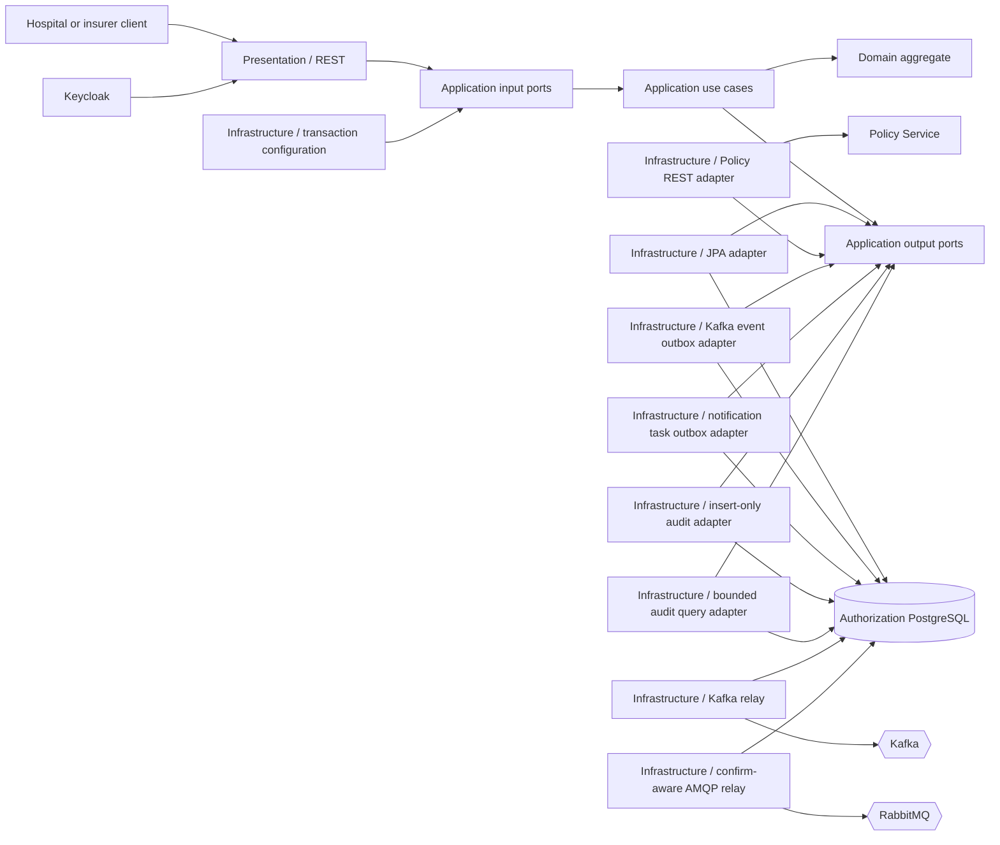
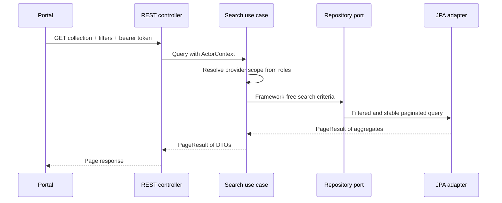
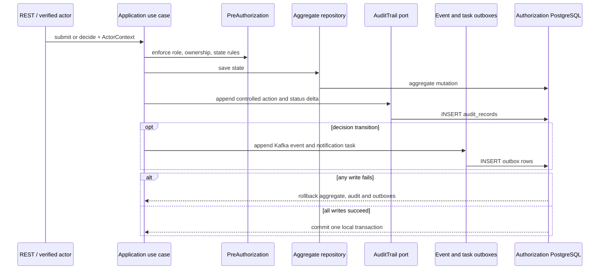
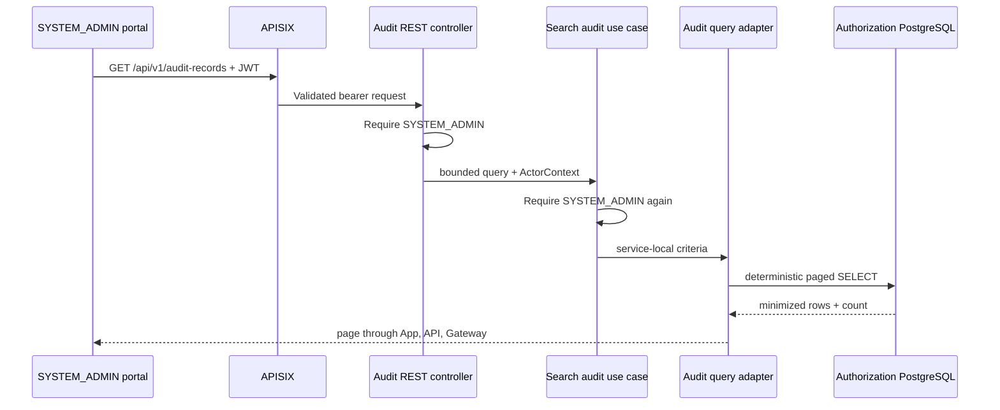
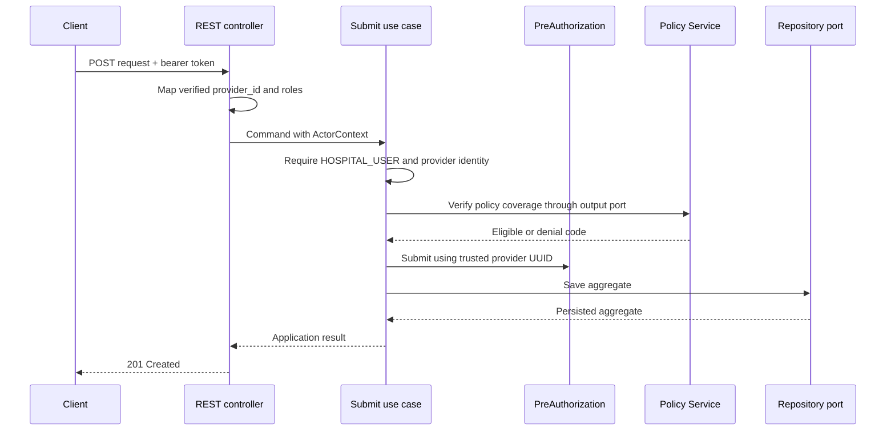

# Authorization Service components

The Authorization Service uses Clean Architecture inside its bounded context.

## Package responsibilities

- `domain.model`: aggregate state and business invariants.
- `domain.exception`: domain-specific rule violations.
- `application.port.in`: operations exposed by the application core.
- `application.port.out`: capabilities required from infrastructure.
- `application.usecase`: orchestration, ownership, and authorization policies.
- `application.command` and `application.query`: explicit use-case inputs.
- `application.dto`: framework-independent use-case results.
- `infrastructure.persistence`: JPA entities, Spring Data, and repository adapter.
- `infrastructure.messaging`: Kafka and notification outbox persistence,
  at-least-once relays, safe wire mapping, and RabbitMQ topology.
- `infrastructure.security`: OAuth2 resource-server configuration.
- `infrastructure.configuration`: dependency wiring and transaction boundaries.
- `presentation.rest`: HTTP requests, responses, validation, and Problem Details.

The application service remains framework-free. An infrastructure decorator
wraps its input ports in Spring-managed transactions: commands use read/write
transactions and queries use read-only transactions.

`CleanArchitectureTest` uses allowlists for the inner layers: Domain may depend
only on Java and Domain, while Application may depend only on Java, Domain, and
Application. Presentation cannot bypass Application to reach Domain or
Infrastructure, and Infrastructure cannot depend on Presentation. This fails
fast when a future framework dependency accidentally enters an inner layer.

## Paginated work queue

The list operation uses application-owned `SearchPreAuthorizationsQuery`,
`PreAuthorizationSearchCriteria`, and `PageResult` types. Spring Data `Page`,
`Pageable`, and `Specification` remain inside the persistence adapter.

Hospital users always receive a provider-scoped query. Insurance specialists
and system administrators can search across providers. Sort fields are
explicitly allow-listed, and `id` is added as a deterministic tie-breaker so
records do not move unpredictably between pages when primary sort values match.

Query inputs are bounded before persistence: pages cannot be negative, page
size is `1..100`, status/sort/direction values use allowlists, and policy number
filters are capped at the persisted 50-character limit. PostgreSQL provides a
composite `(provider_id, status, created_at)` index for the default hospital
work queue, a functional `lower(policy_number)` index for case-insensitive exact
matching, and member/status access indexes. The integration test proves filter,
scope, sort, and pagination semantics against PostgreSQL. These are query-design
controls, not a claim of measured throughput; no load benchmark is attached to
this service.

## Concurrent decisions

The JPA entity has a version column. If two specialists load the same pending
request, the first decision increments that version and the second update no
longer matches the database row. The persistence adapter flushes inside the
transaction boundary and translates Spring's optimistic-lock exception into an
application conflict. The REST boundary returns an RFC 9457 `409 Conflict`
response with the `concurrent-update` problem type.

## Persistence integrity

The aggregate validates positive monetary requests and consistent lifecycle
data when it is created or rehydrated. Liquibase changeset `008` repeats the
critical invariants at the PostgreSQL boundary: allowed statuses, positive
amount, non-negative optimistic-lock version, uppercase three-letter currency,
and the relationship between status, decision reason, and decision timestamp.
Domain validation remains the first line of defense; database constraints also
protect direct SQL, maintenance scripts, and future persistence adapters.

JPA uses a zero-based `@Version`. Integration/search contracts deliberately
publish `sourceRevision = version + 1`, giving an issued request business
revision `1` and its first decision revision `2`. Rebuild exports use the same
mapping, so live events and reconstructed search records remain comparable.

## REST security and error contract

Keycloak realm roles are mapped to Spring `ROLE_*` authorities, while the
signed `provider_id` claim becomes the application actor's provider scope.
Hospital-owned reads and submissions therefore never trust a provider supplied
in JSON or query parameters. Endpoint annotations reject invalid roles before
the use case, and the framework-free application layer repeats capability and
ownership checks for defense in depth.

Both Spring Security filter failures and controller/application failures use
RFC 9457 `application/problem+json`. Missing authentication returns `401` with
the `authentication-required` problem type; an authenticated caller lacking a
required role returns `403` with `operation-not-permitted`. This keeps browser,
gateway, and direct API clients on one predictable error contract.

## Decision event flow

Approval/rejection, its Kafka event, and its minimal notification task are part
of the same transaction. Separate output ports and tables prevent the Kafka
relay from accidentally publishing a RabbitMQ command. Broker relays remain
outside the domain; the application depends only on outbox ports.
See the [event-driven messaging view](event-driven-messaging.md).

The PostgreSQL transaction integration test disables Kafka auto-configuration
because it verifies durable outbox intent rather than broker delivery. Kafka and
RabbitMQ relay behavior is covered separately. This keeps the test boundary
explicit and prevents unrelated broker retries from slowing the suite.

## Transactional audit evidence

Submission, approval, and rejection append a minimized `AuditRecord` through an
application output port. The application contract is framework-free; an MDC
context adapter supplies the validated correlation ID and a JDBC adapter writes
the local journal. The transaction decorator encloses the aggregate save, audit
append, Kafka outbox append, and notification-task append.

The journal deliberately omits member/policy identifiers, diagnosis/service
codes, money, free-text reasons, tokens, and request bodies. PostgreSQL rejects
row update/delete and table truncation. This is strong application-level
append-only protection, but not cryptographic immutability against a privileged
database administrator; that residual control belongs to later backup/WORM and
operational governance work.

## Privileged audit query

`GET /api/v1/audit-records` maps HTTP parameters into the framework-independent
`SearchAuditRecordsQuery` input port. The controller rejects callers without
`SYSTEM_ADMIN`, and the application use case repeats that check so alternate
adapters cannot bypass it. The query adapter accepts only an optional aggregate
UUID and an allowlisted Authorization action, caps page size at 100, and sorts by
`occurred_at DESC, audit_id DESC`. It maps rows directly to minimized application
DTOs; business aggregates and sensitive source columns are never joined.

The notification relay uses a pessimistic write lock to keep concurrent service
instances from selecting the same pending batch. It sends a persistent message
to a durable direct-exchange route, waits for the correlated broker confirm,
and also checks mandatory publisher returns. A `nack`, timeout, serialization
failure, or unroutable return increments the attempt count and leaves the task
unpublished for the next scheduled poll.

## Submit flow

The Policy REST adapter relays the initiating bearer token and correlation ID,
uses bounded two-second connect and three-second read timeouts, and fails closed.
HTTP/network failures, unreadable JSON, an empty body, or a response without a
stable decision code and reason are treated as Policy dependency failures; no
`PENDING` pre-authorization is persisted. A valid business denial remains a
domain outcome and is translated by Authorization to `422` Problem Details.
