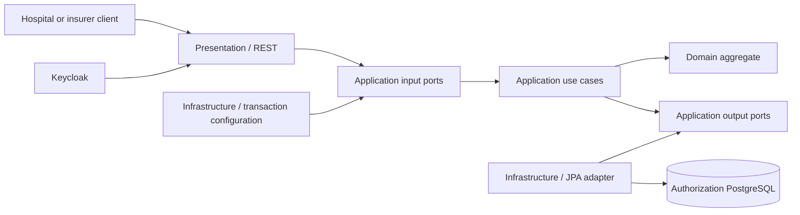
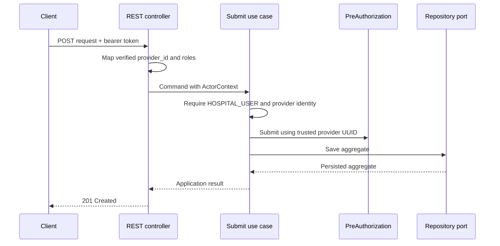

# Authorization Service components

The Authorization Service uses Clean Architecture inside its bounded context.

## Package responsibilities

- `domain.model`: aggregate state and business invariants.
- `domain.exception`: domain-specific rule violations.
- `application.port.in`: operations exposed by the application core.
- `application.port.out`: capabilities required from infrastructure.
- `application.usecase`: orchestration, ownership, and authorization policies.
- `application.command` and `application.query`: explicit use-case inputs.
- `application.dto`: framework-independent use-case results.
- `infrastructure.persistence`: JPA entities, Spring Data, and repository adapter.
- `infrastructure.security`: OAuth2 resource-server configuration.
- `infrastructure.configuration`: dependency wiring and transaction boundaries.
- `presentation.rest`: HTTP requests, responses, validation, and Problem Details.

## Submit flow

