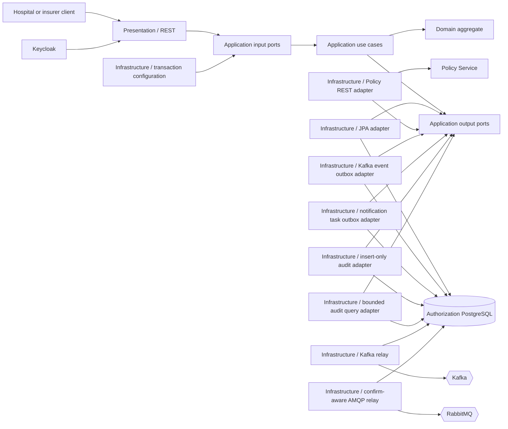
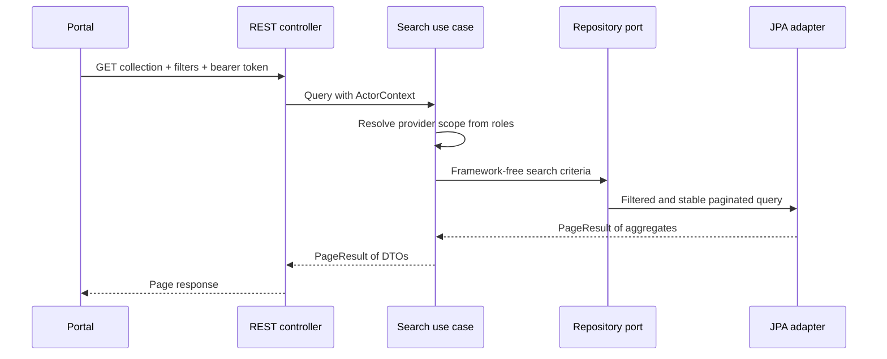
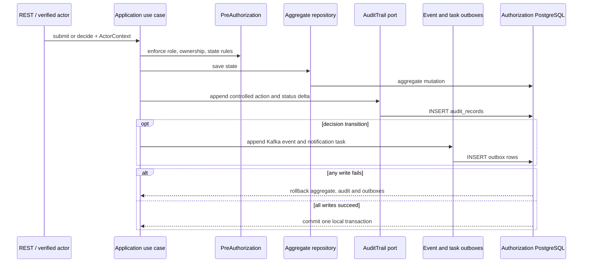
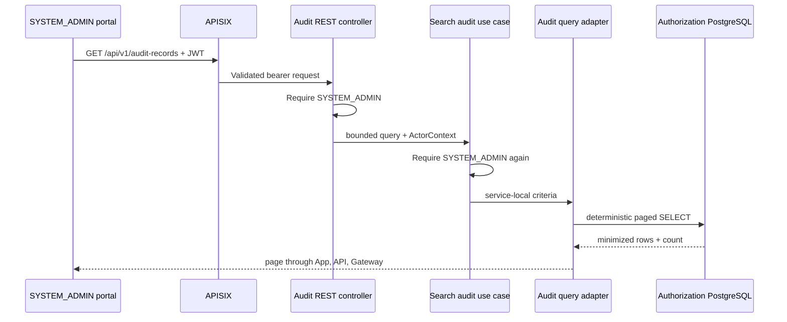
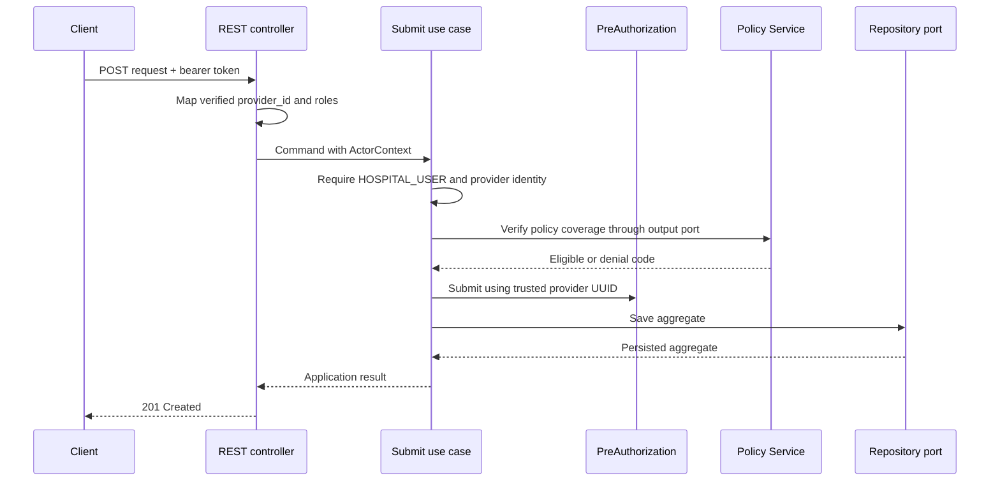

# Authorization Service bileşenleri

Authorization Service kendi bounded context'i içinde Clean Architecture kullanır.

## Package sorumlulukları

- `domain.model`: aggregate state ve business invariant'lar.
- `domain.exception`: domain'e özgü rule violation'lar.
- `application.port.in`: application core tarafından dışarı açılan operation'lar.
- `application.port.out`: infrastructure'dan beklenen capability'ler.
- `application.usecase`: orchestration, ownership ve authorization policy'leri.
- `application.command` ve `application.query`: açık use-case input'ları.
- `application.dto`: framework bağımsız use-case result'ları.
- `infrastructure.persistence`: JPA entity'leri, Spring Data ve repository adapter.
- `infrastructure.messaging`: Kafka ve notification outbox persistence,
  at-least-once relay'ler, safe wire mapping ve RabbitMQ topology.
- `infrastructure.security`: OAuth2 resource-server configuration.
- `infrastructure.configuration`: dependency wiring ve transaction boundary'leri.
- `presentation.rest`: HTTP request/response, validation ve Problem Details.

Application service framework bağımsız kalır. Infrastructure decorator input port'ları
Spring-managed transaction'larla sarar: command'lar read/write transaction, query'ler
read-only transaction kullanır.

`CleanArchitectureTest` inner layer'lar için allowlist kullanır: Domain yalnızca
Java ve Domain'e, Application ise yalnızca Java, Domain ve Application'a bağımlı
olabilir. Presentation, Domain veya Infrastructure'a erişmek için Application'ı
bypass edemez; Infrastructure da Presentation'a bağımlı olamaz. Bu yaklaşım,
gelecekte bir framework dependency yanlışlıkla inner layer'a girdiğinde hızlıca
failure üretir.

## Sayfalı iş kuyruğu

List operation application-owned `SearchPreAuthorizationsQuery`,
`PreAuthorizationSearchCriteria` ve `PageResult` type'larını kullanır.
Spring Data `Page`, `Pageable` ve `Specification` yalnızca persistence adapter
içinde kalır.

Hospital user'lar her zaman provider-scoped query alır. Insurance specialist ve
system administrator provider'lar arasında search yapabilir. Sort field'ları açıkça
allowlist edilir ve primary sort value eşit olduğunda record'ların page'ler arasında
öngörülemez şekilde hareket etmesini önlemek için `id` deterministic tie-breaker
olarak eklenir.

Query input'ları persistence öncesinde sınırlandırılır: page negatif olamaz, page size
`1..100`, status/sort/direction allowlist kullanır ve policy number filter'ı persist
edilen 50-character limit ile sınırlandırılır. PostgreSQL default hospital work queue
için composite `(provider_id, status, created_at)` index, case-insensitive exact match
için functional `lower(policy_number)` index ve member/status access index'leri sağlar.
Integration test PostgreSQL üzerinde filter, scope, sort ve pagination semantics'i
doğrular. Bunlar query-design control'leridir; measured throughput iddiası değildir ve
servise load benchmark eklenmemiştir.

## Concurrent kararlar

JPA entity version column'a sahiptir. İki specialist aynı pending request'i yüklerse
ilk decision bu version'ı artırır ve ikinci update artık database row ile eşleşmez.
Persistence adapter transaction boundary içinde flush eder ve Spring optimistic-lock
exception'ını application conflict'e translate eder. REST boundary RFC 9457
`409 Conflict` response ve `concurrent-update` problem type döndürür.

## Persistence bütünlüğü

Aggregate oluşturulurken veya rehydrate edilirken positive monetary request ve
consistent lifecycle data doğrular. Liquibase changeset `008` kritik invariant'ları
PostgreSQL boundary'de tekrarlar: allowed status'lar, positive amount,
non-negative optimistic-lock version, uppercase three-letter currency ve status,
decision reason ile decision timestamp arasındaki ilişki. Domain validation first line
of defense olmaya devam eder; database constraint'leri direct SQL, maintenance script
ve future persistence adapter'ları da korur.

JPA zero-based `@Version` kullanır. Integration/search contract'ları bilinçli olarak
`sourceRevision = version + 1` yayınlar; böylece issued request business revision
`1`, ilk decision revision `2` olur. Rebuild export'ları aynı mapping'i kullanır;
live event'ler ve reconstructed search record'ları karşılaştırılabilir kalır.

## REST security ve error contract

Keycloak realm role'leri Spring `ROLE_*` authority'lerine map edilir; signed
`provider_id` claim application actor'ın provider scope'u olur. Hospital-owned read
ve submission bu nedenle JSON veya query parameter içinden gelen provider'a güvenmez.
Endpoint annotation'ları invalid role'leri use case öncesinde reddeder; framework
bağımsız application layer defense in depth için capability ve ownership check'lerini
tekrarlar.

Hem Spring Security filter failure'ları hem controller/application failure'ları RFC
9457 `application/problem+json` kullanır. Missing authentication `401` ve
`authentication-required` problem type döndürür; required role'a sahip olmayan
authenticated caller `403` ve `operation-not-permitted` alır. Böylece browser,
gateway ve direct API client'ları aynı predictable error contract'ı kullanır.

## Decision event flow

Approval/rejection, Kafka event'i ve minimal notification task aynı transaction'ın
parçasıdır. Ayrı output port ve table'lar Kafka relay'in yanlışlıkla RabbitMQ command
publish etmesini engeller. Broker relay'leri domain dışında kalır; application yalnızca
outbox port'larına bağımlıdır.
Bkz. [event-driven messaging görünümü](event-driven-messaging.md).

PostgreSQL transaction integration testi Kafka auto-configuration'ı kapatır; çünkü
broker delivery değil durable outbox intent doğrular. Kafka ve RabbitMQ relay behavior
ayrı testlerle kapsanır. Bu test boundary'sini açık tutar ve ilgisiz broker retry'ların
suite'i yavaşlatmasını engeller.

## Transactional audit evidence

Submission, approval ve rejection application output port üzerinden minimized
`AuditRecord` append eder. Application contract framework bağımsızdır; MDC context
adapter validated correlation ID sağlar ve JDBC adapter local journal'a yazar.
Transaction decorator aggregate save, audit append, Kafka outbox append ve
notification-task append işlemlerini aynı boundary içinde tutar.

Journal bilinçli olarak member/policy identifier, diagnosis/service code, money,
free-text reason, token ve request body içermez. PostgreSQL row update/delete ve
table truncation'ı reddeder. Bu güçlü application-level append-only protection'dır;
privileged database administrator'a karşı cryptographic immutability iddiası değildir.
Bu residual control daha sonraki backup/WORM ve operational governance çalışmasına aittir.

## Privileged audit query

`GET /api/v1/audit-records`, HTTP parameter'larını framework bağımsız
`SearchAuditRecordsQuery` input port'una map eder. Controller `SYSTEM_ADMIN`
olmayan caller'ları reddeder ve application use case bu check'i tekrarlar; böylece
alternative adapter bypass edemez. Query adapter yalnızca optional aggregate UUID ve
allowlisted Authorization action kabul eder, page size'ı 100 ile sınırlar ve
`occurred_at DESC, audit_id DESC` sıralaması yapar. Row'ları doğrudan minimized
application DTO'larına map eder; business aggregate veya sensitive source column
join edilmez.

Notification relay, concurrent service instance'larının aynı pending batch'i seçmesini
engellemek için pessimistic write lock kullanır. Persistent message'ı durable
direct-exchange route'a gönderir, correlated broker confirm bekler ve mandatory
publisher return'leri de kontrol eder. `nack`, timeout, serialization failure veya
unroutable return attempt count'u artırır ve task'ı sonraki scheduled poll için
unpublished bırakır.

## Submit flow

Policy REST adapter initiating bearer token ve correlation ID'yi relay eder, bounded
iki saniyelik connect ve üç saniyelik read timeout kullanır ve fail-closed davranır.
HTTP/network failure, okunamayan JSON, empty body veya stable decision code/reason
olmayan response Policy dependency failure sayılır; hiçbir `PENDING` pre-authorization
persist edilmez. Valid business denial domain outcome olarak kalır ve Authorization
tarafından `422` Problem Details'e çevrilir.
