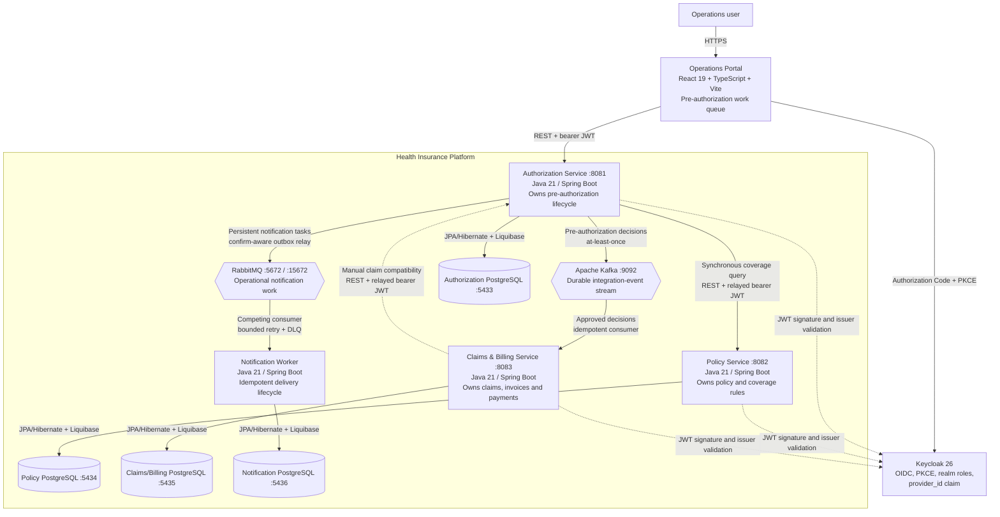

# C4 Level 2 — Container Diagram

## Communication decisions

| Caller | Callee | Current purpose | Failure behavior |
| --- | --- | --- | --- |
| Portal | Authorization | Work queue, detail, submission and decision | UI error state; no local copy of server state |
| Authorization | Policy | Coverage eligibility before accepting a request | Fail closed with 503; nothing persisted |
| Claims/Billing | Authorization | Confirm current approved, provider-owned authorization | Fail closed with 503; no claim or invoice persisted |
| Authorization | Kafka | Publish committed decisions from the outbox | Row remains unpublished and the next poll retries |
| Kafka | Claims/Billing | Start claim/invoice from approval | Idempotent no-op on duplicate; three attempts then DLT |
| Authorization | RabbitMQ | Publish committed provider-notification commands | Positive confirm and no mandatory return mark outbox row published |
| RabbitMQ | Notification Worker | Distribute operational delivery work | Retry classified transient failures; permanent/exhausted tasks go to DLQ |

Redis, Elasticsearch, APISIX and Kubernetes are not shown because they remain
roadmap items rather than current runtime components.
