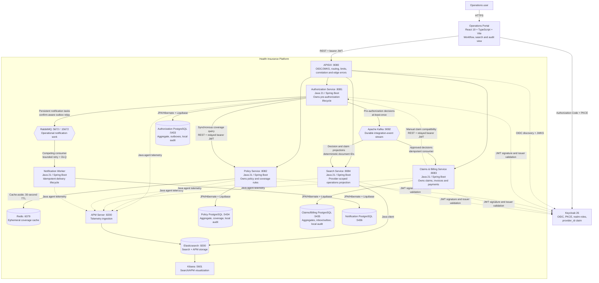

# C4 Level 2 — Container Diagram

## Communication decisions

| Caller | Callee | Current purpose | Failure behavior |
| --- | --- | --- | --- |
| Portal | APISIX | Single external business API, authentication and traffic governance | RFC 9457 gateway error with correlation ID |
| APISIX | Spring APIs | Route authenticated requests over the private Compose network | Bounded connect/send/read timeout; upstream unavailable response |
| Authorization | Policy | Coverage eligibility before accepting a request | Fail closed with 503; nothing persisted |
| Claims/Billing | Authorization | Confirm current approved, provider-owned authorization | Fail closed with 503; no claim or invoice persisted |
| Authorization | Kafka | Publish committed decisions from the outbox | Row remains unpublished and the next poll retries |
| Kafka | Claims/Billing | Start claim/invoice from approval | Idempotent no-op on duplicate; three attempts then DLT |
| Authorization | RabbitMQ | Publish committed provider-notification commands | Positive confirm and no mandatory return mark outbox row published |
| RabbitMQ | Notification Worker | Distribute operational delivery work | Retry classified transient failures; permanent/exhausted tasks go to DLQ |
| Policy | Redis | Cache repeated immutable coverage evaluations | Fail open to authoritative PostgreSQL evaluation |
| Claims/Billing | Kafka/Search | Publish transactionally recorded operational projections | Outbox row remains pending until acknowledged |
| Portal | Search | Provider-authorized full-text/filter query | Empty/error state; no impact on source transactions |
| Portal | Authorization/Policy/Claims audit APIs | `SYSTEM_ADMIN` service-local evidence query | Controller and use-case authorization; bounded filters/page; no cross-database join |

Kubernetes remains a roadmap item and is not shown as a current runtime
component.
