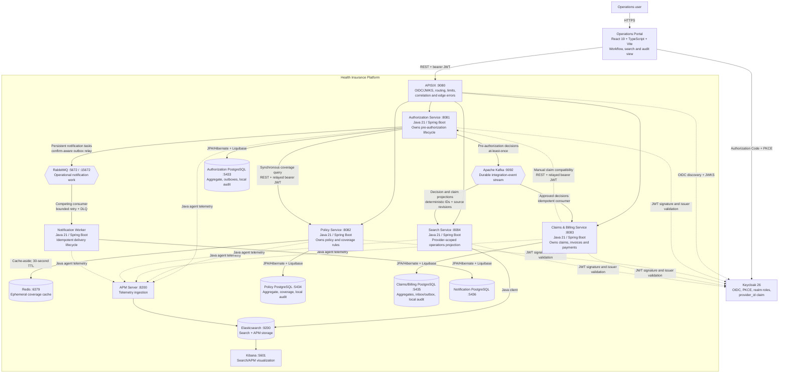
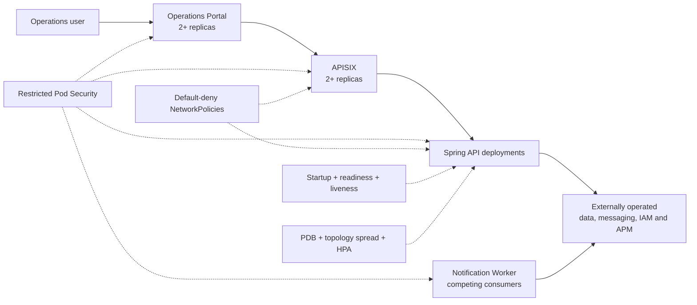

# C4 Level 2 — Container Diyagramı

## İletişim kararları

| Caller | Callee | Mevcut amaç | Failure davranışı |
| --- | --- | --- | --- |
| Portal | APISIX | Tek external business API, authentication ve traffic governance | Correlation ID içeren RFC 9457 gateway hatası |
| APISIX | Spring API'leri | Authenticated request'leri private Compose network üzerinden route etmek | Bounded connect/send/read timeout; upstream unavailable response |
| Authorization | Policy | Request kabulünden önce coverage eligibility | 503 ile fail-closed; hiçbir şey persist edilmez |
| Claims/Billing | Authorization | Current approved, provider-owned authorization'ı doğrulamak | 503 ile fail-closed; claim veya invoice persist edilmez |
| Authorization | Kafka | Commit edilmiş decision'ları outbox'tan publish etmek | Row unpublished kalır, sonraki poll retry eder |
| Kafka | Claims/Billing | Approval'dan claim/invoice başlatmak | Duplicate'te idempotent no-op; üç deneme sonrası DLT |
| Authorization | RabbitMQ | Commit edilmiş provider-notification command'larını publish etmek | Positive confirm ve mandatory return olmaması outbox row'u published yapar |
| RabbitMQ | Notification Worker | Operational delivery work dağıtmak | Classified transient failure retry edilir; permanent/exhausted task DLQ'ya gider |
| Policy | Redis | Tekrarlanan immutable coverage evaluation'ları cache'lemek | Authoritative PostgreSQL evaluation'a fail-open |
| Claims/Billing | Kafka/Search | Transactionally recorded operational projection publish etmek | Outbox row acknowledge edilene kadar pending kalır |
| Portal | Search | Provider-authorized full-text/filter query | Empty/error state; source transaction'lara etkisi yoktur |
| Portal | Authorization/Policy/Claims audit API'leri | `SYSTEM_ADMIN` service-local evidence query | Controller ve use-case authorization; bounded filter/page; cross-database join yok |

## Kubernetes deployment görünümü

Kubernetes stateless rollout ve isolation'ın sahibidir. Stateful dependency'ler
ayrı işletilen contract'lar olarak kalır; bu diyagram application repository'nin
bunlar için production high availability sağladığını ima etmez.
