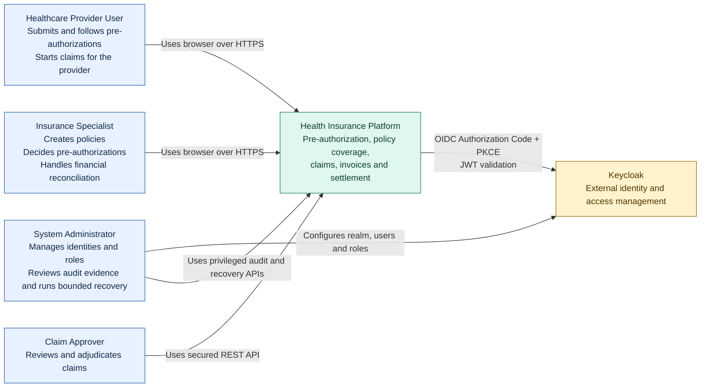

# C4 Level 1 — Sistem Bağlamı

Bu diyagram Milestone 10'a kadar uygulanan kullanıcı ve trust boundary'yi açıklar.
Runtime container'lar ve broker'lar Level 2 görünümünde ayrıntılandırılır.

## Trust boundary'leri

- Browser input trusted değildir. Provider ownership request body'den değil,
  signed `provider_id` token claim'inden türetilir.
- Keycloak kullanıcıları authenticate eder; her servis JWT'leri bağımsız olarak
  doğrular ve application-level authorization uygular.
- Hiçbir servis başka bir servisin database'ini okumaz.
- Public repository ve demo asset'lerinde yalnızca sentetik veri kullanılabilir.
