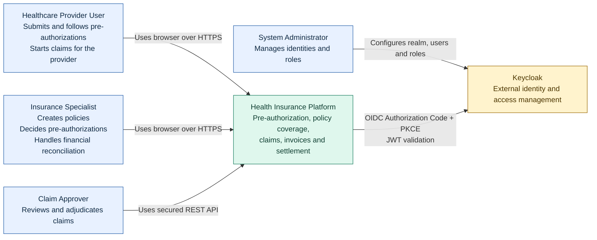

# C4 Level 1 — System Context

This diagram describes the system and people implemented through Milestone 4.
Dashed elements are external dependencies; future messaging/search components
are deliberately excluded because they are not implemented yet.

## Trust boundaries

- Browser input is untrusted. Provider ownership is derived from the signed
  `provider_id` token claim, never from a request body.
- Keycloak authenticates users; every service independently validates JWTs and
  enforces application-level authorization.
- No service reads another service's database.
- Only synthetic data may be used in the public repository and demo assets.
