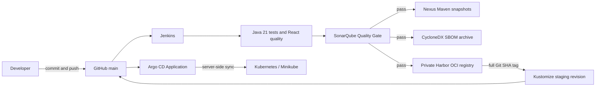

# CI/CD and software supply chain

## Verified checkpoint

| Boundary | Evidence |
|---|---|
| Git | `main` contains the pipeline and immutable GitOps revision |
| Jenkins | Build #7 reached successful tests, frontend, Sonar, Nexus and SBOM stages |
| SonarQube | Blocking Quality Gate succeeded |
| Nexus | Authorization smoke upload and all Jenkins Maven publications succeeded |
| Harbor | Six existing service images were pushed with tag `7fc3ea6b1086d3f5be2d7adeb9f43bda6bd6ad8d` |
| Argo CD | Seven control-plane pods became Ready; Application sync operation succeeded |
| Kubernetes | Git revision `a56fff2a14405d3024b98f357b1c3b38edd8384b` rendered and synced |

The quality stack was revalidated from its existing images and persistent
volumes on 15 September 2026 without a rebuild or new pipeline run. Jenkins,
SonarQube and Sonar PostgreSQL were healthy; authenticated APIs, internal DNS,
the Sonar webhook and the `OK` gate for revision `7fc3ea6b...` were confirmed.
Build #7 remains overall red because its final Harbor stage failed; its upstream
quality, Nexus and SBOM stages remain successful stage-level evidence. See the
[local verification record](../development/jenkins-sonarqube-local-verification.md).

Nexus was independently revalidated from its persisted volume without a build,
pull or publication. Its EULA state, six Maven components and eight repository-
scoped publisher privileges were confirmed. Anonymous access was found enabled
and was disabled; metadata now returns `403` without credentials and `200` for
the least-privilege publisher. See the
[Nexus verification record](../development/nexus-local-verification.md).

Harbor was rebuilt only at the runtime-metadata boundary: no application image
was rebuilt. Its private project, anonymous `401`, 90-day four-permission robot,
six SHA-tagged repositories and exact manifest digests were verified. Docker
Desktop bind-mount ownership/type defects were corrected without deleting data.
See the [Harbor verification record](../development/harbor-local-verification.md).

`Progressing` or `Degraded` after sync is expected locally because production-owned databases,
brokers, IAM, TLS, and external secrets are not fabricated inside the GitOps
repository. This is a deployment dependency boundary, not a failed sync.

## Failure boundaries

- Quality failure: stop before Nexus/Harbor.
- Nexus failure: retry Maven publication only.
- Harbor failure: reuse existing images and retry tag/push only.
- GitOps failure: do not rebuild; correct the manifest or cluster dependency and
  resync the same immutable image revision.
