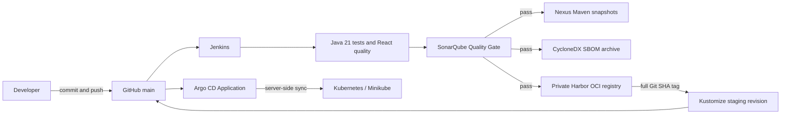

# CI/CD and software supply chain

## Verified checkpoint

| Boundary | Evidence |
|---|---|
| Git | `main` contains the pipeline and immutable GitOps revision |
| Jenkins | Build #10 completed the entire pipeline successfully at source `6c07fa8...` |
| SonarQube | Blocking Quality Gate succeeded; overall coverage `80.3%` |
| Nexus | Five Java artifacts and five provenance classifiers published |
| Harbor | Six OCI images published with tag and revision label `6c07fa8...` |
| Argo CD | Seven control-plane pods became Ready; restricted Application sync operation succeeded |
| Kubernetes | GitOps revision `c9c1baa...` promoted all six `6c07fa8...` images |

The quality stack was revalidated from its existing images and persistent
volumes on 15 September 2026 without a rebuild or new pipeline run. Jenkins,
SonarQube and Sonar PostgreSQL were healthy; authenticated APIs, internal DNS,
the Sonar webhook and the `OK` gate for revision `6c07fa8...` were confirmed.
Build #10 is the final successful, end-to-end pipeline evidence. See the
[local verification record](../development/jenkins-sonarqube-local-verification.md).

Nexus was independently revalidated from its persisted volume without a build,
pull or publication. Its EULA state, six Maven components and eight repository-
scoped publisher privileges were confirmed. Anonymous access was found enabled
and was disabled; metadata now returns `403` without credentials and `200` for
the least-privilege publisher. See the
[Nexus verification record](../development/nexus-local-verification.md).

Harbor was rebuilt only at the runtime-metadata boundary: no application image
was rebuilt. Its private project, anonymous `401`, 90-day four-permission robot,
six SHA-tagged repositories and exact manifest digests were verified. Docker
Desktop bind-mount ownership/type defects were corrected without deleting data.
See the [Harbor verification record](../development/harbor-local-verification.md).

Argo CD was independently verified at revision `c9c1baa...`: its seven
control-plane pods were Ready, the restricted AppProject excluded Secret and
RBAC ownership, and one manual sync finished `Synced`/`Succeeded`. Runtime-only
registry credentials were inherited through per-workload ServiceAccounts. All
six SHA-tagged images were pulled from the private Harbor project and their
Deployment specifications use the exact Build #10 image revision. See the
[Argo CD verification record](../development/argocd-local-verification.md).

`Progressing` or `Degraded` after sync is expected locally because production-owned databases,
brokers, IAM, TLS, and external secrets are not fabricated inside the GitOps
repository. This is a deployment dependency boundary, not a failed sync.

## Failure boundaries

- Quality failure: stop before Nexus/Harbor.
- Nexus failure: retry Maven publication only.
- Harbor failure: reuse existing images and retry tag/push only.
- GitOps failure: do not rebuild; correct the manifest or cluster dependency and
  resync the same immutable image revision.

## Revision trace contract

One full 40-character commit identity crosses each boundary:

1. Jenkins checks out the commit and records `GIT_COMMIT`.
2. Every Maven publication attaches `build-provenance.json` with the commit,
   Jenkins build URL, and JAR SHA-256 to the same coordinate.
3. Every OCI image uses the commit as its tag and carries standard OCI
   `revision` and `source` labels.
4. The Kustomize environment uses that tag and adds the same source-revision
   annotation to rendered resources.
5. Argo CD reports the reviewed Git desired-state revision; Kubernetes exposes
   the promoted image tag, annotation, and exact runtime manifest digest.

The contract was exercised end to end by Build #10. Nexus provenance files,
Harbor OCI labels, Kustomize annotations, and Kubernetes image tags all identify
source revision `6c07fa8...`; Argo CD records the separate desired-state commit
`c9c1baa...` that promoted it.

GitHub Actions dependencies are pinned to reviewed full upstream commit SHAs;
the trailing major-version comments retain readability without allowing a tag
to move underneath a previously reviewed workflow.
