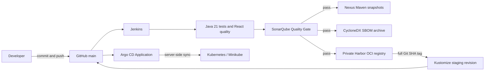

# CI/CD ve software supply chain

## Doğrulanmış checkpoint

| Boundary | Kanıt |
|---|---|
| Git | `main` pipeline ve immutable GitOps revision'ı içerir |
| Jenkins | Build #10 source `6c07fa8...` üzerinde tüm pipeline'ı başarıyla tamamladı |
| SonarQube | Blocking Quality Gate başarılı oldu; overall coverage `80.3%` |
| Nexus | Beş Java artifact ve beş provenance classifier yayınlandı |
| Harbor | Tag ve revision label `6c07fa8...` ile altı OCI image yayınlandı |
| Argo CD | Yedi control-plane pod Ready oldu; restricted Application sync operation başarılı oldu |
| Kubernetes | GitOps revision `c9c1baa...` tüm altı `6c07fa8...` image'ı promote etti |

Quality stack, 15 Eylül 2026'da rebuild veya yeni pipeline run olmadan mevcut
image ve persistent volume'lardan yeniden doğrulandı. Jenkins, SonarQube ve Sonar
PostgreSQL healthy durumdaydı; authenticated API'ler, internal DNS, Sonar webhook
ve revision `6c07fa8...` için `OK` gate doğrulandı. Build #10 son başarılı
end-to-end pipeline kanıtıdır. Bkz.
[local verification kaydı](../development/jenkins-sonarqube-local-verification.md).

Nexus da build, pull veya publication olmadan persisted volume üzerinden bağımsız
şekilde yeniden doğrulandı. EULA state'i, altı Maven component'i ve repository
scoped publisher için sekiz privilege doğrulandı. Anonymous access açık bulundu
ve kapatıldı; metadata artık credential olmadan `403`, least-privilege publisher
ile `200` döndürüyor. Bkz.
[Nexus verification kaydı](../development/nexus-local-verification.md).

Harbor yalnızca runtime-metadata boundary'de yeniden oluşturuldu; hiçbir application
image yeniden build edilmedi. Private project, anonymous `401`, 90 günlük dört
permission'lı robot, altı SHA-tagged repository ve exact manifest digest'leri
doğrulandı. Docker Desktop bind-mount ownership/type sorunları veri silinmeden
düzeltildi. Bkz. [Harbor verification kaydı](../development/harbor-local-verification.md).

Argo CD revision `c9c1baa...` üzerinde bağımsız olarak doğrulandı: yedi
control-plane pod Ready durumundaydı, restricted AppProject Secret ve RBAC
ownership'i dışlıyordu ve bir manual sync `Synced`/`Succeeded` ile tamamlandı.
Runtime-only registry credential'ları workload başına ServiceAccount üzerinden
inherit edildi. Altı SHA-tagged image'ın tamamı private Harbor project'ten pull
edildi ve Deployment specification'ları Build #10'un exact image revision'ını
kullanıyor. Bkz. [Argo CD verification kaydı](../development/argocd-local-verification.md).

Sync sonrasında `Progressing` veya `Degraded` durumu lokal ortamda beklenir;
çünkü production-owned database, broker, IAM, TLS ve external secret'lar GitOps
repository içinde yapay olarak oluşturulmaz. Bu bir deployment dependency
boundary'dir; failed sync değildir.

## Failure boundary'leri

- Quality failure: Nexus/Harbor öncesinde dur.
- Nexus failure: yalnızca Maven publication'ı retry et.
- Harbor failure: mevcut image'ları yeniden kullan ve yalnızca tag/push'u retry et.
- GitOps failure: rebuild etme; manifest veya cluster dependency'yi düzelt ve aynı
  immutable image revision'ı tekrar sync et.

## Revision trace contract

Tek bir tam 40 karakterli commit identity her boundary'den geçer:

1. Jenkins commit'i checkout eder ve `GIT_COMMIT` değerini kaydeder.
2. Her Maven publication aynı coordinate'e commit, Jenkins build URL ve JAR
   SHA-256 içeren `build-provenance.json` ekler.
3. Her OCI image commit'i tag olarak kullanır ve standard OCI `revision` ile
   `source` label'larını taşır.
4. Kustomize environment aynı tag'i kullanır ve rendered resource'lara aynı
   source-revision annotation'ını ekler.
5. Argo CD review edilmiş Git desired-state revision'ını raporlar; Kubernetes
   promote edilmiş image tag, annotation ve exact runtime manifest digest'i gösterir.

Contract Build #10 ile end-to-end çalıştırıldı. Nexus provenance file'ları, Harbor
OCI label'ları, Kustomize annotation'ları ve Kubernetes image tag'leri source
revision `6c07fa8...` değerini gösterir; Argo CD bunu promote eden ayrı
desired-state commit `c9c1baa...` değerini kaydeder.

GitHub Actions dependency'leri review edilmiş full upstream commit SHA'larına pin
edilmiştir; sondaki major-version comment'leri readability sağlar ancak daha önce
review edilmiş workflow'un altındaki tag'in hareket etmesine izin vermez.
