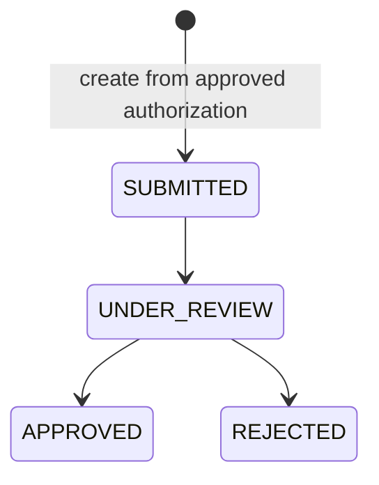
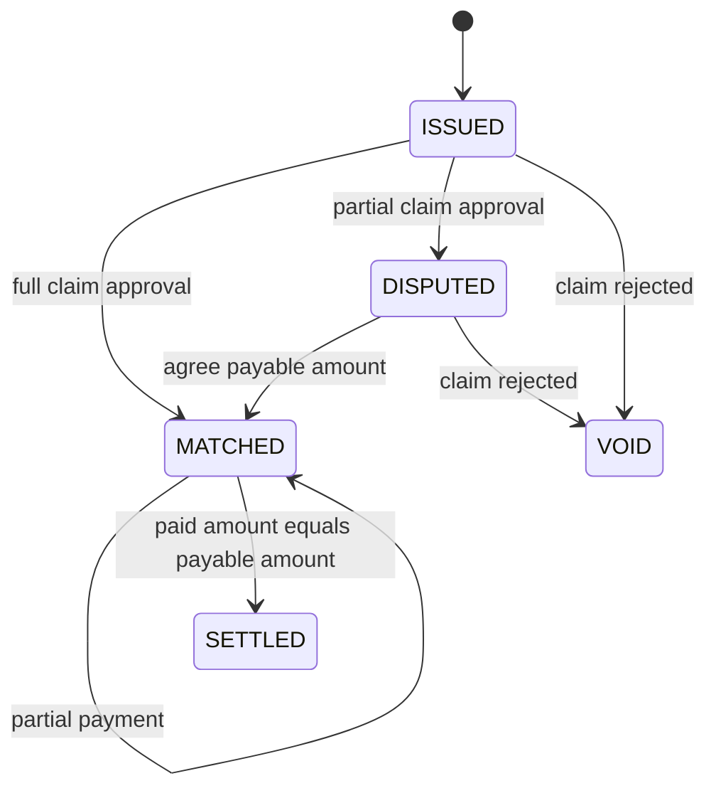
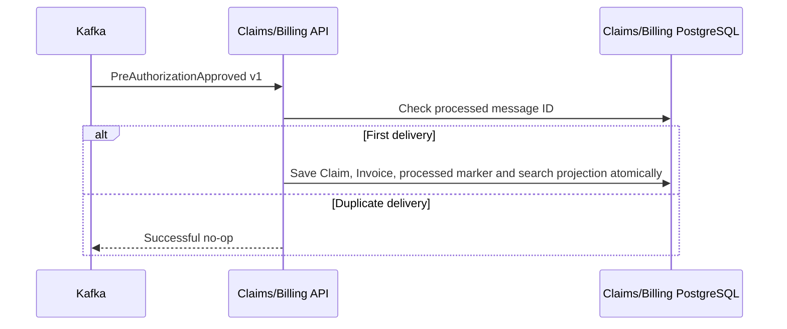
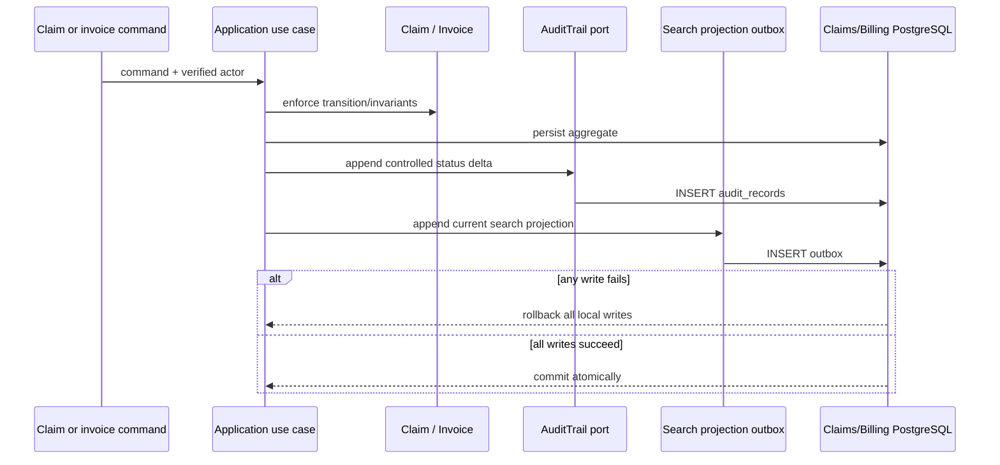

# Claims and Billing Service

## Responsibility and ownership

The service owns claim adjudication and the financial records derived from it:
claims, invoices, payment entries, reconciliation state, and settlement state.
It never reads the Authorization or Policy databases. Authorization remains the
source of truth for treatment approval; Policy remains the source of truth for
coverage rules and limits.

## Aggregate boundaries

`Claim` and `Invoice` are separate aggregate roots. Claim protects adjudication
rules and decision transitions. Invoice protects payable amount, reconciliation,
unique payment references, overpayment prevention, and settlement. They share a
local transaction because both are owned by this bounded context; approving or
rejecting a claim must update its invoice atomically.

## Event-driven creation flow

Application input/output ports keep the use cases framework independent. JPA,
REST, OAuth/JWT mapping, and transaction annotations live in infrastructure or
presentation. ArchUnit verifies these dependencies. PostgreSQL uniqueness
constraints prevent duplicate claims per pre-authorization and duplicate
invoice/payment references under concurrency; `@Version` protects updates.
Changeset `005` also mirrors aggregate lifecycle invariants at the database
boundary: allowlisted states, uppercase three-letter currencies, non-negative
versions, legal decision/reconciliation shapes, timestamp ordering, nonblank
payment references, and valid search-outbox counters. Aggregate rehydration
rejects inconsistent historical rows before they enter a use case.
The existing authenticated `POST /claims` path remains available for manual
submission compatibility and still verifies Authorization synchronously. New
approvals normally enter through Kafka and can be observed through the
provider-scoped `/claims/by-pre-authorization/{id}` query.

The synchronous adapter relays the caller's bearer token and uses bounded HTTP
timeouts. Its anti-corruption boundary validates response identity, required
fields, status, positive amount, and currency before constructing the
application record. Transport/`5xx`, deserialization, incomplete-contract,
identity-mismatch, invalid-value, and missing-token failures are normalized as
dependency unavailability and exposed as `503`. Only a genuine Authorization
`404` becomes an empty lookup. This prevents malformed or untrusted upstream
data from creating financial aggregates.

Spring Security JWT failures and method-security denials return RFC 9457
`application/problem+json`, matching controller/application failures. Domain
and Application packages use dependency allowlists in ArchUnit, so an unknown
outer framework cannot enter an inner layer merely because it was absent from
a denylist.

Every create/review/decision/reconciliation/payment transition also appends a
complete `ClaimSearchProjection` to `claim_search_outbox` inside the same local
transaction. A scheduled relay publishes version 1 to
`health.claims.search-projection.v1`. Search availability therefore cannot roll
back a financial command, while a committed command cannot lose its indexing
intent.

## Transactional financial audit

The command use cases append controlled evidence for claim submission, review,
approval/rejection, invoice issuance, reconciliation, voiding, dispute
resolution, and payment. The audit insert shares the owning PostgreSQL
transaction with the aggregate mutation and any search projection outbox row;
failure is fail-closed. Typed application records exclude member ID, policy
number, service code, amounts, payment references, and free-text reasons.
Liquibase constraints and triggers reject invalid change keys plus update,
delete, and truncate operations.

`GET /api/v1/claims/audit-records` requires `SYSTEM_ADMIN` in both presentation
and application layers. The service accepts only aggregate UUID, a Claims/Billing
action allowlist, and page sizes up to 100, ordered by occurrence and audit UUID.
Because Claim and Invoice are aggregates in the same bounded context, they share
this service-owned journal; Authorization and Policy audit records remain in
their respective databases and APIs.

