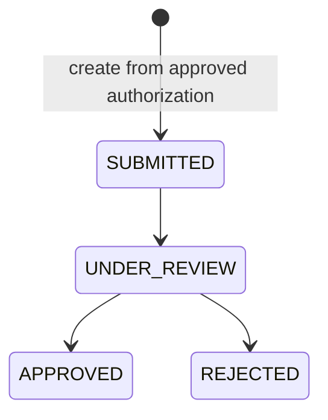
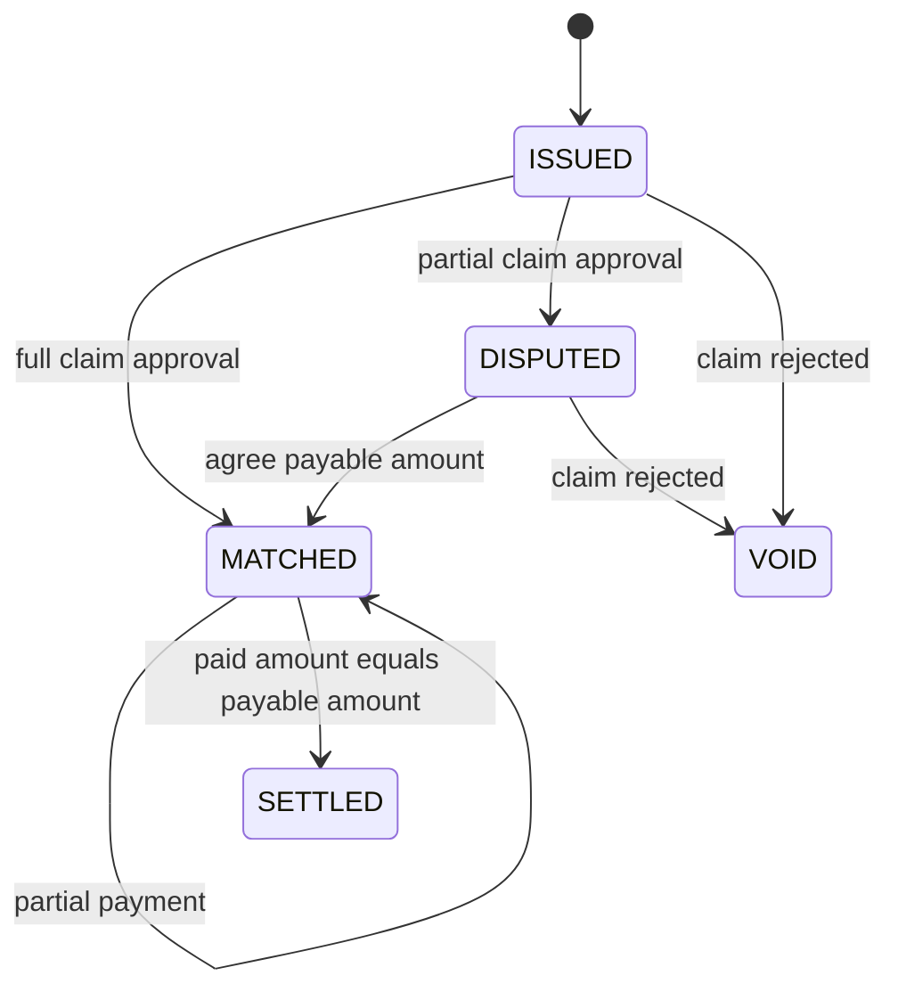
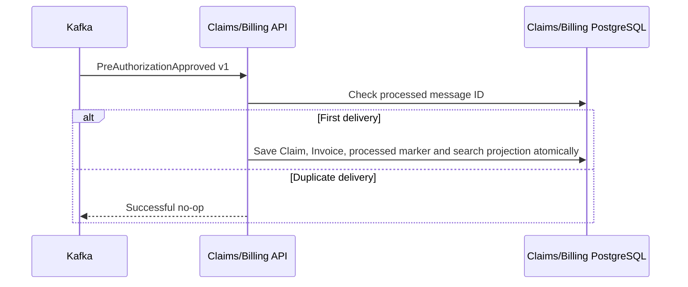
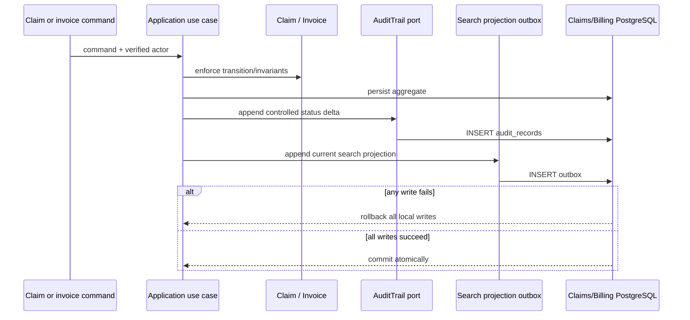

# Claims and Billing Service

## Sorumluluk ve sahiplik

Servis claim adjudication ve bundan türetilen finansal record'ların sahibidir:
claims, invoices, payment entry'leri, reconciliation state ve settlement state.
Authorization veya Policy database'lerini asla okumaz. Authorization treatment
approval için source of truth; Policy coverage rule ve limit'leri için source of
truth olmaya devam eder.

## Aggregate sınırları

`Claim` ve `Invoice` ayrı aggregate root'lardır. Claim adjudication rule ve
decision transition'larını korur. Invoice payable amount, reconciliation, unique
payment reference'ları, overpayment prevention ve settlement'ı korur. İkisi de bu
bounded context'e ait olduğu için local transaction paylaşır; claim approval veya
rejection invoice'u atomik olarak güncellemelidir.

## Event-driven creation flow

Application input/output port'ları use case'leri framework bağımsız tutar. JPA,
REST, OAuth/JWT mapping ve transaction annotation'ları infrastructure veya
presentation içinde bulunur. ArchUnit bu dependency'leri doğrular. PostgreSQL
uniqueness constraint'leri concurrency altında pre-authorization başına duplicate
claim'i ve duplicate invoice/payment reference'larını engeller; `@Version`
update'leri korur. Changeset `005` ayrıca aggregate lifecycle invariant'larını
database boundary'de tekrarlar: allowlisted state'ler, uppercase üç harfli currency,
non-negative version, legal decision/reconciliation shape'leri, timestamp ordering,
nonblank payment reference ve valid search-outbox counter'ları. Aggregate
rehydration tutarsız historical row'ları use case'e girmeden reddeder.

Mevcut authenticated `POST /claims` yolu manual submission compatibility için
kullanılabilir kalır ve Authorization'ı senkron doğrulamaya devam eder. Yeni
approval'lar normalde Kafka üzerinden gelir ve provider-scoped
`/claims/by-pre-authorization/{id}` query ile gözlemlenebilir.

Synchronous adapter caller'ın bearer token'ını relay eder ve bounded HTTP timeout
kullanır. Anti-corruption boundary response identity, required field, status,
positive amount ve currency değerlerini application record oluşturmadan önce
doğrular. Transport/`5xx`, deserialization, incomplete-contract, identity-mismatch,
invalid-value ve missing-token failure'ları dependency unavailability olarak
normalize edilir ve `503` sunulur. Yalnızca genuine Authorization `404` empty
lookup olur. Bu, malformed veya untrusted upstream data'nın financial aggregate
oluşturmasını engeller.

Spring Security JWT failure ve method-security denial'ları controller/application
failure'larıyla aynı RFC 9457 `application/problem+json` contract'ını kullanır.
Domain ve Application package'ları ArchUnit içinde dependency allowlist kullanır;
böylece unknown outer framework yalnızca denylist'te olmadığı için inner layer'a
giremez.

Her create/review/decision/reconciliation/payment transition aynı local
transaction içinde complete `ClaimSearchProjection` değerini
`claim_search_outbox` tablosuna append eder. Scheduled relay version 1'i
`health.claims.search-projection.v1` topic'ine publish eder. Search availability
financial command'ı rollback edemez; commit edilmiş command da indexing intent'ini
kaybedemez.

## Transactional finansal audit

Command use case'leri claim submission, review, approval/rejection, invoice
issuance, reconciliation, voiding, dispute resolution ve payment için controlled
evidence append eder. Audit insert aggregate mutation ve varsa search projection
outbox row ile aynı owner PostgreSQL transaction'ını paylaşır; failure fail-closed'dur.
Typed application record member ID, policy number, service code, amount, payment
reference ve free-text reason içermez. Liquibase constraint ve trigger'ları invalid
change key'lerini ve update/delete/truncate operation'larını reddeder.

`GET /api/v1/claims/audit-records`, presentation ve application layer'ın ikisinde
de `SYSTEM_ADMIN` gerektirir. Servis yalnızca aggregate UUID, Claims/Billing
action allowlist ve 100'e kadar page size kabul eder; occurrence ve audit UUID'ye
göre order edilir. Claim ve Invoice aynı bounded context içinde aggregate olduğu
için service-owned journal'ı paylaşır; Authorization ve Policy audit record'ları
kendi database ve API'lerinde kalır.

