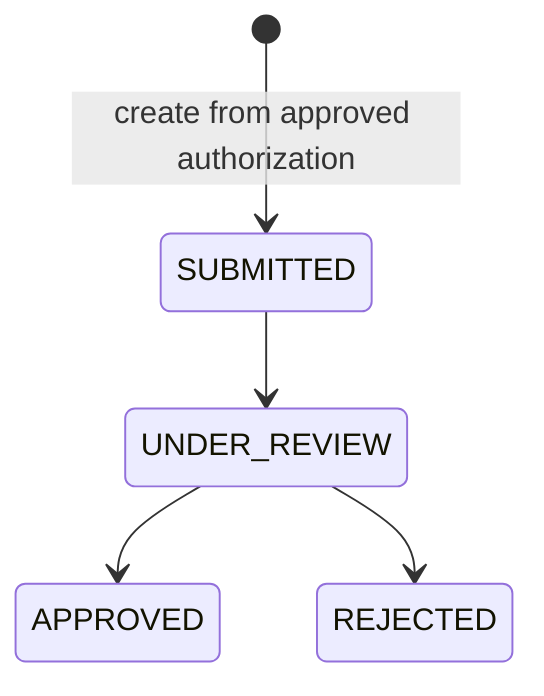
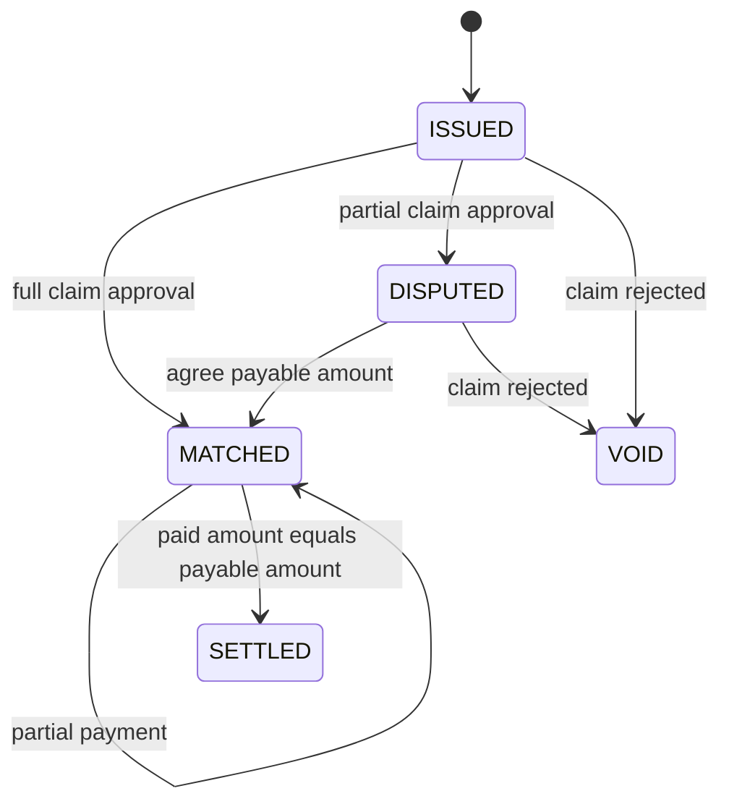
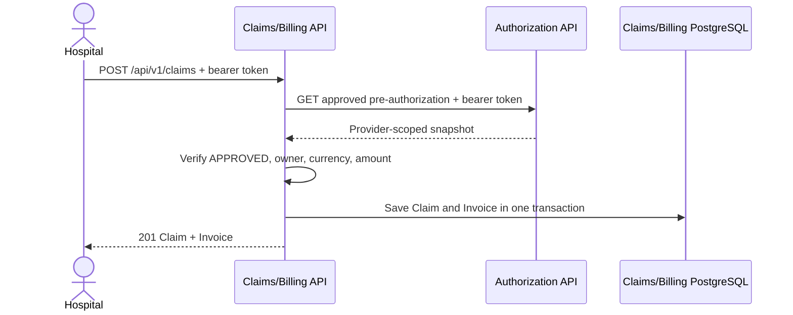

# Claims and Billing Service

## Responsibility and ownership

The service owns claim adjudication and the financial records derived from it:
claims, invoices, payment entries, reconciliation state, and settlement state.
It never reads the Authorization or Policy databases. Authorization remains the
source of truth for treatment approval; Policy remains the source of truth for
coverage rules and limits.

## Aggregate boundaries

`Claim` and `Invoice` are separate aggregate roots. Claim protects adjudication
rules and decision transitions. Invoice protects payable amount, reconciliation,
unique payment references, overpayment prevention, and settlement. They share a
local transaction because both are owned by this bounded context; approving or
rejecting a claim must update its invoice atomically.

## Request flow

Application input/output ports keep the use cases framework independent. JPA,
REST, OAuth/JWT mapping, and transaction annotations live in infrastructure or
presentation. ArchUnit verifies these dependencies. PostgreSQL uniqueness
constraints prevent duplicate claims per pre-authorization and duplicate
invoice/payment references under concurrency; `@Version` protects updates.
