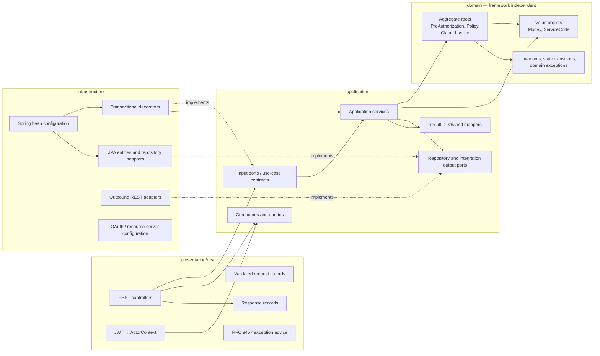

# Clean Architecture Bileşen Modeli

Üç backend servisin tamamı, yalnızca use case'lerinin ihtiyaç duyduğu
abstraction'ları koruyarak aynı dependency rule'u kullanır.

Düz oklar compile-time dependency'leri gösterir. Kesik `implements` okları
Dependency Inversion'ı gösterir: interface'lerin sahibi application'dır,
implementation'ları infrastructure sağlar. ArchUnit testleri domain-to-framework,
application-to-infrastructure, presentation-to-domain ve
infrastructure-to-presentation dependency'lerini reddeder.
