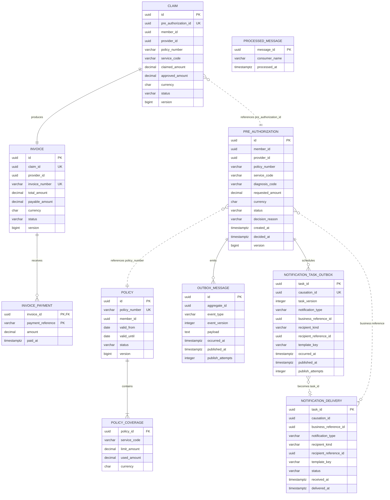

# Logical Data Model and Ownership

The diagram is logical: relationships crossing a service boundary are UUID or
business-key references, not database foreign keys.

| Database owner | Tables | Other services' access |
| --- | --- | --- |
| Policy Service | `policies`, `policy_coverages` | REST coverage evaluation only |
| Authorization Service | `pre_authorizations`, `outbox_messages`, `notification_task_outbox` | REST snapshots; Kafka events; confirm-aware RabbitMQ task publishing (runtime pending) |
| Claims/Billing Service | `claims`, `invoices`, `invoice_payments`, `processed_messages` | No direct database access |
| Notification Worker | `notification_deliveries` | No direct database access |

Cross-context references intentionally have no foreign keys. Each owner can
change its schema independently; consistency across services is currently
checked through explicit synchronous contracts or versioned broker messages.
