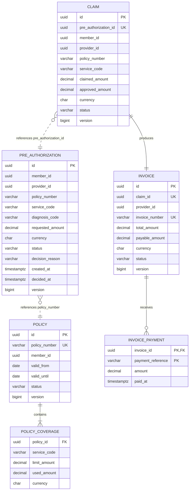

# Logical Data Model and Ownership

The diagram is logical: relationships crossing a service boundary are UUID or
business-key references, not database foreign keys.

| Database owner | Tables | Other services' access |
| --- | --- | --- |
| Policy Service | `policies`, `policy_coverages` | REST coverage evaluation only |
| Authorization Service | `pre_authorizations` | REST provider-scoped snapshot only |
| Claims/Billing Service | `claims`, `invoices`, `invoice_payments` | No external access implemented yet |

Cross-context references intentionally have no foreign keys. Each owner can
change its schema independently; consistency across services is currently
checked through synchronous contracts and will gain event reconciliation in a
future milestone.
