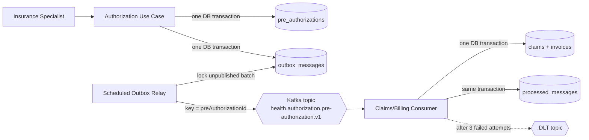
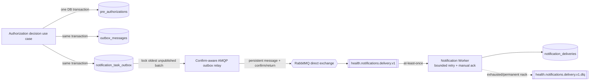
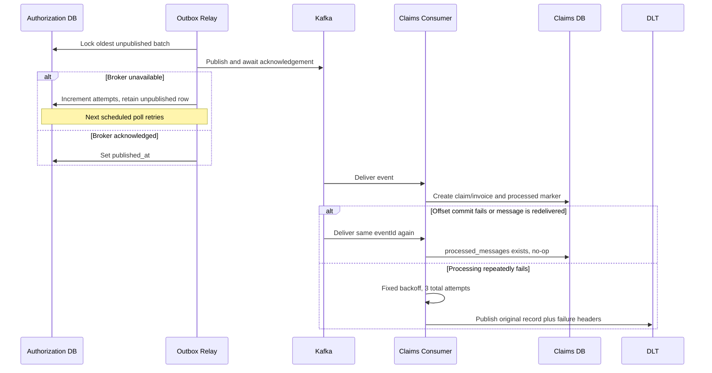
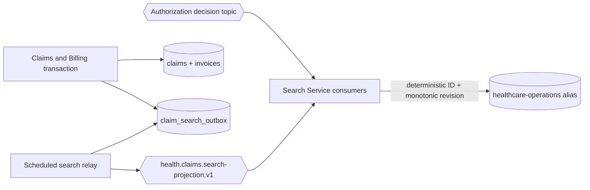
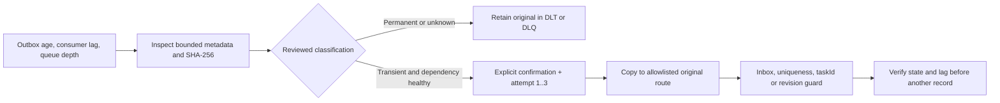

# Event-Driven Messaging Mimarisi

## Delivery topolojisi



## Notification command yolu (Milestone 6)



Producer write'ları, AMQP relay, safe JSON mapping, publisher-confirm/return
kararları, durable delivery/DLQ topology, worker retry ve acknowledgement
uygulanmıştır. RabbitMQ ve worker Compose runtime wiring'e sahiptir; bir
RabbitMQ/PostgreSQL Testcontainers testi gerçek routing, duplicate delivery,
persistence, acknowledgement ve dead-lettering davranışını çalıştırır.
Adapter'lar broker-free testler ve standalone development için feature-gated
kalmaya devam eder.

### Persist edilen notification task intent v1

```json
{
  "taskId": "UUID",
  "causationId": "decision event UUID",
  "taskVersion": 1,
  "notificationType": "PRE_AUTHORIZATION_APPROVED",
  "businessReferenceId": "pre-authorization UUID",
  "recipientKind": "PROVIDER",
  "recipientReferenceId": "provider UUID",
  "templateKey": "pre-authorization-approved-v1",
  "occurredAt": "2026-09-08T12:00:00Z"
}
```

Bu field'lar artık hem producer-outbox intent hem de versioned AMQP JSON contract'ıdır.
`taskId` AMQP message ID, `causationId` correlation ID olur ve `taskVersion`
header olarak da taşınır. Contract bilinçli olarak member, policy, diagnosis,
amount, decision reason, contact address, rendered content ve security token data'yı
dışlar.

Publisher confirm, RabbitMQ'nun publish sorumluluğunu kabul ettiğini kanıtlar;
consumer'ın mesajı işlediğini değil. Direct exchange mandatory bir unroutable
message'ı kabul edip sonra return edebileceğinden relay, `published_at` set etmeden
önce hem positive confirm hem de returned message bulunmamasını gerektirir.

### RabbitMQ failure policy

| Failure | Deneme | Broker sonucu | Gerekçe |
| --- | ---: | --- | --- |
| Explicit transient delivery exception | Toplam 3, bounded exponential backoff | Başarılı committed attempt sonrası ack; aksi halde requeue olmadan nack | Geçici provider/dependency hızlıca iyileşebilir |
| Unsupported contract version | 1 | Requeue olmadan nack → DLQ | Code deployment veya contract handling gerekir |
| Malformed JSON veya invalid invariant | 1 | Requeue olmadan nack → DLQ | Aynı data'yı tekrar etmek problemi düzeltemez |
| Aynı intent ile delivered duplicate `taskId` | 1 | Idempotent no-op ardından ack | At-least-once redelivery beklenir |
| Aynı `taskId`, farklı intent | 1 | Requeue olmadan nack → DLQ | Producer/contract corruption göstergesidir |

Default retry ayarları `NOTIFICATION_RETRY_MAX_ATTEMPTS`,
`NOTIFICATION_RETRY_INITIAL_INTERVAL`, `NOTIFICATION_RETRY_MULTIPLIER` ve
`NOTIFICATION_RETRY_MAX_INTERVAL` üzerinden configure edilir. Varsayılanlar
toplam üç attempt, 250 ms, 2.0 ve 2 saniyedir.

## Event contract v1

Topic iki decision type'ını da içerir. Payload bilinçli olarak JPA entity ve HTTP
response DTO'larından bağımsızdır.

```json
{
  "eventId": "UUID",
  "eventType": "PreAuthorizationApproved",
  "eventVersion": 1,
  "preAuthorizationId": "UUID",
  "memberId": "UUID",
  "providerId": "UUID",
  "policyNumber": "POL-...",
  "serviceCode": "IMG-MRI",
  "requestedAmount": 1250.00,
  "currency": "TRY",
  "decision": "APPROVED",
  "reason": "Coverage verified",
  "sourceRevision": 2,
  "occurredAt": "2026-09-08T12:00:00Z"
}
```

`eventId` consumer idempotency key'dir. `eventType` business event'i explicit
hale getirir; `eventVersion` consumer'ların unsupported contract'ı sessizce yanlış
yorumlamak yerine reject etmesini sağlar. `preAuthorizationId` Kafka message key ve
Claims/Billing business uniqueness key'dir. `decision` Claims/Billing'in work
başlatıp başlatmayacağını belirler; hem `PreAuthorizationApproved` hem
`PreAuthorizationRejected` yayınlanır. v1 içindeki additive evolution mevcut
meaning'leri korumalıdır; breaking change yeni topic/contract version gerektirir.
`sourceRevision` owner aggregate'in monotonic state revision'ıdır; bu field olmayan
legacy v1 message'lar baseline revision 1'e map edilir.

## Failure semantics



Relay, Kafka acknowledgement sonrasında fakat `published_at` commit edilmeden crash
olursa duplicate publish edebilir. Inbox table bu yüzden gereklidir. Outbox row'ları
delivery evidence olarak tutulur; retention/archival operational follow-up olarak
kalır. Milestone 10 automatic recovery iddiasında bulunmadan bounded DLT inspection
ve reviewed copy-replay ekler.

## Search projection yolu (Milestone 7)



Claim ve invoice transition'ları aggregate'i update eder ve aynı local transaction
içinde complete operational projection append eder. Relay yalnızca commit sonrası
publish eder ve row'ları yalnızca Kafka acknowledgement sonrası published işaretler.
Search at-least-once consume eder; `CLAIM-{claimId}` ve
`PRE_AUTHORIZATION-{id}` document ID'leri redelivery'yi replacement'a çevirir.
Kafka partition key'leri tek aggregate için claim transition sırasını korur.
Conditional Elasticsearch upsert eski `sourceRevision` değerini de reddeder;
böylece delayed event online rebuild sırasında newer snapshot'ı geriletemez.
Elasticsearch disposable ve rebuild edilebilir read state olarak kalır.

## Kontrollü dead-letter recovery (Milestone 10)



Kafka tooling yalnızca Authorization decision ve Claims search DLT topic'lerine izin
verir. RabbitMQ tooling yalnızca notification DLQ ve delivery route'a izin verir.
Inspection payload'ı memory içinde hash'ler ve sadece safe metadata yazdırır. Replay
on record ile sınırlandırılır, `Transient` classification ve `-ConfirmReplay`
gerektirir, recovery ID/source/attempt metadata ekler ve original dead-letter record'u
korur. Bilinçli olarak discard command yoktur.

Bu operator-assisted local control'dür; production recovery service değildir.
Kafka access tools-only Compose profile tarafından sağlanır, RabbitMQ credential'ları
runtime input'tur ve henüz central audit/workload identity yoktur. Detaylı command ve
stop condition'lar
[search and messaging recovery runbook](../operations/search-and-messaging-recovery.md)
içindedir.
