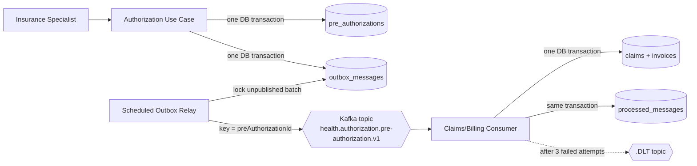
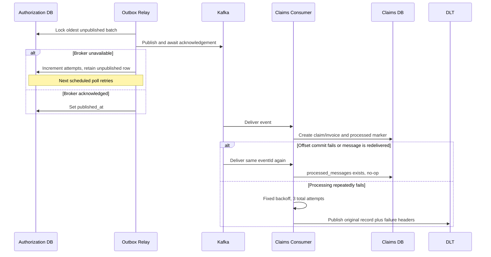

# Event-Driven Messaging Architecture

## Delivery topology



## Event contract v1

The topic contains both decision types. The payload is deliberately independent
of JPA entities and HTTP response DTOs.

```json
{
  "eventId": "UUID",
  "eventType": "PreAuthorizationApproved",
  "eventVersion": 1,
  "preAuthorizationId": "UUID",
  "memberId": "UUID",
  "providerId": "UUID",
  "policyNumber": "POL-...",
  "serviceCode": "IMG-MRI",
  "requestedAmount": 1250.00,
  "currency": "TRY",
  "decision": "APPROVED",
  "reason": "Coverage verified",
  "occurredAt": "2026-09-08T12:00:00Z"
}
```

`eventId` is the consumer idempotency key. `eventType` makes the business event
explicit and `eventVersion` lets consumers reject unsupported contracts instead
of silently misinterpreting them. `preAuthorizationId` is the Kafka
message key and the Claims/Billing business uniqueness key. `decision` selects
whether Claims/Billing starts work; both `PreAuthorizationApproved` and
`PreAuthorizationRejected` are published. Additive evolution within v1 must
retain existing meanings, while breaking changes require a new topic/contract
version.

## Failure semantics



The relay can publish a duplicate if it crashes after Kafka acknowledgement but
before committing `published_at`. That window is why the inbox table is required.
Outbox rows are retained as delivery evidence; retention/archival and DLT replay
are explicit operational follow-ups.
