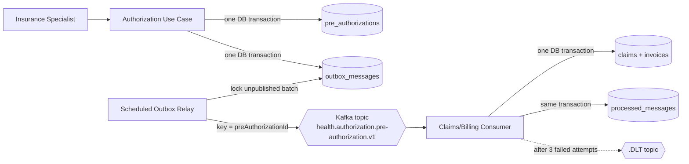
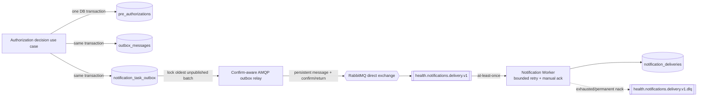
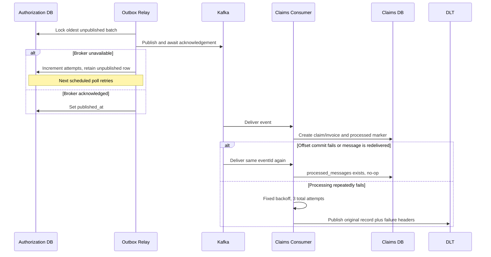
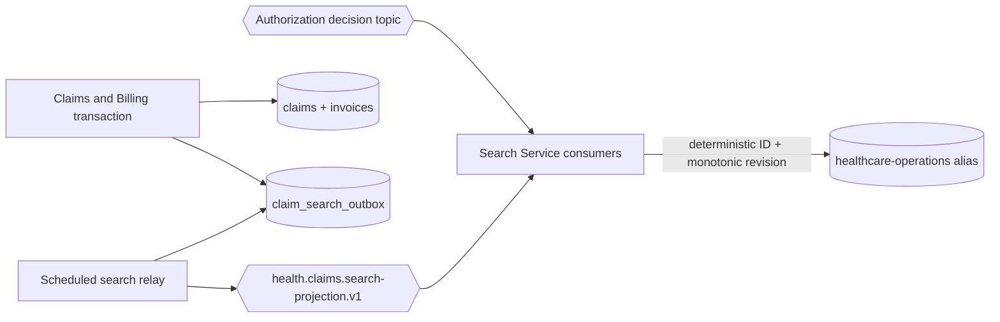
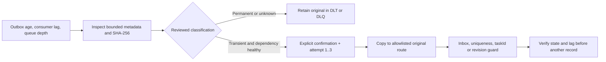

# Event-Driven Messaging Architecture

## Delivery topology



## Notification command path (Milestone 6)



The producer writes, AMQP relay, safe JSON mapping, publisher-confirm/return
decisions, durable delivery/DLQ topology, worker retry and acknowledgement are
implemented. RabbitMQ and the worker have Compose runtime wiring, and a
RabbitMQ/PostgreSQL Testcontainers test exercises real routing, duplicate
delivery, persistence, acknowledgement, and dead-lettering. The adapters remain
feature-gated for broker-free tests and standalone development.

### Persisted notification task intent v1

```json
{
  "taskId": "UUID",
  "causationId": "decision event UUID",
  "taskVersion": 1,
  "notificationType": "PRE_AUTHORIZATION_APPROVED",
  "businessReferenceId": "pre-authorization UUID",
  "recipientKind": "PROVIDER",
  "recipientReferenceId": "provider UUID",
  "templateKey": "pre-authorization-approved-v1",
  "occurredAt": "2026-09-08T12:00:00Z"
}
```

These fields are now both the producer-outbox intent and the versioned AMQP JSON
contract. `taskId` becomes the AMQP message ID, `causationId` the correlation ID,
and `taskVersion` is also carried as a header. The contract deliberately
excludes member, policy, diagnosis, amount, decision reason, contact address,
rendered content, and security token data.

Publisher confirms prove that RabbitMQ accepted responsibility for the publish,
not that a consumer processed it. Because a direct exchange may accept and then
return an unroutable mandatory message, the relay requires both a positive
confirm and the absence of a returned message before setting `published_at`.

### RabbitMQ failure policy

| Failure | Attempts | Broker outcome | Rationale |
| --- | ---: | --- | --- |
| Explicit transient delivery exception | 3 total, exponential bounded backoff | Ack after a successful committed attempt; otherwise nack without requeue | Temporary providers/dependencies can recover quickly |
| Unsupported contract version | 1 | Nack without requeue → DLQ | Code deployment or contract handling is required |
| Malformed JSON or invalid invariant | 1 | Nack without requeue → DLQ | Repeating identical data cannot repair it |
| Delivered duplicate `taskId` with same intent | 1 | Idempotent no-op then ack | At-least-once redelivery is expected |
| Same `taskId`, different intent | 1 | Nack without requeue → DLQ | Indicates producer/contract corruption |

Default retry settings are configurable through `NOTIFICATION_RETRY_MAX_ATTEMPTS`,
`NOTIFICATION_RETRY_INITIAL_INTERVAL`, `NOTIFICATION_RETRY_MULTIPLIER`, and
`NOTIFICATION_RETRY_MAX_INTERVAL`. Defaults are three total attempts, 250 ms,
2.0, and 2 seconds respectively.

## Event contract v1

The topic contains both decision types. The payload is deliberately independent
of JPA entities and HTTP response DTOs.

```json
{
  "eventId": "UUID",
  "eventType": "PreAuthorizationApproved",
  "eventVersion": 1,
  "preAuthorizationId": "UUID",
  "memberId": "UUID",
  "providerId": "UUID",
  "policyNumber": "POL-...",
  "serviceCode": "IMG-MRI",
  "requestedAmount": 1250.00,
  "currency": "TRY",
  "decision": "APPROVED",
  "reason": "Coverage verified",
  "sourceRevision": 2,
  "occurredAt": "2026-09-08T12:00:00Z"
}
```

`eventId` is the consumer idempotency key. `eventType` makes the business event
explicit and `eventVersion` lets consumers reject unsupported contracts instead
of silently misinterpreting them. `preAuthorizationId` is the Kafka
message key and the Claims/Billing business uniqueness key. `decision` selects
whether Claims/Billing starts work; both `PreAuthorizationApproved` and
`PreAuthorizationRejected` are published. Additive evolution within v1 must
retain existing meanings, while breaking changes require a new topic/contract
version. `sourceRevision` is the owning aggregate's monotonic state revision;
legacy v1 messages without it map to baseline revision 1.

## Failure semantics



The relay can publish a duplicate if it crashes after Kafka acknowledgement but
before committing `published_at`. That window is why the inbox table is required.
Outbox rows are retained as delivery evidence; retention/archival remains an
operational follow-up. Milestone 10 adds bounded DLT inspection and reviewed
copy-replay without claiming automatic recovery.

## Search projection path (Milestone 7)



Claim and invoice transitions update their aggregate and append a complete
operational projection in one local transaction. The relay publishes only after
commit and marks rows published only after Kafka acknowledgement. Search consumes
at least once; `CLAIM-{claimId}` and `PRE_AUTHORIZATION-{id}` document IDs turn
redelivery into replacement. Kafka partition keys preserve claim transition order
for one aggregate. A conditional Elasticsearch upsert also rejects an older
`sourceRevision`, so a delayed event cannot regress a newer snapshot during an
online rebuild. Elasticsearch remains disposable and rebuildable read state.

## Controlled dead-letter recovery (Milestone 10)



Kafka tooling permits only the Authorization decision and Claims search DLT
topics. RabbitMQ tooling permits only the notification DLQ and delivery route.
Inspection hashes payloads in memory and prints only safe metadata. Replay is
limited to ten records, requires `Transient` classification and
`-ConfirmReplay`, attaches recovery ID/source/attempt metadata, and preserves
the original dead-letter record. There is deliberately no discard command.

This is an operator-assisted local control, not a production recovery service:
Kafka access is provided by the tools-only Compose profile, RabbitMQ credentials
are runtime inputs, and no central audit/workload identity exists yet. Detailed
commands and stop conditions are in the
[search and messaging recovery runbook](../operations/search-and-messaging-recovery.md).
