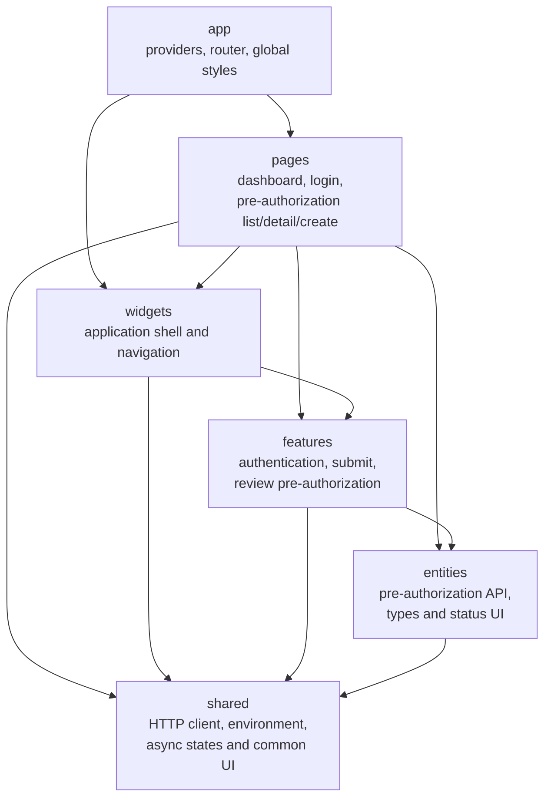

# Operations Portal Architecture

Imports may only point downward. `src/app/architecture.test.ts` scans source
imports and rejects reverse dependencies. TanStack Query owns server state;
authentication uses a narrow React context; API data is not copied into a
global client store. React Hook Form and Zod validate submission input, while
route and feature components apply role-aware UI behavior.
