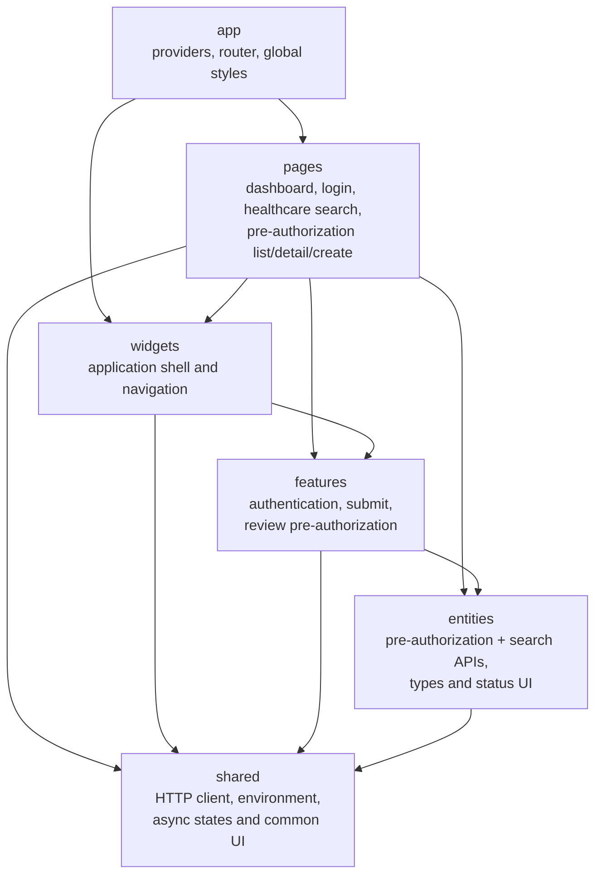

# Operations Portal Mimarisi

Import'lar yalnızca aşağı yönlü olabilir. `src/app/architecture.test.ts` source
import'larını tarar ve ters dependency'leri reddeder. Server state TanStack Query
tarafından yönetilir; authentication dar kapsamlı React context kullanır; API
data global client store'a kopyalanmaz. React Hook Form ve Zod submission input'u
doğrularken route ve feature component'leri role-aware UI davranışı uygular.

Authorization ve search client'ları ayrı environment override key'lerini korur,
ancak ikisi de varsayılan olarak `http://localhost:9080/api/v1` adresindeki APISIX
origin'ini kullanır. Shared HTTP client aynı Keycloak access token'ını ve yeni,
bounded correlation ID'yi sağlar. Search filter'ları ve pagination URL state'tir;
TanStack Query result'ları server-state cache içinde tutar. Provider ownership'i
browser değil Search Service uygular.

Canonical identifier'lar shared `javaUuid()` Zod schema'sını kullanır. Bu schema,
RFC version bit'lerini yanlışlıkla zorunlu kılmadan backend `java.util.UUID`
tarafından kabul edilen text formatını yansıtır ve form, URL filter ve API response
schema'larında tekrar kullanılır.

Shared HTTP boundary on saniyelik default timeout uygular, caller cancellation'ı
compose eder, bearer token'ı refresh eder, bounded correlation ID propagate eder,
RFC 9457 failure'ları korur ve Zod contract'ını ihlal eden başarılı payload'ları
reddeder. `401` centralized Keycloak session recovery'yi tetikler. Query-level
error'lar güvenli retry control'leri gösterir; beklenmeyen render failure'ları app
Error Boundary'de durur ve console metadata exception message veya component
detail içermez.

Responsive davranış 820px ve 520px breakpoint'leri kullanır: fixed desktop shell
flow layout'a dönüşür, form ve filter'lar tek kolona düşer, geniş table'lar document'i
genişletmek yerine kendi container'ları içinde scroll eder. Focus ring, reduced-motion
preference, named table column ve WCAG AA table contrast gerçek 390px Chrome viewport'ta
axe-core ile doğrulanır.

Tüm page component'leri route-level lazy import'tur. Vite ayrıca React, TanStack
Query, form/validation ve Keycloak'ı stable vendor chunk'lara ayırır; böylece page
değişikliği tüm third-party dependency'leri invalidate etmez. `build:budget`
kontrolü 100 KiB gzip üzerindeki JavaScript chunk'ını reddeder; mevcut en büyük
chunk 70.54 KiB gzip ile React vendor bundle'dır.
