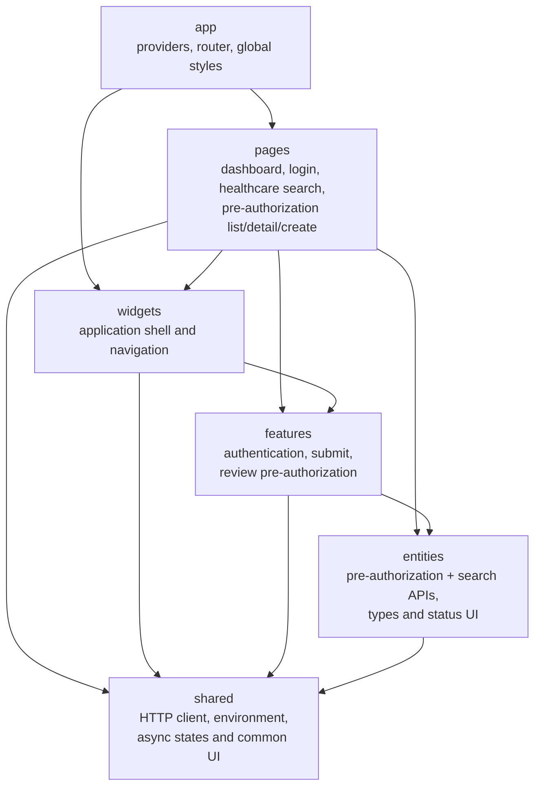

# Operations Portal Architecture

Imports may only point downward. `src/app/architecture.test.ts` scans source
imports and rejects reverse dependencies. TanStack Query owns server state;
authentication uses a narrow React context; API data is not copied into a
global client store. React Hook Form and Zod validate submission input, while
route and feature components apply role-aware UI behavior.

The authorization and search clients retain separate environment override keys,
but both default to the APISIX origin at `http://localhost:9080/api/v1`. The
shared HTTP client supplies the same Keycloak access token and a fresh bounded
correlation ID. Search filters and pagination are URL state, while TanStack Query
keeps results in its server-state cache. The Search Service, not the browser,
enforces provider ownership.

Canonical identifiers use the shared `javaUuid()` Zod schema. It mirrors the
text accepted by backend `java.util.UUID` without incorrectly requiring RFC
version bits, and is reused by forms, URL filters and API response schemas.

The shared HTTP boundary applies a ten-second default timeout, composes caller
cancellation, refreshes the bearer token, propagates a bounded correlation ID,
preserves RFC 9457 failures and rejects successful payloads that violate their
Zod contract. A `401` invokes centralized Keycloak session recovery. Query-level
errors render safe retry controls; unexpected render failures stop at the app
Error Boundary, whose console metadata excludes exception messages and component
details.

Responsive behavior uses 820px and 520px breakpoints: the fixed desktop shell
becomes a flow layout, forms and filters collapse to one column, and wide tables
scroll inside their own container instead of widening the document. Focus rings,
reduced-motion preferences, named table columns and WCAG AA table contrast are
verified in a real 390px Chrome viewport with axe-core.
