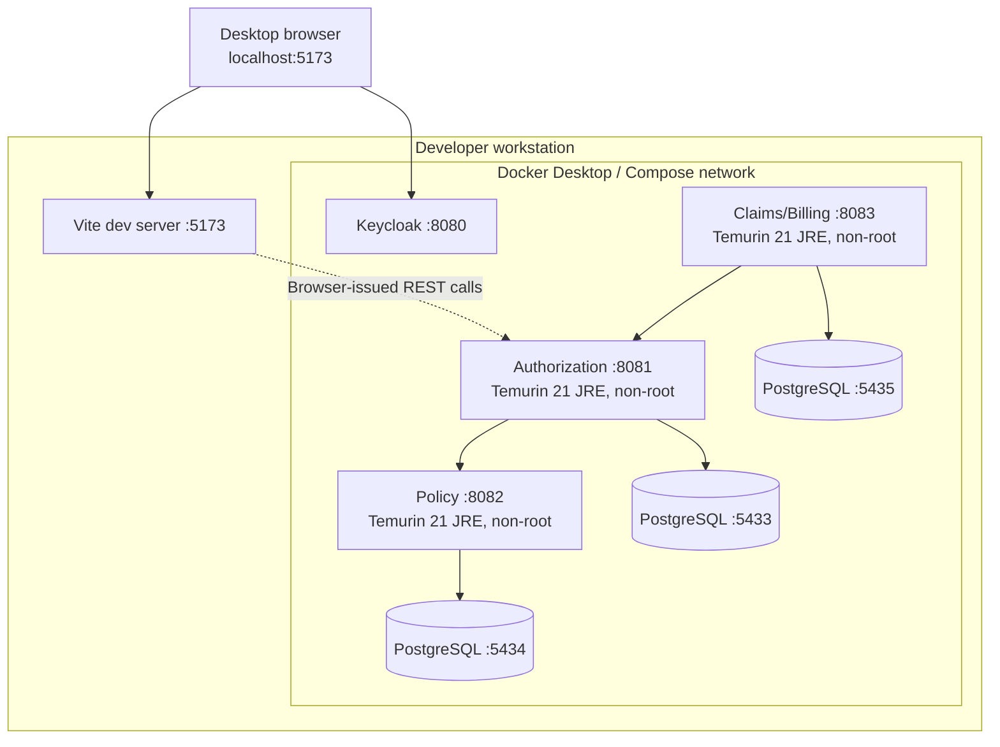

# Local Deployment Diagram

Docker images use a Java 21 JDK build stage and a smaller Java 21 JRE runtime
stage. Services run as the unprivileged `spring` user. Credentials are supplied
through an ignored `.env`; `.env.example` contains placeholders only.
