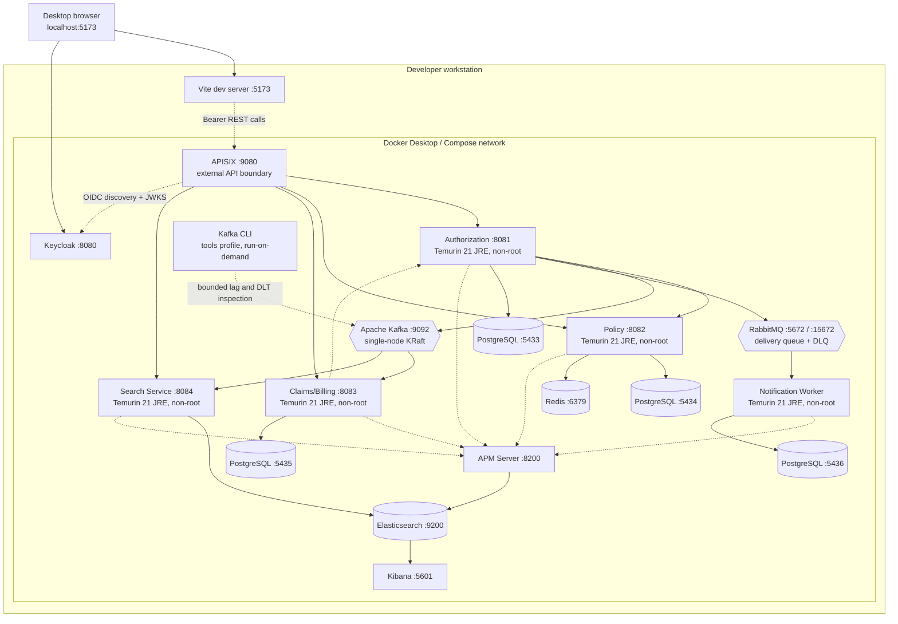

# Lokal Deployment Diyagramı

APISIX host üzerinde publish edilen tek business API portudur. Dört Spring API
portu yalnızca Compose network içinde görünür; Keycloak Authorization Code + PKCE
için browser tarafından erişilebilir kalır. APISIX etcd veya Admin API olmadan
çalışır ve Git-versioned route'ları read-only volume'dan yükler.

Docker image'ları Java 21 JDK build stage ve daha küçük Java 21 JRE runtime stage
kullanır. Servisler unprivileged `spring` user olarak çalışır. Credential'lar
ignore edilen `.env` üzerinden sağlanır; `.env.example` yalnızca placeholder içerir.

Compose, dependent servisleri başlatmadan önce dört PostgreSQL database'i, Kafka,
RabbitMQ, Redis ve Elasticsearch için health gate uygular. `http://localhost:15672`
adresindeki RabbitMQ Management local queue/DLQ inspection sağlar. Worker bilinçli
olarak HTTP business API açmaz; observable output'ları broker acknowledgement/dead-lettering,
log'lardaki güvenli structured task metadata ve private delivery table'dır. Elastic
portları yalnızca development için localhost'a bind edilir. Production deployment
TLS, authentication, authorization, retention ve secret management etkinleştirmelidir.

Runtime `apache/kafka-native` image administrative binary içermez. `kafka-cli`
servisi `tools` profile'a aittir ve yalnızca `docker compose run` ile başlatılır;
başka bir broker veya long-running production container değildir. Recovery script'leri
bunu bounded group-lag ve DLT inspection için kullanır. Elasticsearch read/write
işlemleri `healthcare-operations` alias'ını hedefler; versioned physical index'ler
ve retained predecessor'lar local derived data'dır.
