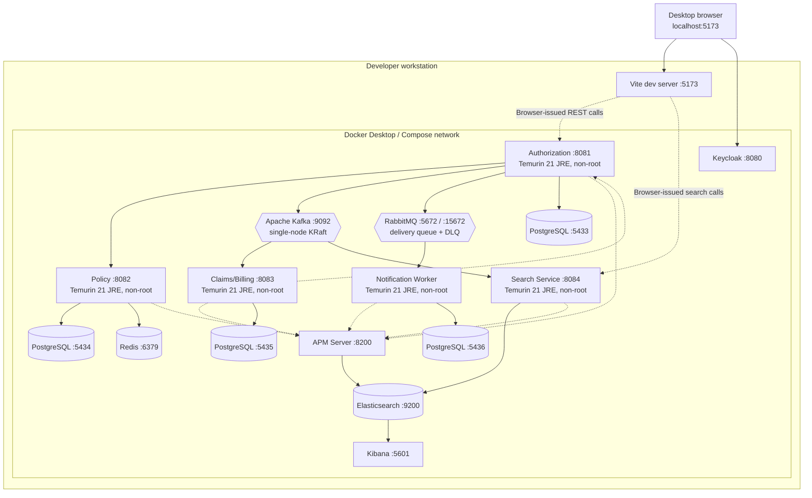

# Local Deployment Diagram

Docker images use a Java 21 JDK build stage and a smaller Java 21 JRE runtime
stage. Services run as the unprivileged `spring` user. Credentials are supplied
through an ignored `.env`; `.env.example` contains placeholders only.

Compose health-gates the four PostgreSQL databases, Kafka, RabbitMQ, Redis, and
Elasticsearch before
starting their dependants. RabbitMQ Management at `http://localhost:15672`
provides local queue/DLQ inspection. The worker deliberately exposes no HTTP
business API; its observable outputs are broker acknowledgement/dead-lettering,
safe structured task metadata in logs, and its private delivery table. Elastic
ports bind to localhost for development only. Production deployments must enable
TLS, authentication, authorization, retention, and secret management.
