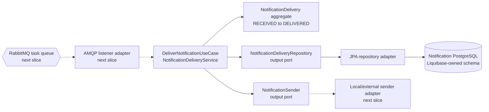
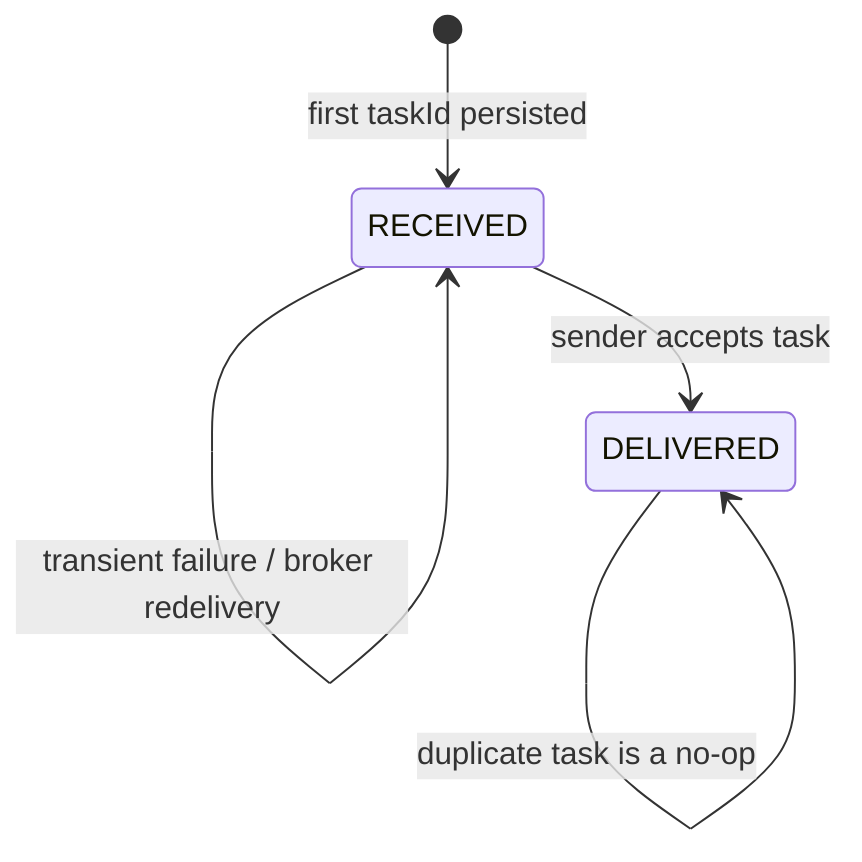

# Notification Worker Architecture

The Notification Worker owns operational delivery attempts. It does not own a
member, policy, pre-authorization, claim, contact address, or clinical record.
The current Milestone 6 checkpoint implements the domain/application core and
PostgreSQL adapter. AMQP adapters shown with dashed lines are the next slice,
not a delivered runtime capability.

## Component boundaries

The domain and application packages import neither Spring nor Jakarta. JPA
entities translate persistence rows at the infrastructure boundary, and
ArchUnit continuously enforces that direction.

## Delivery state and replay behavior

`task_id` is the primary key and the downstream sender idempotency key. Reusing
it with a different causation, business reference, type, recipient, or template
is a contract conflict rather than a duplicate. A worker
crash can still cause a task to be received more than once; the design does not
claim exactly-once messaging. A previously delivered row suppresses another
send. A received row remains retryable. The downstream provider must also honor
the idempotency key to close the crash window after external acceptance but
before the local delivered state is committed.

## Persisted data

The delivery row contains only technical routing and lifecycle information:

- task, causation, and business-reference UUIDs;
- notification type and versioned template key;
- recipient kind and opaque provider reference;
- received/delivered timestamps and status.

It deliberately excludes names, member identifiers, policy numbers, diagnosis
codes, email addresses, phone numbers, access tokens, and rendered message
content. Database check constraints keep timestamp and state combinations
consistent even if a future adapter bypasses the aggregate accidentally.

## Current verification

The Java 21 suite has 11 tests. A PostgreSQL 17 Testcontainer applies Liquibase,
lets Hibernate validate the schema, round-trips both delivery states, and checks
the primary-key and operational indexes. It also invokes the use case twice
against the persisted row to prove that a delivered replay does not call the
sender again. RabbitMQ retry, acknowledgement, and dead-letter behavior are not
part of this checkpoint and must not be inferred from these tests.
