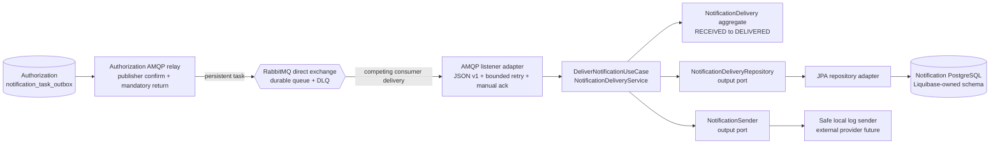
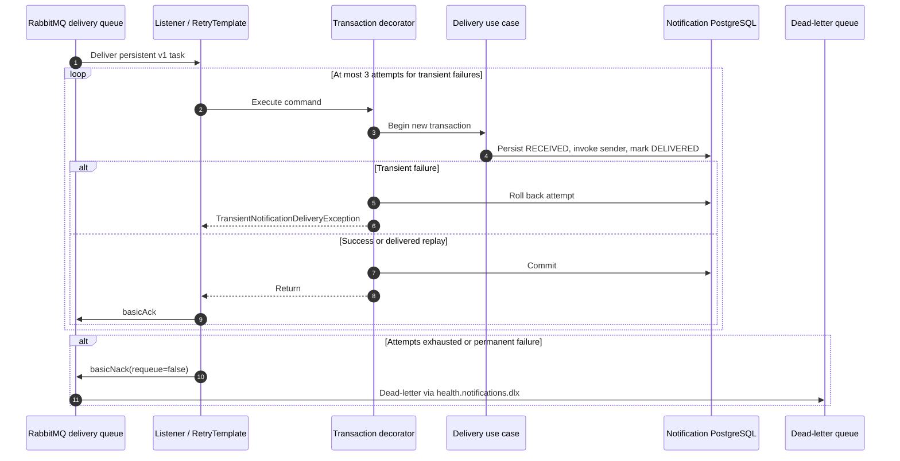
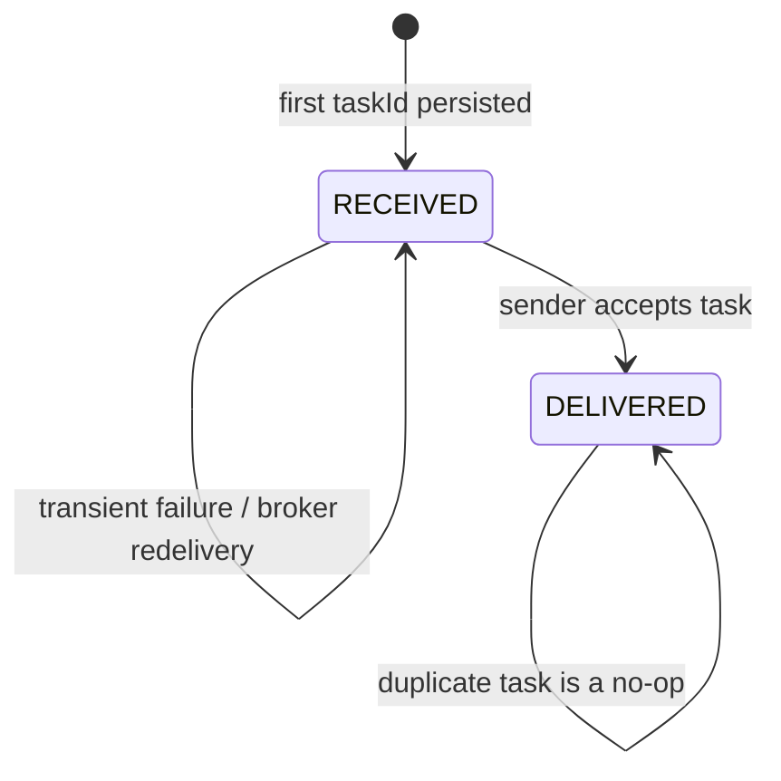

# Notification Worker Architecture

The Notification Worker owns operational delivery attempts. It does not own a
member, policy, pre-authorization, claim, contact address, or clinical record.
Milestone 6 implements the domain/application core, PostgreSQL adapter,
Authorization producer task outbox, confirm-aware AMQP relay, version-aware
listener, bounded retry, manual acknowledgement, and live RabbitMQ/DLQ runtime.

## Component boundaries

## Retry and acknowledgement boundary

The retry classifier is deliberately narrow. Only
`TransientNotificationDeliveryException` receives bounded exponential backoff.
Unsupported message versions, malformed contracts, and invariant violations are
permanent and are rejected after one attempt. Retry wraps the transactional
proxy, so each attempt gets a separate transaction and no failed state leaks
into the next attempt.

The domain and application packages import neither Spring nor Jakarta. JPA
entities translate persistence rows at the infrastructure boundary, and
ArchUnit continuously enforces that direction.

## Delivery state and replay behavior

`task_id` is the primary key and the downstream sender idempotency key. Reusing
it with a different causation, business reference, type, recipient, or template
is a contract conflict rather than a duplicate. A worker
crash can still cause a task to be received more than once; the design does not
claim exactly-once messaging. A previously delivered row suppresses another
send. A received row remains retryable. The downstream provider must also honor
the idempotency key to close the crash window after external acceptance but
before the local delivered state is committed.

## Persisted data

The delivery row contains only technical routing and lifecycle information:

- task, causation, and business-reference UUIDs;
- notification type and versioned template key;
- recipient kind and opaque provider reference;
- received/delivered timestamps and status.

It deliberately excludes names, member identifiers, policy numbers, diagnosis
codes, email addresses, phone numbers, access tokens, and rendered message
content. Database check constraints keep timestamp and state combinations
consistent even if a future adapter bypasses the aggregate accidentally.

## Verification

The Java 21 suite uses PostgreSQL 17 and RabbitMQ 4.1 Testcontainers. Persistence
tests apply Liquibase, let Hibernate validate the schema, round-trip both states,
and inspect operational indexes. Application tests prove delivered replay is a
no-op and conflicting reuse of a task ID fails. Listener tests prove transient
success after retry, exhaustion after three attempts, immediate permanent
failure, unsupported-version quarantine, and commit-before-ack ordering.

The broker integration test sends real persistent messages through the declared
exchange. Two identical messages create one `DELIVERED` row and leave both
queues empty; an unsupported v99 message creates no delivery row and appears in
`health.notifications.delivery.v1.dlq`. Compose repeats the complete producer to
consumer path with independent PostgreSQL ownership. On 8 September 2026 the
worker suite passed 23/23 tests.

The local sender logs only the task identifier, notification type, recipient
kind, and opaque provider reference. It demonstrates the output port and
idempotency flow but does not claim to send email or SMS.
