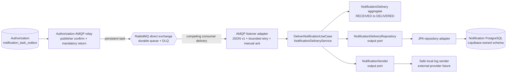
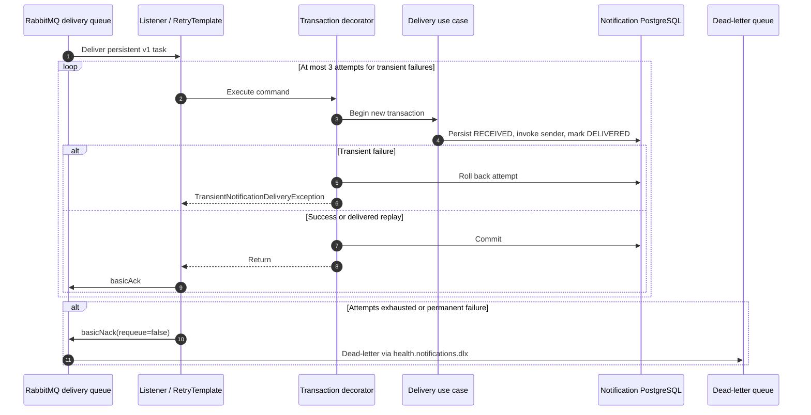
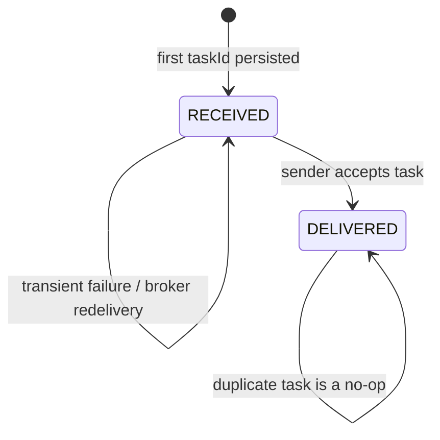

# Notification Worker Mimarisi

Notification Worker operational delivery attempt'ların sahibidir. Member, policy,
pre-authorization, claim, contact address veya clinical record sahibi değildir.
Milestone 6 domain/application core, PostgreSQL adapter, Authorization producer
task outbox, confirm-aware AMQP relay, version-aware listener, bounded retry,
manual acknowledgement ve canlı RabbitMQ/DLQ runtime'ını uygular.

## Bileşen sınırları

Use case delivery row'u okumadan önce PostgreSQL adapter, `taskId` değerinden
türetilen transaction-scoped advisory lock alır. Aynı task'ın concurrent consumer'ları
sender çağrılmadan önce serialize edilir. Lock commit veya rollback'te otomatik
serbest kalır; ilgisiz task ID'leri concurrent çalışmaya devam eder. Bu primary key'i
tamamlar: uniqueness stored data'yı, lock external side-effect window'u korur.

## Retry ve acknowledgement boundary

Retry classifier bilinçli olarak dardır. Yalnızca
`TransientNotificationDeliveryException` bounded exponential backoff alır.
Unsupported message version, malformed contract ve invariant violation permanent
kabul edilir ve bir denemeden sonra reject edilir. Retry transactional proxy'yi
sarar; böylece her attempt ayrı transaction alır ve failed state sonraki attempt'e
sızmaz.

Domain ve application package'ları Spring veya Jakarta import etmez. JPA entity'leri
persistence row'larını infrastructure boundary'de translate eder; ArchUnit bu yönü
sürekli enforce eder.

## Delivery state ve replay davranışı

`task_id` primary key ve downstream sender idempotency key'dir. Aynı ID'nin farklı
causation, business reference, type, recipient veya template ile tekrar kullanılması
duplicate değil contract conflict'tir. Worker crash task'ın birden fazla alınmasına
neden olabilir; design exactly-once messaging iddia etmez. Önceden delivered row
başka send'i suppress eder. Received row retry edilebilir kalır. External provider
kabulünden sonra local delivered state commit edilmeden oluşabilecek crash window'u
kapatmak için downstream provider da idempotency key'i uygulamalıdır.

## Persist edilen veri

Delivery row yalnızca technical routing ve lifecycle bilgisi içerir:

- task, causation ve business-reference UUID'leri;
- notification type ve versioned template key;
- recipient kind ve opaque provider reference;
- received/delivered timestamp'leri ve status.

Name, member identifier, policy number, diagnosis code, email address, phone number,
access token veya rendered message content bilinçli olarak dışlanır. Database check
constraint'leri future adapter aggregate'i yanlışlıkla bypass etse bile timestamp ve
state combination'larını tutarlı tutar.

## Doğrulama

Java 21 suite PostgreSQL 17 ve RabbitMQ 4.1 Testcontainers kullanır. Persistence
testleri Liquibase uygular, Hibernate'in schema'yı validate etmesini sağlar, iki
state'i round-trip eder, operational index'leri inspect eder ve aynı task için iki
transaction'ı concurrent çalıştırır. Concurrency testi tek row ve tek sender invocation
kanıtlar. Application testleri delivered replay'in no-op olduğunu ve task ID'nin
conflicting reuse durumunda failure oluştuğunu doğrular. Listener testleri retry
sonrası transient success, üç attempt sonrası exhaustion, immediate permanent failure,
unsupported-version quarantine ve commit-before-ack ordering'i doğrular.

Broker integration testi declared exchange üzerinden gerçek persistent message
gönderir. İki identical message tek `DELIVERED` row oluşturur ve iki queue'yu da
boş bırakır; unsupported v99 message hiçbir delivery row oluşturmaz ve
`health.notifications.delivery.v1.dlq` içinde görünür. Compose independent
PostgreSQL ownership ile complete producer-to-consumer path'i tekrarlar. 14 Eylül
2026'da worker suite Java 21.0.8 üzerinde 24/24 testten geçti.

Local sender yalnızca task identifier, notification type, recipient kind ve opaque
provider reference loglar. Output port ve idempotency flow'u gösterir ancak email
veya SMS gönderdiğini iddia etmez.

Uygulanmış business semantics ve repeatable evidence için
[business analysis](../business/notification-worker-business-analysis.md) ve
[local verification guide](../development/notification-worker-local-verification.md)
dokümanlarına bakın.
