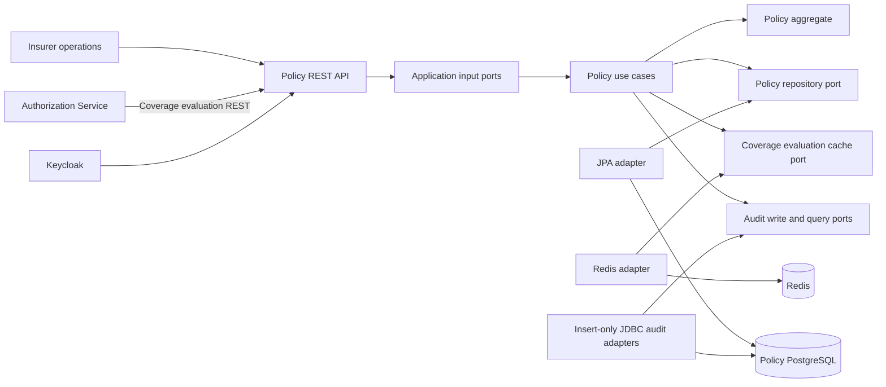
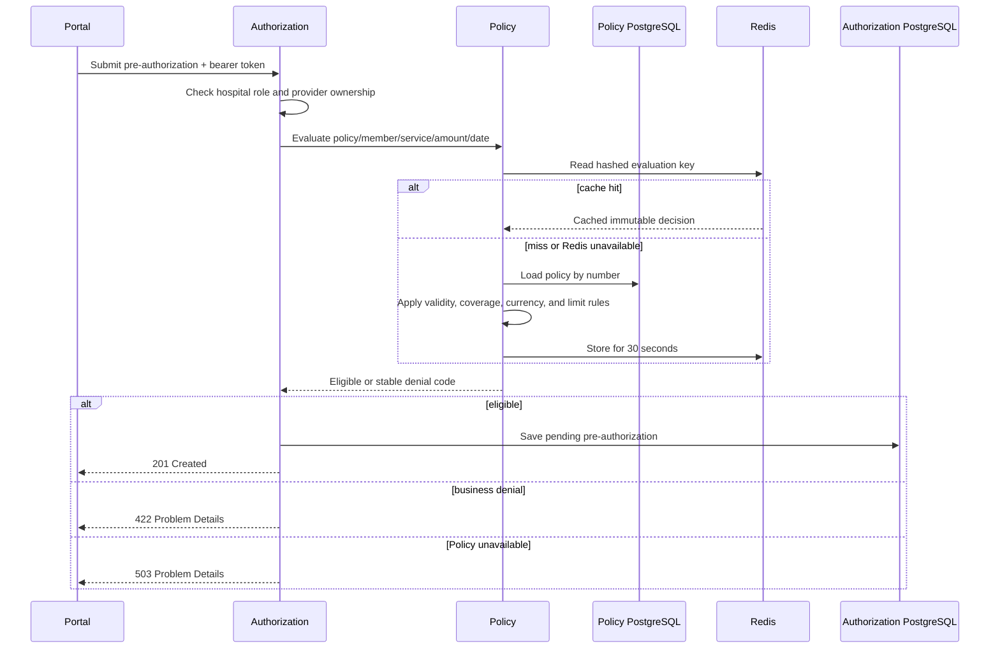
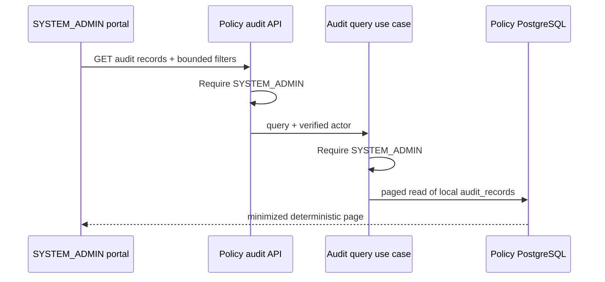

# Policy Service bileşenleri

Policy Service; policy'lerin, coverage definition'ların, validity period'ların ve
financial limit'lerin sahibidir. Başka hiçbir servis onun PostgreSQL database'ini
okumaz.

## Boundary ve sorumluluk

| Capability | Policy Service sorumluluğu | Boundary dışında kalan |
| --- | --- | --- |
| Policy issuance | Bir veya daha fazla coverage içeren policy'yi validate edip persist etmek | Member registration ve demographic ownership |
| Coverage evaluation | Policy, member, service, date, amount ve currency üzerinden eligibility kararı vermek | Pre-authorization oluşturmak veya karar vermek |
| Financial limits | Aggregate içindeki limit ve used-amount invariant'larını korumak | Cross-request benefit reservation ve compensation |
| Audit evidence | Minimized policy issuance evidence append etmek ve query etmek | Cross-service audit join veya clinical-data storage |
| Cache | Immutable evaluation result'larını kısa süreli hızlandırmak | Source of truth gibi davranmak |

Bu nedenle servis Authorization için bir domain question yanıtlar ancak rule veya
database ownership'ini Authorization'a devretmez. Business denial başarılı bir
evaluation result'tır; infrastructure unavailability technical failure'dır ve
eligibility olarak translate edilmemelidir.

### Enforce edilen dependency direction

`CleanArchitectureTest` dört compile-time boundary'yi kontrol eder. Domain class'ları
yalnızca Java ve diğer Domain class'larına bağımlı olabilir. Application class'ları
yalnızca Java, Domain ve Application class'larına bağımlı olabilir. Presentation,
Application kullanabilir ancak Domain veya Infrastructure'a ulaşmak için onu bypass
edemez. Infrastructure, Application/Domain port'larını implement edebilir ancak
Presentation'a bağımlı olamaz. Inner-layer rule'lar allowlist kullandığından,
onaylanmamış third-party framework eklemek Spring veya Jakarta olmasa bile
architecture test'i fail eder.

Focused Java 21 ArchUnit run dört rule'un tamamından geçti. Bu rule'lar source-code
dependency direction'ı korur; runtime behavior, module deployment independence veya
domain decision correctness kanıtı değildir.

## API ve use-case haritası

| Method ve path | Input port | İzin verilen roller | Success contract | İlgili failure contract |
| --- | --- | --- | --- | --- |
| `POST /api/v1/policies` | `CreatePolicyUseCase` | `INSURANCE_SPECIALIST`, `SYSTEM_ADMIN` | Policy representation ile `201 Created` | `400` validation/domain error, `401` unauthenticated, `403` forbidden, `409` duplicate policy number |
| `POST /api/v1/coverage-evaluations` | `EvaluateCoverageUseCase` | `HOSPITAL_USER`, `INSURANCE_SPECIALIST`, `SYSTEM_ADMIN` | Eligible veya denied business decision içeren `200 OK` | `400` malformed input, `401` unauthenticated, `403` forbidden |
| `GET /api/v1/policies/audit-records` | `SearchAuditRecordsUseCase` | `SYSTEM_ADMIN` | Minimized evidence için bounded page içeren `200 OK` | `400` invalid query, `401` unauthenticated, `403` forbidden |

`LIMIT_EXCEEDED` gibi business denial'lar bilinçli olarak `200 OK` kullanır:
request valid'dir ve domain bir decision üretmiştir. Bunlar transport veya server
failure değildir. Controller request record'ları application use case çağrılmadan
önce required value'ları, positive money'yi, ISO-style üç harfli uppercase currency
string'lerini ve bounded policy/service code'larını enforce eder.

Creation response bilinçli olarak `Location` içermez; çünkü servis henüz
`GET /api/v1/policies/{id}` açmaz. Dereference edilemeyen URI publish etmek mevcut
REST lifecycle'ı yanlış temsil eder. Gelecekte secured query use case hem resource
endpoint'i hem matching `Location` header'ı birlikte ekleyebilir.

## Application orchestration

`PolicyApplicationService` framework bağımsız kalır. Her output port çağrısından
önce application role kontrolü yapar. Policy creation daha sonra uniqueness kontrol
eder, aggregate'i oluşturup save eder, minimized audit evidence append eder ve ancak
sonrasında cached evaluation'ları invalidate eder. Coverage evaluation, cache veya
repository okumadan önce operations role kontrolünü yapar ve yalnızca cache miss'te
hesaplanan database result'ı store eder.

`TransactionalPolicyUseCases`, Infrastructure katmanından write ve read-only
transaction boundary sağlar. Audit insert bu nedenle policy creation ile aynı local
PostgreSQL transaction'a katılır. Audit persistence fail olursa policy creation
rollback olur ve cache invalidation denenmez. Focused run altı application testi ve
beş transaction/audit integration testinden geçti; unauthorized short-circuiting ve
bu failure ordering dahil.

## Security modeli ve trust boundary'leri

Spring Security bearer token'ı OAuth 2.0 resource server olarak validate eder ve
Keycloak `realm_access.roles` value'larını `ROLE_*` authority'lerine map eder.
HTTP filter chain health probe dışındaki her endpoint için authentication gerektirir.
Method-level `@PreAuthorize` rule'ları endpoint authorization sağlar. Custom
authentication-entry-point ve access-denied handler'ları hem `401` hem `403`
response'larını RFC 9457 `application/problem+json` olarak serialize eder;
controller advice request MVC'ye ulaştıktan sonraki application ve validation
failure'larını handle etmeye devam eder.

Servis issuer ve JWKS validation configure eder ancak external boundary'de APISIX
tarafından yapılan `health-insurance-api` audience check'i tekrar etmez. Bu yalnızca
direct service exposure deployment network boundary tarafından engellendiği sürece
kabul edilebilir. Service'lere gateway dışındaki herhangi bir path'ten erişilebiliyorsa
her resource server'da audience validation tekrar etmek geçerli bir defense-in-depth
iyileştirmesidir.

Authorization application layer'da `ActorContext` üzerinden bilinçli olarak tekrar
edilir. Bu defense-in-depth; alternative adapter, test harness veya future message
consumer'ın REST controller'dan geçmediği için business capability check'i bypass
etmesini engeller. Audit search aynı dual enforcement'a sahiptir. Application layer
kendi role enum'una bağımlıdır ve Spring Security type içermez.

Local service-to-service request end-user bearer token'ı relay eder. Bu, portfolio
topology içinde initiating identity ve role'leri korur ancak workload identity değildir.
Client credentials veya token exchange ayrı production-hardening kararıdır.

### Configuration ve sensitive-data control'leri

Datasource password için empty fallback yoktur: `DB_PASSWORD` runtime'da sağlanmalıdır;
Compose da ignore edilen `.env` value'sunu gerektirir. Tracked `.env.example`
yalnızca placeholder içerir ve `.env` Git-ignore edilir. PostgreSQL, Redis ve Keycloak
için local HTTP default'ları development convenience'dır; Compose explicit service
address ve credential sağlar.

Actuator yalnızca `health` ve `info` expose eder; unauthenticated health output
component detail açıklamaz. Application logging ECS structured output kullanır ve
request body, policy number, member identifier, bearer token veya credential loglamaz.
Cache failure log'ları operational exception içerir ancak cache key business identifier
yerine hash içerir.

`CorrelationIdFilter` yalnızca 1–64 safe ASCII character kabul eder, unsafe input'u
generated UUID ile değiştirir, seçilen ID'yi return eder ve `finally` block içinde
MDC'den kaldırır. Focused observability/security testleri unsafe-header rejection,
MDC cleanup ve Keycloak role conversion dahil üç case'in tamamından geçti.

## Aggregate modeli

`Policy` aggregate root'tur. Validity period, lifecycle status, member identity ve
`ServiceCode` ile index'lenmiş unique `Coverage` entry set'inin sahibidir.
`Money` non-negative amount ve currency-safe arithmetic'i korur. Policy; coverage
olmadan, ters validity date ile, duplicate service code ile, non-positive coverage
limit ile, negative utilization ile veya used amount limit'i aşacak şekilde issue
edilemez. Suspension guarded transition'dır: yalnızca active policy suspend edilebilir.

Evaluation persistence veya HTTP type'larını domain'e sızdırmak yerine
`CoverageDecision` üretir. Stable outcome'lar member mismatch, inactive/expired
policy, uncovered service, currency mismatch ve exceeded limit içerir.

## Persistence mapping ve consistency

Domain aggregate JPA annotation içermez. `PolicyJpaEntity` ve
`CoverageJpaEmbeddable` infrastructure model'leridir; `JpaPolicyRepositoryAdapter`
iki yönlü translation yapar. Böylece Hibernate proxy, collection semantics ve column
concern'leri domain model'e sızmaz.

| Persistence concern | Mevcut implementation | Doğrulanan boundary |
| --- | --- | --- |
| Aggregate identity | `policies` üzerinde UUID primary key | JPA/PostgreSQL round-trip |
| Case-insensitive policy identity | `lower(policy_number)` unique index ve ignore-case repository method'ları | Index existence ve lowercase lookup |
| Coverage ownership | `policy_coverages.policy_id` foreign key ve JPA `@ElementCollection` | Aggregate reload owned coverage'ı içerir |
| Duplicate service coverage | Unique `(policy_id, service_code)` constraint | Index/constraint existence |
| Concurrency token | Aggregate `version`, JPA `@Version` ve non-null database column'a map edilir | İki stale aggregate copy; ikinci update reddedilir |
| Policy invariant'ları | Validity ordering, status allowlist ve non-negative version check'leri | Constraint existence ve invalid-date rejection |
| Financial invariant'lar | Positive limit, `0 <= used <= limit` ve uppercase three-letter currency check'leri | Constraint existence ve zero-limit rejection |
| Member/date access path | `(member_id, valid_from, valid_until)` index | Index existence; mevcut repository query kullanmıyor |

Coverage eager load edilir; çünkü evaluation tek policy yükler ve hemen küçük olan
coverage definition'larının tamamına ihtiyaç duyar. Bu adapter dışında lazy-loading
dependency'yi engeller. Paginated policy listing eklenirse yeniden değerlendirilmelidir;
çünkü birçok policy üzerinde eager collection join row volume'u artırabilir veya ek
select oluşturabilir.

`saveAndFlush`, uniqueness violation'ın adapter içinde observable olmasını sağlar.
Application friendly pre-check yapar; database unique index concurrent duplicate policy
number'a karşı final protection'dır. Adapter çıkan integrity violation'ı
application-level policy number conflict'e translate eder.

Repository adapter aggregate version'ı iki mapping yönünde de taşır. Caller'ın detached
version'ını latest entity'yi önce yükleyip sessizce overwrite etmek yerine merge eder.
Böylece PostgreSQL/Hibernate stale update'i optimistic locking ile reddeder. Mevcut
public API mutation command içermediğinden bu, exposed concurrent workflow iddiası
değil repository boundary ve future command korumasıdır.

Changeset `004-add-policy-invariant-constraints` kritik aggregate rule'larını PostgreSQL
boundary'de tekrarlar. Domain validation first line of defense olarak kalır ve daha
anlaşılır error sağlar; database check'leri direct SQL, maintenance script ve future
writer'ları korur. Currency constraint stored üç harfli uppercase shape'i doğrular;
Java `Currency` daha güçlü supported-code validation yapar.

## Ön provizyon doğrulaması

Evaluation bilinçli olarak query-like'dır ve limit consume veya reserve etmez.
Aggregate guarded utilization transition içerir ancak hiçbir application command şu
anda benefit reservation persist veya coordinate etmez. Bu capability mevcut portfolio
scope dışında kalır: güvenli design idempotent reservation/release command'ları,
optimistic concurrency ve explicit compensation veya process coordination gerektirir.

Redis acceleration adapter'dır; policy storage değildir. Full lookup identity'yi hash'ler,
invalidation için policy başına key track eder ve her cache operation'da fail-open davranır.
PostgreSQL authoritative kalır ve failure hiçbir zaman assumed eligible response'a
çevrilmez.

Focused cache-adapter run dört testten geçti: hashed-key read/write, cache miss olarak
read failure, non-fatal write failure ve non-fatal invalidation failure. Live outage
exercise yalnızca Redis'i durdurup synthetic MRI evaluation'ı tekrar etti. Policy Service
authoritative PostgreSQL path üzerinden `200 ELIGIBLE` döndürdü ve Redis hemen yeniden
başlatıldı. Bu local scenario için availability behavior kanıtıdır; load veya timeout
budget measurement değildir.

Decision key member, service, amount, currency ve date içerdiğinden arbitrary request
variation 30-second window içinde high key cardinality oluşturabilir. TTL retention'ı
sınırlar ancak load altında memory safety'yi tek başına kanıtlamaz. Production review
hit ratio ve key creation rate ölçmeli, explicit Redis memory/eviction policy belirlemeli
ve current portfolio design değiştirilmeden önce decision caching ile policy-snapshot
cache karşılaştırılmalıdır.

## Verification evidence ve mevcut gap'ler

En güncel complete Policy Service run 2026-09-14 tarihinde 49 testin tamamından geçti.
Suite domain decision'ları, application authorization, Spring bean wiring, PostgreSQL
Testcontainers üzerinde JPA ve dört Liquibase changeset, Redis Testcontainer üzerinde
Redis cache behavior, transactional audit rollback, optimistic concurrency,
controller/security contract'ları, correlation-ID hygiene ve ArchUnit dependency
rule'larını kapsar.

Focused persistence run fresh PostgreSQL 17 Testcontainer üzerinde
`JpaPolicyRepositoryIntegrationTest` içindeki beş method'un tamamından geçti.
Tüm Liquibase changeset'lerini uyguladı, aggregate'i coverage ve remaining amount ile
reload etti, index ve invariant constraint'lerini doğruladı, stale aggregate update'in
reddedildiğini ve invalid date ile zero-limit SQL write'ların reddedildiğini kanıtladı.

Focused domain run tüm dokuz `PolicyTest` case'inden geçti; validity, coverage uniqueness,
positive limit/utilization, eligibility ve denial decision'ları ile guarded suspension
transition dahil.

Audit-integrity review daha sonra changeset `003-harden-audit-change-shape` ekledi.
Focused `PolicyAuditTransactionIntegrationTest` ve `JpaPolicyRepositoryIntegrationTest`
run iki fresh PostgreSQL 17 container üzerinde yedi testin tamamından geçti. Existing
commit, rollback, append-only, query, migration, round-trip ve index check'lerine ek
olarak incomplete audit change object'lerin reddedildiğini kanıtlar.

Focused MVC evidence şu anda şunları doğrular:

- insurance specialist tarafından policy creation;
- unauthenticated policy creation request'in RFC 9457 `401` ile reddedilmesi;
- hospital user için policy creation'ın use case çağrılmadan RFC 9457 `403` ile reddi;
- use case çağrılmadan RFC 9457 validation output;
- duplicate policy-number'ın RFC 9457 `409 Conflict` olarak map edilmesi;
- coverage denial'ın valid `200 OK` business response olarak temsil edilmesi;
- audit access'in yalnızca system administrator ile sınırlandırılması;
- audit response'un policy, member ve coverage data açısından minimize edilmesi; ve
- Keycloak `realm_access.roles` değerlerinin Spring `ROLE_*` authority'lerine dönüşümü.

MVC testleri authenticated authority'leri hâlâ doğrudan inject eder; role-claim conversion
ayrı unit test olarak test edilir. Bu nedenle cryptographic end-to-end JWT test
oluşturmazlar.

### Lokal runtime evidence (2026-09-14)

Isolated local exercise mevcut PostgreSQL 17, Redis ve Keycloak container'larını
başlattı ve Policy Service'i Java 21.0.8 üzerinde çalıştırdı. Şunları doğruladı:

- import edilmiş `health-insurance` realm'den OIDC discovery;
- `UP` application health ve token olmadan `401 Unauthorized`;
- `INSURANCE_SPECIALIST` taşıyan gerçek Keycloak-signed token;
- MRI coverage içeren active policy için `201 Created`;
- limit içindeki request için `ELIGIBLE`, üzerindeki için `LIMIT_EXCEEDED`;
- ilgili negative input'lar için `MEMBER_MISMATCH`, `SERVICE_NOT_COVERED`,
  `CURRENCY_MISMATCH` ve `POLICY_EXPIRED`;
- `400 Bad Request` ve bounded field name'lerle RFC 9457 validation evidence;
- PostgreSQL'de `used_amount = 0` olan policy ve coverage row;
- supplied correlation ID ile transactionally stored `POLICY_ISSUED` audit row;
- tüm Policy Liquibase changeset'lerinin `databasechangelog` içinde bulunması;
- changeset `004` ile kurulan altı policy/coverage invariant constraint'in tamamı;
- PostgreSQL'de audit JSON allowlist constraint ve append-only trigger; ve
- 30-second TTL'li hashed Redis evaluation value ve policy-key set.

Değişmeyen `used_amount`, evaluation'ın read-only olduğunu doğrular; benefit reservation
olarak sunulmamalıdır. Bu isolated exercise APISIX veya Authorization Service üzerinden
geçmedi; dolayısıyla gateway audience rejection ve end-user token relay ayrı integration
check olarak kalır, Policy-only evidence değildir.

## Transactional policy audit

Policy issue etmek, aggregate ile aynı local transaction içinde `POLICY_ISSUED`
evidence append eder. Typed record actor subject/roles, correlation ID, controlled
reason/status value ve retention class içerir; member ID, policy number, coverage/service
code, limit veya başka business snapshot taşıyamaz. Liquibase migration'ları JSON-shape
check ve update/delete/truncate reddeden statement-level trigger kurar. Hardened shape
hem `fromStatus` hem `toStatus` gerektirir, extra key'leri reddeder, `fromStatus`
için yalnızca JSON string veya JSON null, `toStatus` için JSON string kabul eder.
Audit failure policy issuance'ı rollback eder.

`GET /api/v1/policies/audit-records`, controller ve application use case içinde
bağımsız olarak `SYSTEM_ADMIN` ile korunur. Optional aggregate UUID, service-local
action allowlist ve 100 row'a kadar bounded pagination kabul eder. JDBC query
`occurred_at DESC, audit_id DESC` kullanır. Policy table expose etmez ve başka service
ile database join sağlamaz.

