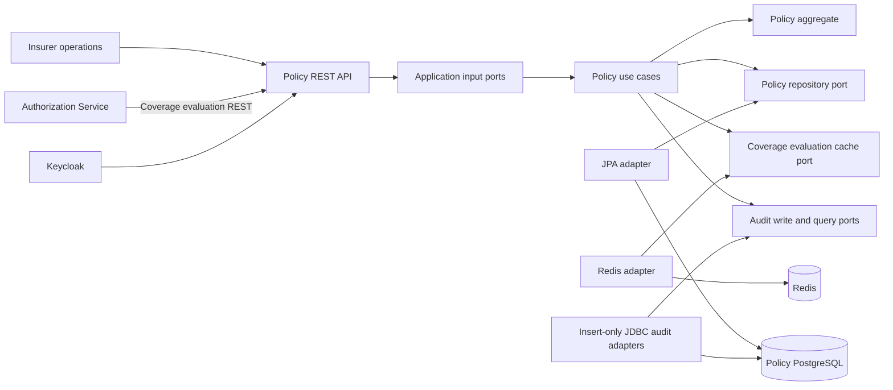
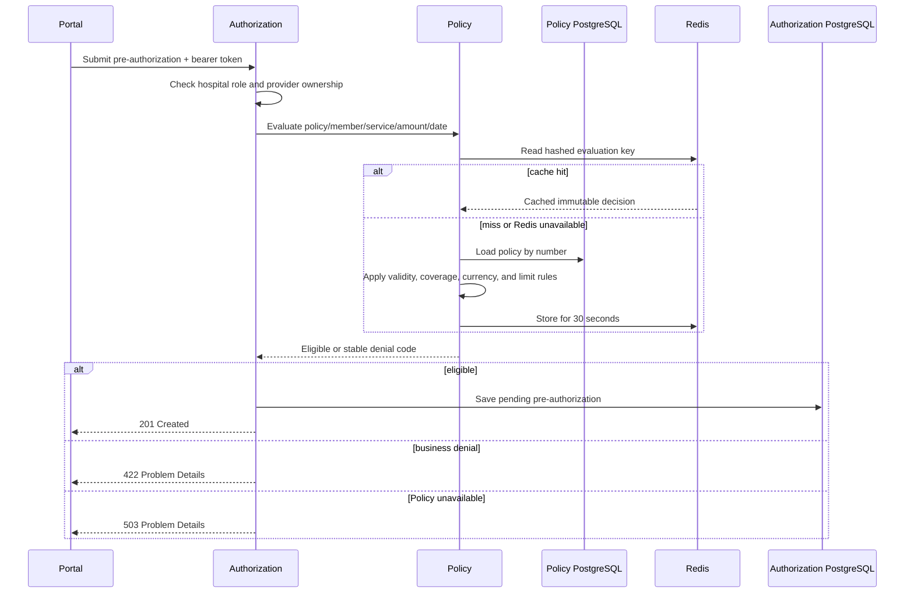
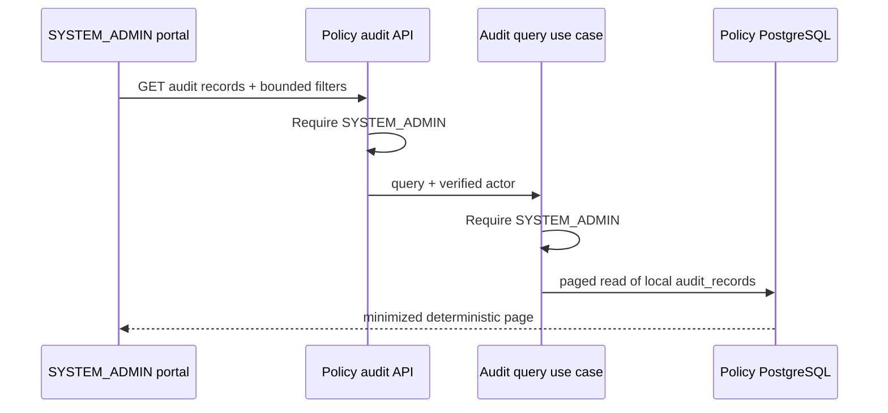

# Policy Service components

The Policy Service owns policies, coverage definitions, validity periods, and
financial limits. No other service reads its PostgreSQL database.

## Aggregate model

`Policy` is the aggregate root. It owns its validity period, lifecycle status,
member identity, and a unique set of `Coverage` entries indexed by
`ServiceCode`. `Money` protects non-negative amounts and currency-safe
arithmetic. A policy cannot be issued without coverage, with reversed validity
dates, duplicate service codes, or used amounts above a limit.

Evaluation produces a `CoverageDecision` instead of leaking persistence or HTTP
types into the domain. Stable outcomes include member mismatch, inactive or
expired policy, uncovered service, currency mismatch, and exceeded limit.

## Pre-authorization validation

The evaluation is deliberately query-like and does not consume or reserve a
limit yet. Reservation becomes a state-changing, idempotent operation with
optimistic concurrency and compensation in the event-driven milestone.

Redis is an acceleration adapter, not policy storage. It hashes the full lookup
identity, tracks keys per policy for invalidation, and fails open on every cache
operation. PostgreSQL remains authoritative and its failure is never converted
into an assumed eligible response.

## Transactional policy audit

Issuing a policy appends `POLICY_ISSUED` evidence in the same local transaction
as the aggregate. The typed record contains actor subject/roles, correlation ID,
controlled reason/status values, and retention class; it cannot carry member ID,
policy number, coverage/service codes, limits, or other business snapshots. A
Liquibase migration installs JSON-shape checks and triggers rejecting update,
delete, and truncate. Audit failure rolls back policy issuance.

`GET /api/v1/policies/audit-records` is independently protected in the controller
and application use case with `SYSTEM_ADMIN`. It accepts an optional aggregate
UUID, the service-local action allowlist, and bounded pagination up to 100 rows.
The JDBC query uses `occurred_at DESC, audit_id DESC`. It does not expose Policy
tables or provide a database join to another service.

