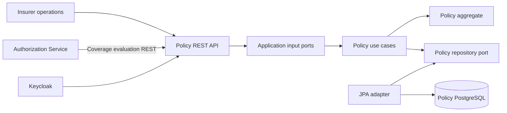
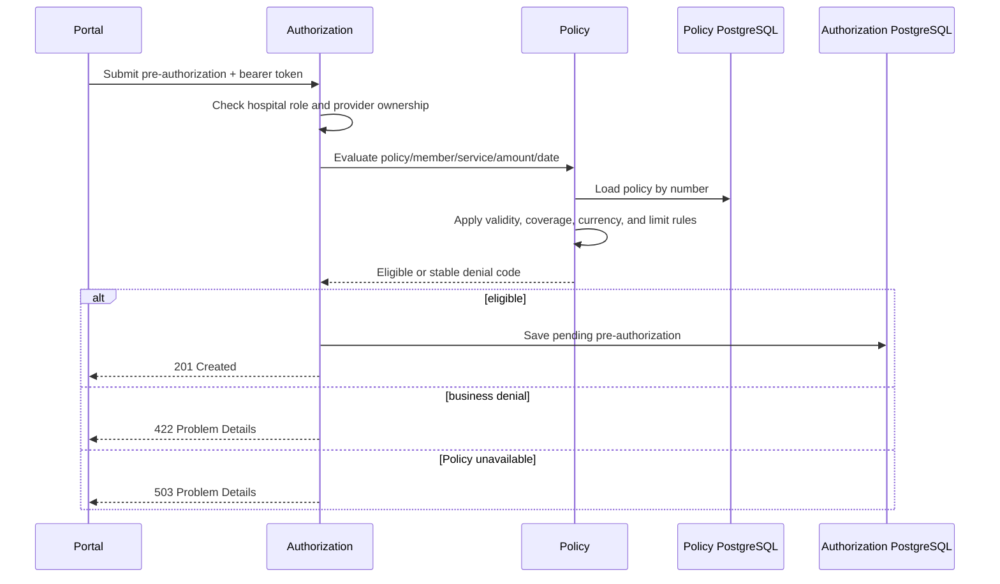

# Policy Service components

The Policy Service owns policies, coverage definitions, validity periods, and
financial limits. No other service reads its PostgreSQL database.

## Aggregate model

`Policy` is the aggregate root. It owns its validity period, lifecycle status,
member identity, and a unique set of `Coverage` entries indexed by
`ServiceCode`. `Money` protects non-negative amounts and currency-safe
arithmetic. A policy cannot be issued without coverage, with reversed validity
dates, duplicate service codes, or used amounts above a limit.

Evaluation produces a `CoverageDecision` instead of leaking persistence or HTTP
types into the domain. Stable outcomes include member mismatch, inactive or
expired policy, uncovered service, currency mismatch, and exceeded limit.

## Pre-authorization validation

The evaluation is deliberately query-like and does not consume or reserve a
limit yet. Reservation becomes a state-changing, idempotent operation with
optimistic concurrency and compensation in the event-driven milestone.

