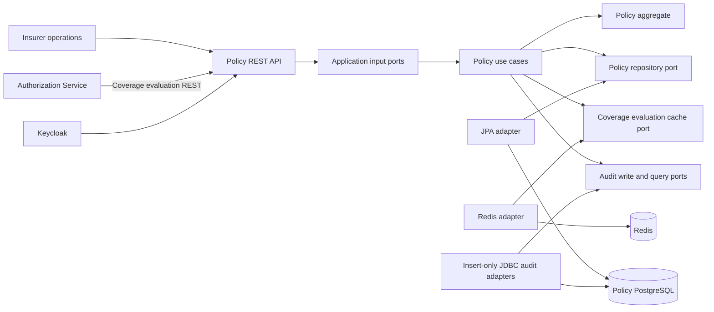
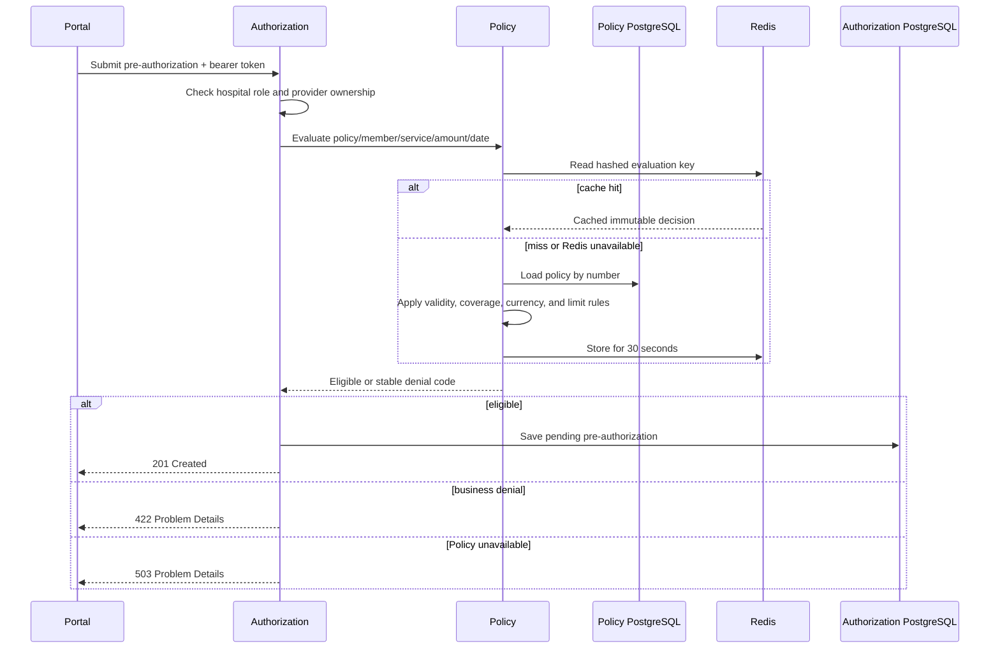
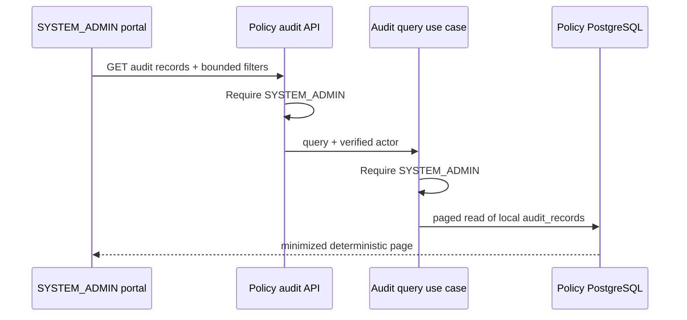

# Policy Service components

The Policy Service owns policies, coverage definitions, validity periods, and
financial limits. No other service reads its PostgreSQL database.

## Boundary and responsibility

| Capability | Policy Service responsibility | Explicitly outside the boundary |
| --- | --- | --- |
| Policy issuance | Validate and persist a policy with one or more coverages | Member registration and demographic ownership |
| Coverage evaluation | Decide eligibility from policy, member, service, date, amount, and currency | Creating or deciding a pre-authorization |
| Financial limits | Protect limit and used-amount invariants inside the aggregate | Cross-request benefit reservation and compensation |
| Audit evidence | Append and query minimized policy issuance evidence | Cross-service audit joins or clinical-data storage |
| Cache | Accelerate immutable evaluation results for a short period | Acting as a source of truth |

The service therefore answers a domain question for Authorization but does not
delegate its rules or database ownership to Authorization. A business denial
is a successful evaluation result; infrastructure unavailability is a technical
failure and must not be translated into eligibility.

### Enforced dependency direction

`CleanArchitectureTest` checks four compile-time boundaries. Domain classes may
depend only on Java and other Domain classes. Application classes may depend
only on Java, Domain, and Application classes. Presentation may use Application
but cannot bypass it to reach Domain or Infrastructure. Infrastructure may
implement Application/Domain ports but cannot depend on Presentation. The
inner-layer rules use allowlists, so introducing an unapproved third-party
framework fails the architecture test even when it is not Spring or Jakarta.

The focused Java 21 ArchUnit run passed all four rules. These rules protect
source-code dependency direction; they do not prove runtime behavior, module
deployment independence, or correctness of domain decisions.

## API and use-case map

| Method and path | Input port | Allowed roles | Success contract | Relevant failure contract |
| --- | --- | --- | --- | --- |
| `POST /api/v1/policies` | `CreatePolicyUseCase` | `INSURANCE_SPECIALIST`, `SYSTEM_ADMIN` | `201 Created` with the policy representation | `400` validation/domain error, `401` unauthenticated, `403` forbidden, `409` duplicate policy number |
| `POST /api/v1/coverage-evaluations` | `EvaluateCoverageUseCase` | `HOSPITAL_USER`, `INSURANCE_SPECIALIST`, `SYSTEM_ADMIN` | `200 OK` with either an eligible or denied business decision | `400` malformed input, `401` unauthenticated, `403` forbidden |
| `GET /api/v1/policies/audit-records` | `SearchAuditRecordsUseCase` | `SYSTEM_ADMIN` | `200 OK` with a bounded page of minimized evidence | `400` invalid query, `401` unauthenticated, `403` forbidden |

Business denials such as `LIMIT_EXCEEDED` intentionally use `200 OK`: the
request was valid and the domain produced a decision. They are not transport or
server failures. Controller request records enforce required values, positive
money, ISO-style three-letter uppercase currency strings, and bounded policy
and service codes before the application use case is invoked.

The creation response intentionally omits `Location` because the service does
not yet expose `GET /api/v1/policies/{id}`. Publishing a non-dereferenceable URI
would misrepresent the current REST lifecycle. A future secured query use case
may add both the resource endpoint and its matching `Location` header together.

## Application orchestration

`PolicyApplicationService` remains framework-free. It checks the application
role before calling any output port. Policy creation then checks uniqueness,
constructs and saves the aggregate, appends minimized audit evidence, and only
then invalidates cached evaluations. Coverage evaluation checks its operations
role before reading the cache or repository and stores the calculated database
result only on a cache miss.

`TransactionalPolicyUseCases` supplies write and read-only transaction
boundaries from Infrastructure. Audit insertion therefore participates in the
same local PostgreSQL transaction as policy creation. If audit persistence
fails, policy creation rolls back and cache invalidation is not attempted. A
focused run passed six application tests and five transaction/audit integration
tests, including unauthorized short-circuiting and this failure ordering.

## Security model and trust boundaries

Spring Security validates the bearer token as an OAuth 2.0 resource server and
maps Keycloak `realm_access.roles` values to `ROLE_*` authorities. The HTTP
filter chain requires authentication for every endpoint except health probes.
Method-level `@PreAuthorize` rules provide endpoint authorization. Custom
authentication-entry-point and access-denied handlers serialize both `401` and
`403` as RFC 9457 `application/problem+json`; controller advice continues to
handle application and validation failures after a request reaches MVC.

The service configures issuer and JWKS validation but does not repeat the
`health-insurance-api` audience check performed by APISIX at the external
boundary. This is acceptable only while direct service exposure is prevented by
the deployment network boundary. Repeating audience validation in every
resource server is a valid defense-in-depth improvement if services can be
reached through any path other than the gateway.

Authorization is deliberately repeated in the application layer through
`ActorContext`. This defense-in-depth prevents an alternative adapter, test
harness, or future message consumer from bypassing the business capability
check merely because it does not pass through the REST controller. Audit search
has the same dual enforcement. The application layer depends on its own role
enum and contains no Spring Security type.

The local service-to-service request relays the end-user bearer token. This
preserves the initiating identity and roles for the portfolio topology, but it
is not workload identity. Client credentials or token exchange would be a
separate production-hardening decision.

### Configuration and sensitive-data controls

The datasource password has no empty fallback: `DB_PASSWORD` must be supplied
at runtime, while Compose also requires its ignored `.env` value. The tracked
`.env.example` contains placeholders only, and `.env` is Git-ignored. Local
HTTP defaults for PostgreSQL, Redis, and Keycloak are development conveniences;
Compose supplies explicit service addresses and credentials.

Actuator exposes only `health` and `info`; unauthenticated health output does
not reveal component details. Application logging uses ECS structured output
and does not log request bodies, policy numbers, member identifiers, bearer
tokens, or credentials. Cache failure logs contain operational exceptions but
cache keys contain hashes rather than business identifiers.

`CorrelationIdFilter` accepts only 1–64 safe ASCII characters, replaces unsafe
input with a generated UUID, returns the selected ID, and removes it from MDC
in a `finally` block. Focused observability/security tests passed all three
cases, including unsafe-header rejection, MDC cleanup, and Keycloak role
conversion.

## Aggregate model

`Policy` is the aggregate root. It owns its validity period, lifecycle status,
member identity, and a unique set of `Coverage` entries indexed by
`ServiceCode`. `Money` protects non-negative amounts and currency-safe
arithmetic. A policy cannot be issued without coverage, with reversed validity
dates, duplicate service codes, a non-positive coverage limit, non-positive
utilization, or used amounts above a limit. Suspension is a guarded transition:
only an active policy can be suspended.

Evaluation produces a `CoverageDecision` instead of leaking persistence or HTTP
types into the domain. Stable outcomes include member mismatch, inactive or
expired policy, uncovered service, currency mismatch, and exceeded limit.

## Persistence mapping and consistency

The domain aggregate remains free of JPA annotations. `PolicyJpaEntity` and
`CoverageJpaEmbeddable` are infrastructure models, while
`JpaPolicyRepositoryAdapter` translates both directions. This prevents
Hibernate proxies, collection semantics, and column concerns from leaking into
the domain model.

| Persistence concern | Current implementation | Verified boundary |
| --- | --- | --- |
| Aggregate identity | UUID primary key on `policies` | JPA/PostgreSQL round-trip |
| Case-insensitive policy identity | `lower(policy_number)` unique index plus ignore-case repository methods | Index existence and lowercase lookup |
| Coverage ownership | `policy_coverages.policy_id` foreign key and JPA `@ElementCollection` | Aggregate reload includes owned coverage |
| Duplicate service coverage | Unique `(policy_id, service_code)` constraint | Index/constraint existence |
| Concurrency token | Aggregate `version` mapped to JPA `@Version` and the non-null database column | Two stale aggregate copies; the second update is rejected |
| Policy invariants | Validity ordering, status allowlist, and non-negative version checks | Constraint existence and invalid-date rejection |
| Financial invariants | Positive limit, `0 <= used <= limit`, and uppercase three-letter currency checks | Constraint existence and zero-limit rejection |
| Member/date access path | `(member_id, valid_from, valid_until)` index | Index existence; no current repository query consumes it |

Coverage is loaded eagerly because evaluation loads one policy and immediately
needs all of its usually small coverage definitions. This avoids a lazy-loading
dependency outside the adapter. It must be reconsidered if a paginated policy
listing is added, because joining an eager collection across many policies can
increase row volume or create additional selects.

`saveAndFlush` makes uniqueness violations observable inside the adapter. The
application performs a friendly pre-check, while the database unique index is
the final protection against concurrent duplicate policy numbers. The adapter
translates the resulting integrity violation into the application-level policy
number conflict.

The repository adapter carries the aggregate version in both mapping
directions. It merges the caller's detached version instead of first loading the
latest entity and silently overwriting it. PostgreSQL/Hibernate therefore
rejects a stale update through optimistic locking. The current public API has
no mutation command, so this protects the repository boundary and future
commands rather than claiming an exposed concurrent workflow.

Changeset `004-add-policy-invariant-constraints` repeats critical aggregate
rules at the PostgreSQL boundary. Domain validation remains the first line of
defense and provides clearer errors; database checks protect direct SQL,
maintenance scripts, and future writers. The currency constraint validates the
stored three-letter uppercase shape, while Java `Currency` performs the
stronger supported-code validation.

## Pre-authorization validation

The evaluation is deliberately query-like and does not consume or reserve a
limit. The aggregate contains a guarded utilization transition, but no
application command currently persists or coordinates benefit reservations.
That capability remains outside the current portfolio scope: a safe design
would require idempotent reservation and release commands, optimistic
concurrency, and explicit compensation or process coordination.

Redis is an acceleration adapter, not policy storage. It hashes the full lookup
identity, tracks keys per policy for invalidation, and fails open on every cache
operation. PostgreSQL remains authoritative and its failure is never converted
into an assumed eligible response.

The focused cache-adapter run passed four tests: hashed-key read/write, read
failure as a cache miss, non-fatal write failure, and non-fatal invalidation
failure. A live outage exercise then stopped only Redis and repeated the
synthetic MRI evaluation. Policy Service returned `200 ELIGIBLE` from the
authoritative PostgreSQL path and Redis was restarted immediately. This proves
availability behavior for this local scenario; it is not a load or timeout
budget measurement.

Because the decision key includes member, service, amount, currency, and date,
arbitrary request variation can create high key cardinality during the 30-second
window. The TTL bounds retention but does not by itself prove memory safety under
load. A production review should measure hit ratio and key creation rate, set an
explicit Redis memory/eviction policy, and compare decision caching with a
policy-snapshot cache before changing the current portfolio design.

## Verification evidence and current gaps

The latest complete Policy Service run on 2026-09-14 passed all 49 tests. The
suite covers domain decisions, application authorization, Spring bean wiring,
JPA and all four Liquibase changesets against PostgreSQL Testcontainers, Redis
cache behavior against a Redis Testcontainer, transactional audit rollback,
optimistic concurrency, controller/security contracts, correlation-ID hygiene,
and ArchUnit dependency rules.

A focused persistence run passed all five
`JpaPolicyRepositoryIntegrationTest` methods against a fresh PostgreSQL 17
Testcontainer. It applied all Liquibase changesets, reloaded the aggregate with
its coverage and remaining amount, asserted indexes and invariant constraints,
proved rejection of a stale aggregate update, and rejected invalid date and
zero-limit SQL writes.

The focused domain run passed all nine `PolicyTest` cases, including validity,
coverage uniqueness, positive limits/utilization, eligibility and denial
decisions, and the guarded suspension transition.

The audit-integrity review then added changeset
`003-harden-audit-change-shape`. A focused run of
`PolicyAuditTransactionIntegrationTest` and
`JpaPolicyRepositoryIntegrationTest` passed all seven tests against two fresh
PostgreSQL 17 containers. It proves that incomplete audit change objects are
rejected in addition to the existing commit, rollback, append-only, query,
migration, round-trip, and index checks.

The focused MVC evidence currently verifies:

- policy creation by an insurance specialist;
- rejection of an unauthenticated policy creation request with an RFC 9457
  `401` response;
- denial of policy creation to a hospital user with an RFC 9457 `403` response
  without invoking the use case;
- RFC 9457 validation output without invoking the use case;
- duplicate policy-number mapping to RFC 9457 `409 Conflict`;
- a coverage denial represented as a valid `200 OK` business response;
- audit access restricted to a system administrator; and
- audit response minimization of policy, member, and coverage data; and
- conversion of Keycloak `realm_access.roles` to Spring `ROLE_*` authorities.

The MVC tests still inject authenticated authorities directly, while role-claim
conversion is tested separately as a unit. They therefore do not constitute a
cryptographic end-to-end JWT test.

### Local runtime evidence (2026-09-14)

An isolated local exercise started the existing PostgreSQL 17, Redis, and
Keycloak containers and ran Policy Service on Java 21.0.8. It verified:

- OIDC discovery from the imported `health-insurance` realm;
- `UP` application health and `401 Unauthorized` without a token;
- a real Keycloak-signed token carrying `INSURANCE_SPECIALIST`;
- `201 Created` for an active policy with MRI coverage;
- `ELIGIBLE` for a request inside the limit and `LIMIT_EXCEEDED` above it;
- `MEMBER_MISMATCH`, `SERVICE_NOT_COVERED`, `CURRENCY_MISMATCH`, and
  `POLICY_EXPIRED` for their corresponding negative inputs;
- RFC 9457 validation evidence with `400 Bad Request` and bounded field names;
- the policy and coverage row in PostgreSQL with `used_amount = 0`;
- a transactionally stored `POLICY_ISSUED` audit row with the supplied
  correlation ID;
- all Policy Liquibase changesets recorded in `databasechangelog`; and
- all six policy/coverage invariant constraints installed by changeset `004`;
- the audit JSON allowlist constraint and append-only trigger installed in
  PostgreSQL; and
- a hashed Redis evaluation value plus policy-key set, both with a 30-second
  TTL.

The unchanged `used_amount` confirms that evaluation is read-only; it must not
be presented as benefit reservation. This isolated exercise did not pass
through APISIX or Authorization Service, so gateway audience rejection and
end-user token relay remain separate integration checks rather than verified
Policy-only evidence.

## Transactional policy audit

Issuing a policy appends `POLICY_ISSUED` evidence in the same local transaction
as the aggregate. The typed record contains actor subject/roles, correlation ID,
controlled reason/status values, and retention class; it cannot carry member ID,
policy number, coverage/service codes, limits, or other business snapshots. A
Liquibase migrations install JSON-shape checks and a statement-level trigger
rejecting update, delete, and truncate. The hardened shape requires both
`fromStatus` and `toStatus`, rejects additional keys, permits only a JSON string
or JSON null for `fromStatus`, and requires a JSON string for `toStatus`. Audit
failure rolls back policy issuance.

`GET /api/v1/policies/audit-records` is independently protected in the controller
and application use case with `SYSTEM_ADMIN`. It accepts an optional aggregate
UUID, the service-local action allowlist, and bounded pagination up to 100 rows.
The JDBC query uses `occurred_at DESC, audit_id DESC`. It does not expose Policy
tables or provide a database join to another service.

