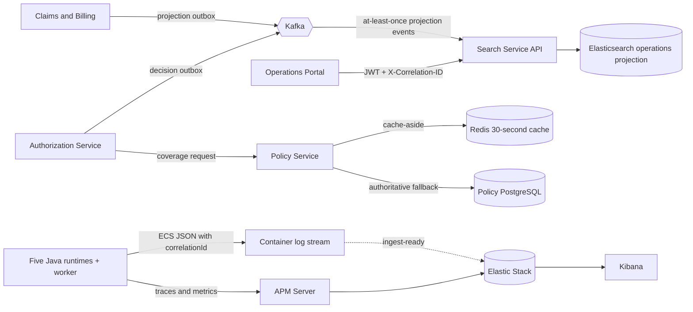
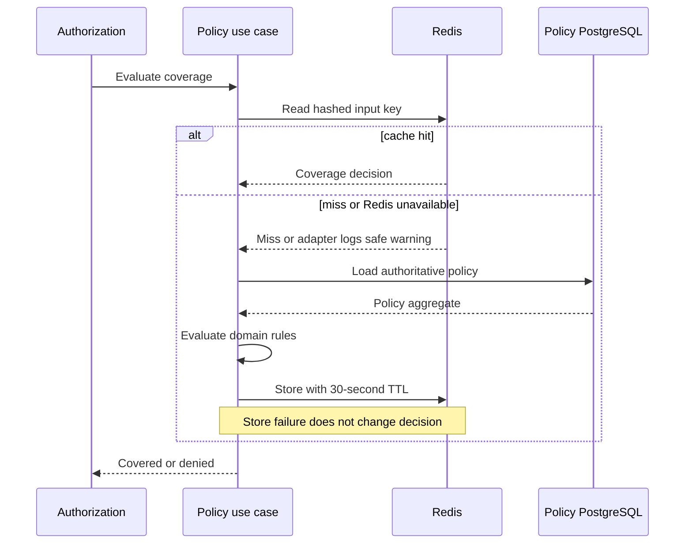
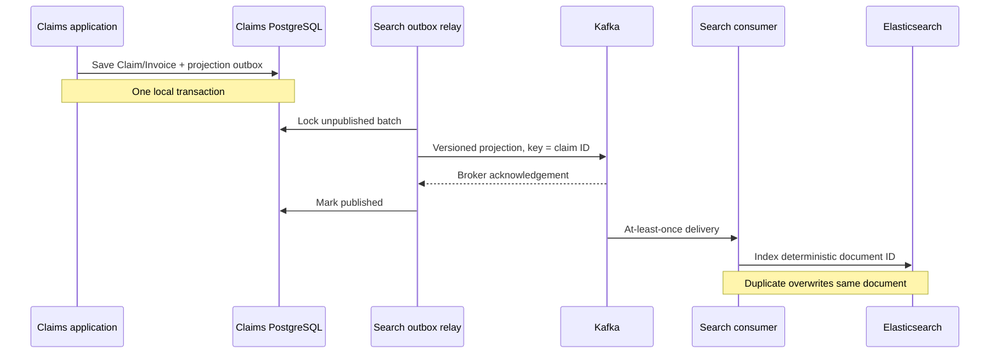
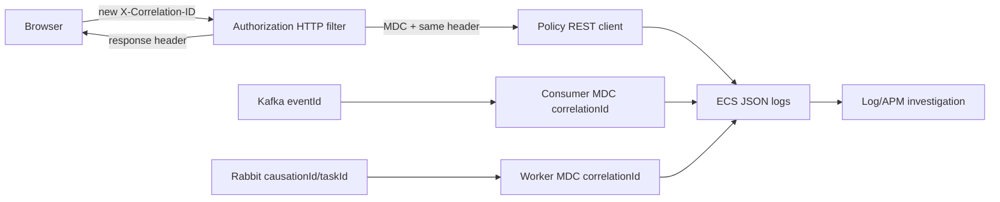

# Search, cache, and observability architecture

## Runtime responsibilities

## Cache-aside sequence and failure behavior

The digest prevents policy/member identifiers from appearing in Redis keys. The
cached value is an evaluation result, not a mutable Policy aggregate. Invalidation
uses a per-policy Redis set so a successful policy creation removes known entries.

## Search projection sequence

Search documents contain only operational identifiers and financial workflow
fields required by the portal. Search does not authorize commands and cannot be
used to reconstruct an aggregate. A rebuild can replay integration history or a
future administrative reindex job. Consumer failures receive three total
fixed-backoff attempts by default and then the original record is sent to the
source topic's `.DLT`; invalid versions and malformed projections therefore do
not block a partition forever.

## Correlation propagation

The filter removes MDC in `finally`, preventing thread-pool leakage. Incoming IDs
are limited to 64 alphanumeric, dot, underscore or hyphen characters. Logs use
safe IDs and state; member health data, access tokens and message payloads must
not be logged.

## Consistency matrix

| Concern | Source of truth | Consistency | Failure behavior |
| --- | --- | --- | --- |
| Policy and coverage | Policy PostgreSQL | Strong in local transaction | Redis bypass; database failure denies submission |
| Claim/invoice state | Claims PostgreSQL | Strong in local transaction | Search intent remains in outbox |
| Operations search | Elasticsearch | Eventual | Core writes continue; relay/consumer retries |
| Trace/metrics | APM Server/Elasticsearch | Best effort | Business processing continues |
| Console logs | Container stdout | Immediate per process | Remain available if APM is unavailable |
