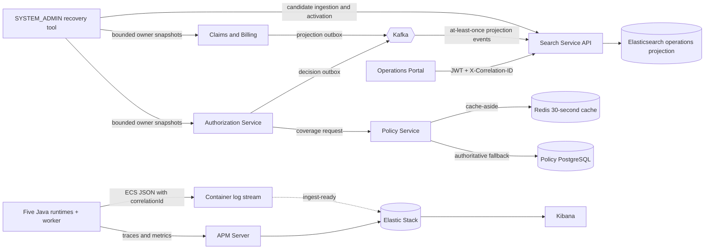
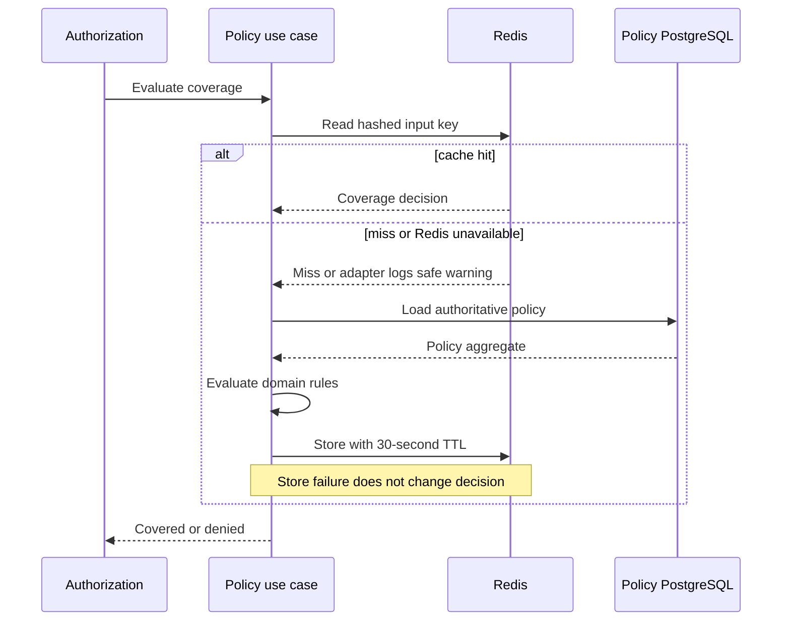
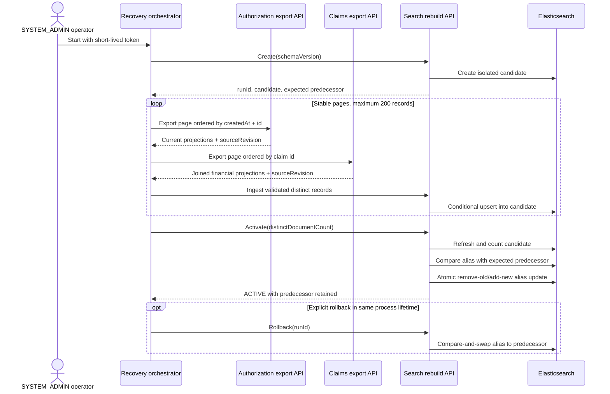
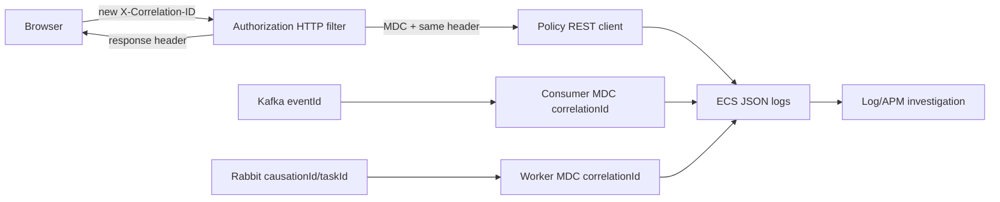

# Search, cache ve observability mimarisi

## Runtime sorumlulukları



## Cache-aside sequence ve failure davranışı



Digest, policy/member identifier'larının Redis key'lerinde görünmesini engeller.
Cached value mutable Policy aggregate değil evaluation result'tır. Invalidation
per-policy Redis set kullanır; başarılı policy creation bilinen entry'leri kaldırır.

## Search projection sequence

```mermaid
sequenceDiagram
    participant C as Claims application
    participant DB as Claims PostgreSQL
    participant O as Search outbox relay
    participant K as Kafka
    participant S as Search consumer
    participant E as Elasticsearch
    C->>DB: Save Claim/Invoice + projection outbox
    Note over C,DB: One local transaction
    O->>DB: Lock unpublished batch
    O->>K: Versioned projection, key = claim ID
    K-->>O: Broker acknowledgement
    O->>DB: Mark published
    K->>S: At-least-once delivery
    S->>E: Conditional upsert by deterministic ID + sourceRevision
    Note right of S: Create or newer replaces; equal/older revisions are no-ops
```

Search document'ları yalnızca portal için gereken operational identifier ve financial
workflow field'larını içerir. Search command authorize etmez ve aggregate reconstruct
etmek için kullanılamaz. Rebuild, Authorization ve Claims/Billing owner API'lerinden
current, bounded snapshot alır; database'lerini asla okumaz ve Kafka retention'ın
complete history içerdiğini varsaymaz. Transient consumer failure varsayılan olarak
toplam üç fixed-backoff attempt alır; ardından original record source topic'in
`.DLT`'sine gönderilir. Malformed JSON, missing event identity, unexpected event
type/version ve invalid projection invariant permanent `IllegalArgumentException`
failure'dır ve gereksiz retry olmadan doğrudan DLT'ye gider.

## Versioned rebuild ve rollback



Normal query ve event write'ları stable `healthcare-operations` alias'ını hedefler.
Physical candidate'lar `healthcare-operations-v{schema}-{opaqueRunId}` kullanır.
Activation hiçbir index'i silmez. Authorization aggregate revision kullanır;
Claims/Billing Claim ve Invoice revision'larını birleştirir; böylece iki transition'dan
biri projection'ı ilerletir. Yeni field olmayan legacy document'lar rebuild bunları
değiştirene kadar revision 1'e map edilir. Equal-revision delivery bilinçli olarak
no-op'tur; ordinary duplicate'leri idempotent tutar ve divergent duplicate'in sadece
daha geç geldiği için kazanmasını engeller.

Candidate count mismatch veya concurrent alias movement RFC 9457 `409` döndürür
ve current read path'e dokunmaz. İlk run registry in-memory'dir; dolayısıyla local
rehearsal destekler, restart-resumable production job değildir. Bkz.
[recovery runbook](../operations/search-and-messaging-recovery.md).

Search authentication ve method-authorization failure'ları da RFC 9457
`application/problem+json` kullanır. `@EnableMethodSecurity` rebuild controller
role'ünü invocation öncesinde enforce eder; application use case defense in depth
olarak `SYSTEM_ADMIN` check'ini tekrarlar. Normal hospital query'leri provider scope'u
signed JWT'den türetir ve request input ile genişletemez.

## Correlation propagation



Filter `finally` içinde MDC'yi temizler ve thread-pool leakage'ı engeller. Incoming
ID'ler 64 alphanumeric, dot, underscore veya hyphen character ile sınırlandırılır.
Log'lar safe ID ve state kullanır; member health data, access token ve message payload
loglanmamalıdır.

## Consistency matrisi

| Concern | Source of truth | Consistency | Failure davranışı |
| --- | --- | --- | --- |
| Policy ve coverage | Policy PostgreSQL | Local transaction'da strong | Redis bypass; database failure submission'ı reddeder |
| Claim/invoice state | Claims PostgreSQL | Local transaction'da strong | Search intent outbox'ta kalır |
| Operations search | Derived index üzerindeki Elasticsearch alias | Eventual | Core write devam eder; failed candidate activate edilmez |
| Trace/metrics | APM Server/Elasticsearch | Best effort | Business processing devam eder |
| Console log'ları | Container stdout | Process başına immediate | APM unavailable olsa da kullanılabilir kalır |
