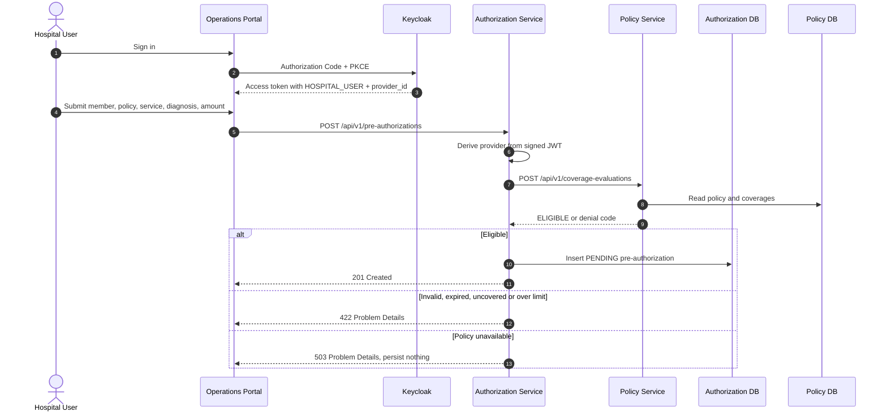
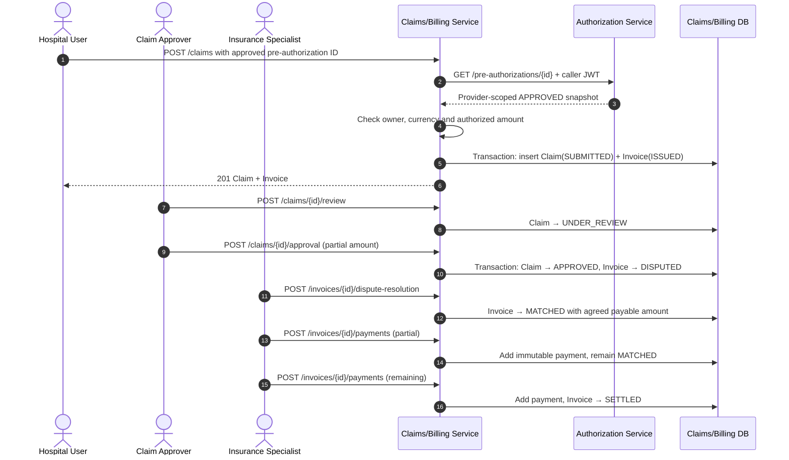
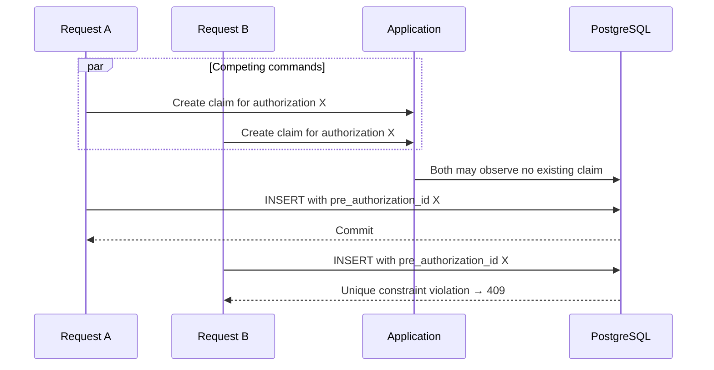

# Workflow Sequence Diagrams

## Submit and decide a pre-authorization

```mermaid
sequenceDiagram
    autonumber
    actor H as Hospital User
    participant UI as Operations Portal
    participant K as Keycloak
    participant A as Authorization Service
    participant P as Policy Service
    participant ADB as Authorization DB
    participant PDB as Policy DB

    H->>UI: Sign in
    UI->>K: Authorization Code + PKCE
    K-->>UI: Access token with HOSPITAL_USER + provider_id
    H->>UI: Submit member, policy, service, diagnosis, amount
    UI->>A: POST /api/v1/pre-authorizations
    A->>A: Derive provider from signed JWT
    A->>P: POST /api/v1/coverage-evaluations
    P->>PDB: Read policy and coverages
    P-->>A: ELIGIBLE or denial code
    alt Eligible
        A->>ADB: Insert PENDING pre-authorization
        A-->>UI: 201 Created
    else Invalid, expired, uncovered or over limit
        A-->>UI: 422 Problem Details
    else Policy unavailable
        A-->>UI: 503 Problem Details, persist nothing
    end
```

## Claim adjudication, reconciliation and settlement

```mermaid
sequenceDiagram
    autonumber
    actor H as Hospital User
    actor C as Claim Approver
    actor F as Insurance Specialist
    participant CB as Claims/Billing Service
    participant A as Authorization Service
    participant DB as Claims/Billing DB

    H->>CB: POST /claims with approved pre-authorization ID
    CB->>A: GET /pre-authorizations/{id} + caller JWT
    A-->>CB: Provider-scoped APPROVED snapshot
    CB->>CB: Check owner, currency and authorized amount
    CB->>DB: Transaction: insert Claim(SUBMITTED) + Invoice(ISSUED)
    CB-->>H: 201 Claim + Invoice

    C->>CB: POST /claims/{id}/review
    CB->>DB: Claim → UNDER_REVIEW
    C->>CB: POST /claims/{id}/approval (partial amount)
    CB->>DB: Transaction: Claim → APPROVED, Invoice → DISPUTED

    F->>CB: POST /invoices/{id}/dispute-resolution
    CB->>DB: Invoice → MATCHED with agreed payable amount
    F->>CB: POST /invoices/{id}/payments (partial)
    CB->>DB: Add immutable payment, remain MATCHED
    F->>CB: POST /invoices/{id}/payments (remaining)
    CB->>DB: Add payment, Invoice → SETTLED
```

## Concurrency and duplicate defense

```mermaid
sequenceDiagram
    participant R1 as Request A
    participant R2 as Request B
    participant App as Application
    participant DB as PostgreSQL
    par Competing commands
        R1->>App: Create claim for authorization X
        R2->>App: Create claim for authorization X
    end
    App->>DB: Both may observe no existing claim
    R1->>DB: INSERT with pre_authorization_id X
    DB-->>R1: Commit
    R2->>DB: INSERT with pre_authorization_id X
    DB-->>R2: Unique constraint violation → 409
```
