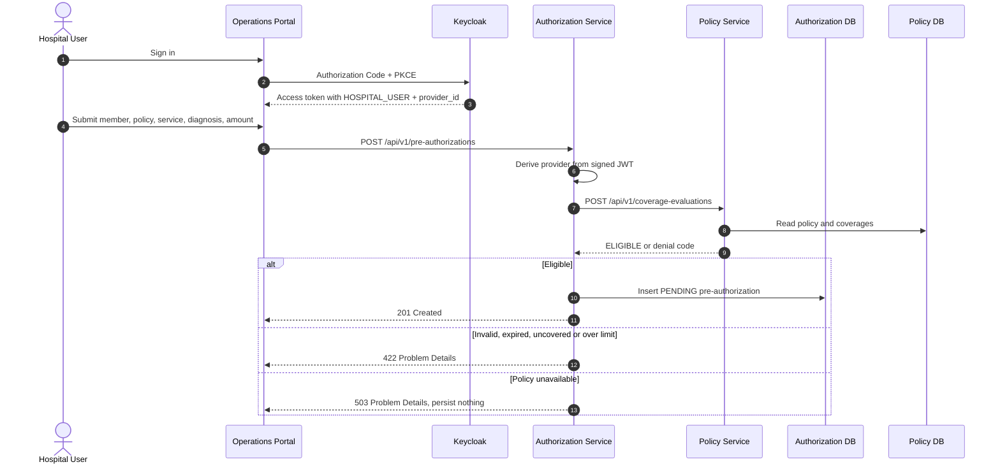
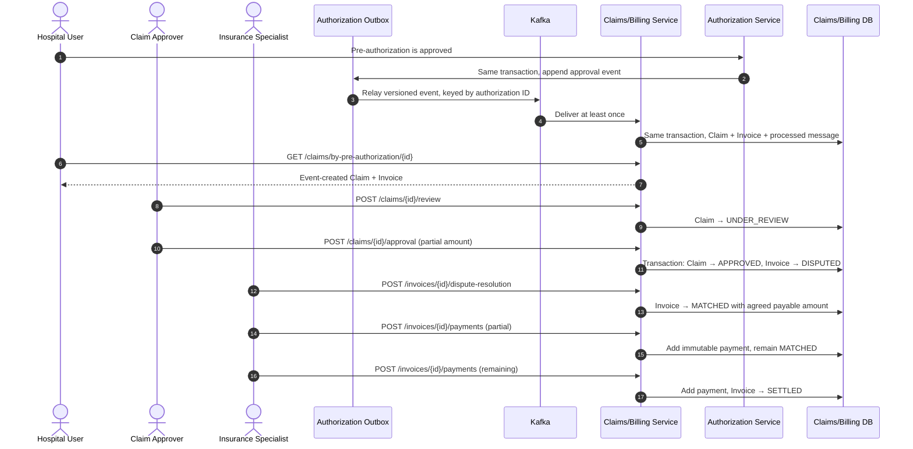
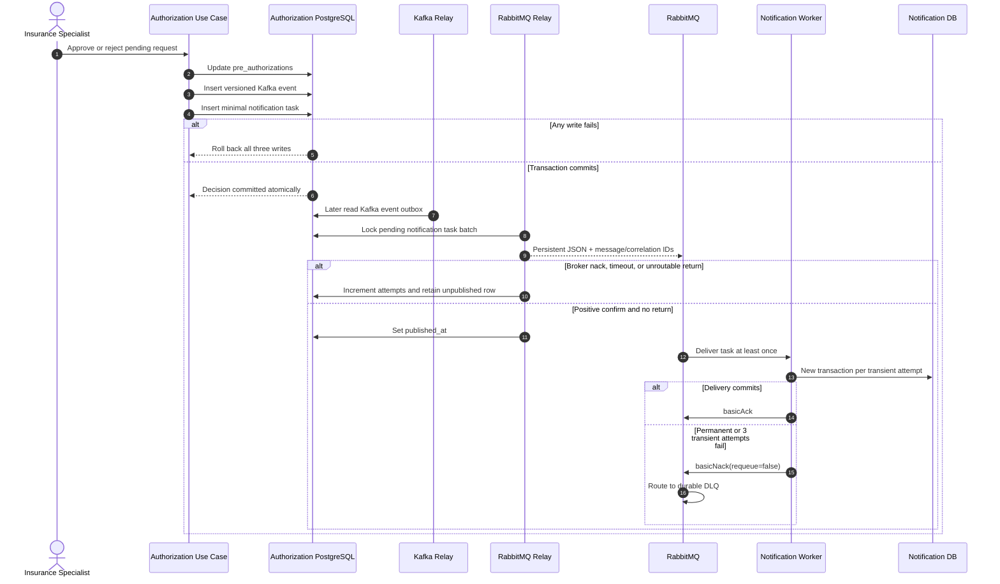
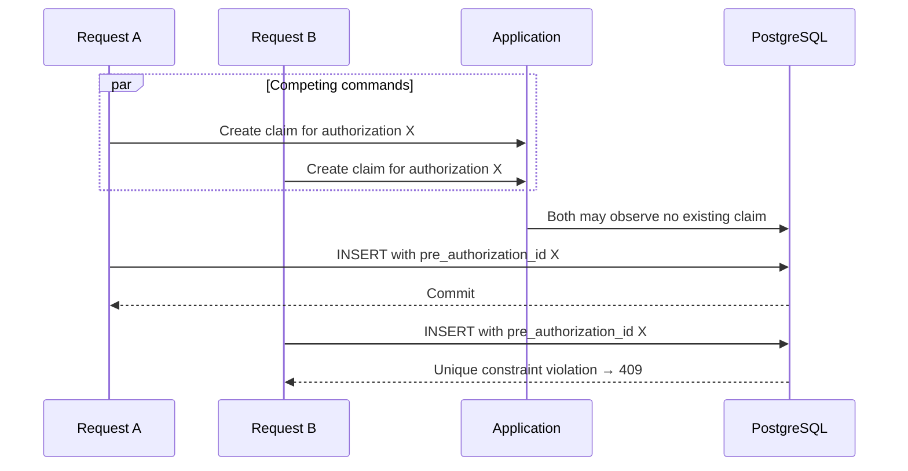

# Workflow Sequence Diagrams

## Submit and decide a pre-authorization

## Claim adjudication, reconciliation and settlement

## Decision and notification intent transaction

`taskId` is retained from producer outbox through RabbitMQ and the delivery
primary key. A broker redelivery after a lost acknowledgement therefore becomes
an idempotent no-op. The sender also receives `taskId` so a future external
provider can apply the same protection across the final side-effect boundary.

## Concurrency and duplicate defense

