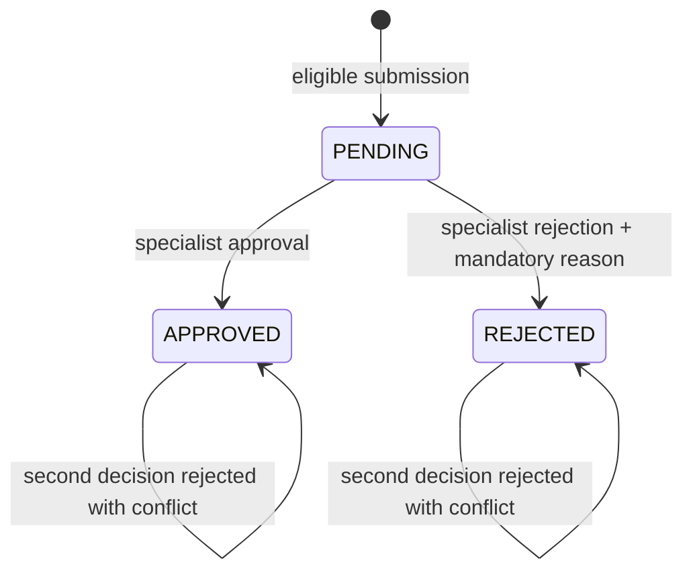
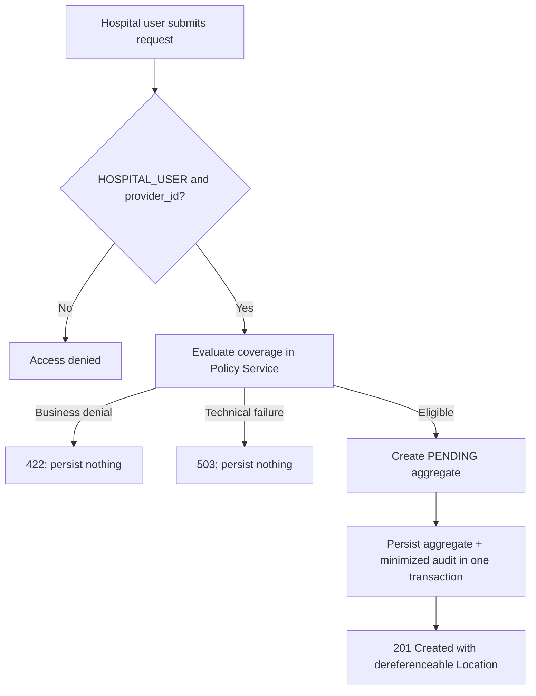

# Authorization Service business analysis

This document describes the implemented pre-authorization workflow. It is a
business view of existing behavior, not a proposal to expand the product.

## Purpose and actors

Authorization Service owns hospital pre-authorization requests and their
decisions. Policy rules remain in Policy Service; claim and invoice ownership
begins only after an approval event reaches Claims/Billing.

| Actor | Implemented responsibility |
| --- | --- |
| `HOSPITAL_USER` | Submit a request for the provider in the signed `provider_id`; list and read only that provider's requests |
| `INSURANCE_SPECIALIST` | List/read requests across providers; approve or reject a pending request |
| `SYSTEM_ADMIN` | List/read across providers and query minimized audit evidence; cannot decide unless also assigned `INSURANCE_SPECIALIST` |

The provider ID is derived from the verified token, never trusted from the
request body. Role checks at REST and application layers protect both HTTP and
future alternative adapters.

## State model

There is no arbitrary status update, reopening, cancellation, or deletion
workflow. A decision is legal only from `PENDING`. Optimistic locking ensures
that two concurrent specialists cannot both persist a decision. The same state,
amount, currency, timestamp, and version invariants are repeated as PostgreSQL
constraints so invalid direct writes cannot bypass the aggregate.

## Submission workflow

Required business input includes member, policy number, service, diagnosis,
positive requested amount, and currency. Coverage evaluation is synchronous
because the hospital requires an immediate answer before a request is accepted.
This creates temporal coupling but prevents an invalid `PENDING` request from
being stored.

## Decision workflow

| Step | Rule or effect |
| ---: | --- |
| 1 | Caller must have `INSURANCE_SPECIALIST` |
| 2 | Target request must exist and be `PENDING` |
| 3 | Approval reason is optional; rejection reason is mandatory |
| 4 | Aggregate, audit evidence, Kafka event, and RabbitMQ notification-task outbox record are written in one local transaction |
| 5 | Kafka later starts Claims/Billing only for an approved event |
| 6 | RabbitMQ later delivers the provider notification task |

Broker publication is not inside the HTTP transaction. The outbox records make
the committed decision recoverable when Kafka or RabbitMQ is temporarily
unavailable. At-least-once delivery requires downstream idempotency.

## Read and work-queue rules

Hospital queries are always scoped to the signed provider identity. Insurance
specialists and system administrators may query across providers. Filters,
page size, and sort fields are bounded; stable ID tie-breaking prevents records
with equal primary sort values from moving unpredictably between pages.

The API exposes submission, collection search, detail lookup, approval, and
rejection. These operations form a task-oriented REST API rather than a generic
CRUD status endpoint.

## Failure semantics

| Situation | Contract | Business effect |
| --- | --- | --- |
| Unauthenticated / wrong role / wrong provider | `401` or `403` Problem Details | No disclosure or mutation |
| Policy business denial | `422` Problem Details | No pre-authorization created |
| Policy dependency unavailable | `503` Problem Details | Fail closed; no request created |
| Missing request | `404` Problem Details | No mutation |
| Already decided or concurrent update | `409` Problem Details | First committed decision remains authoritative |
| Broker unavailable after decision | HTTP decision can remain committed | Outbox stays pending for retry |

## Privacy and audit boundary

The aggregate contains member, policy, diagnosis, service, provider, and money
references needed for the workflow. Logs and audit evidence deliberately avoid
these values. Audit rows contain controlled action/status metadata, actor
identity and roles, correlation ID, and timestamps. Each service owns its own
append-only journal; no cross-database audit join is performed.

## Verified acceptance scenarios

The domain tests verify creation as `PENDING`, approval, rejection with a
mandatory reason, rejection of a second decision, and positive amount. Broader
application, persistence, controller, security, transaction, outbox, and
concurrency evidence is described in
[Authorization Service architecture](../architecture/authorization-service.md)
and the [end-to-end workflow diagrams](../architecture/workflow-sequences.md).

The focused local checkpoint also executed the real HTTP and broker path with
synthetic data: unauthenticated access returned RFC 9457 `401`, a hospital user
submitted a provider-scoped `PENDING` request, a specialist approved it, and a
repeat decision returned `409`. PostgreSQL recorded aggregate version `1`, both
audit actions, and one-attempt acknowledged Kafka and RabbitMQ outbox records.
The complete Authorization suite passed all 78 tests at this checkpoint. The
reproduction commands and evidence limits are documented in the
[local verification guide](../development/authorization-service-local-verification.md).

## Explicit scope boundaries

- There is no automatic approval strategy, medical rules engine, reopening, or cancellation workflow.
- Policy evaluation does not reserve coverage limit.
- Claims/Billing creation is eventually consistent after approval.
- End-user token relay is used instead of production workload identity or token exchange.
- Diagnosis is stored as a code string; terminology validation is outside the implemented scope.
- The workflow is portfolio-grade and tested, but its operational limits are not claimed as production capacity evidence.
