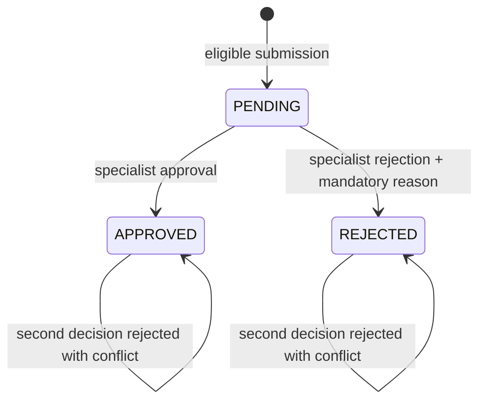
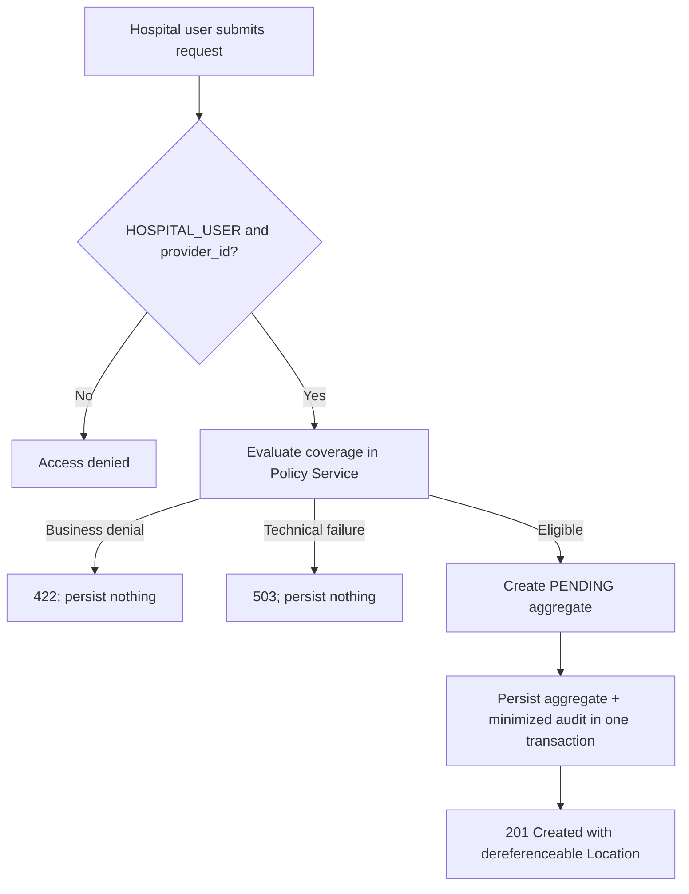

# Authorization Service iş analizi

Bu doküman uygulanmış ön provizyon iş akışını açıklar. Mevcut davranışın business görünümüdür; ürün kapsamını genişletme önerisi değildir.

## Amaç ve aktörler

Authorization Service hastane ön provizyon taleplerinin ve bunlara verilen kararların sahibidir. Policy kuralları Policy Service içinde kalır; claim ve invoice sahipliği yalnızca approval event Claims/Billing'e ulaştıktan sonra başlar.

| Aktör | Uygulanan sorumluluk |
| --- | --- |
| `HOSPITAL_USER` | Signed `provider_id` içindeki provider adına request gönderir; yalnızca o provider'ın request'lerini listeler ve okur |
| `INSURANCE_SPECIALIST` | Provider'lar arasında request listeler/okur; pending request'i approve veya reject eder |
| `SYSTEM_ADMIN` | Provider'lar arasında list/read yapar ve minimized audit evidence sorgular; ayrıca `INSURANCE_SPECIALIST` atanmadıkça karar veremez |

Provider ID verified token'dan türetilir; request body içinden gelen değere asla güvenilmez. REST ve application layer'daki role check'ler hem HTTP'yi hem future alternative adapter'ları korur.

## State modeli

Arbitrary status update, reopening, cancellation veya deletion workflow yoktur. Decision yalnızca `PENDING` durumundan verilebilir. Optimistic locking iki concurrent specialist'in aynı request için birlikte karar persist etmesini engeller. Aynı state, amount, currency, timestamp ve version invariant'ları PostgreSQL constraint'leriyle tekrarlanır; böylece invalid direct write aggregate'i bypass edemez.

## Submission workflow

Required business input member, policy number, service, diagnosis, positive requested amount ve currency içerir. Coverage evaluation synchronous'dur; çünkü hospital bir request kabul edilmeden önce immediate answer ister. Bu temporal coupling oluşturur ancak invalid `PENDING` request'in saklanmasını engeller.

## Decision workflow

| Adım | Kural veya etki |
| ---: | --- |
| 1 | Caller `INSURANCE_SPECIALIST` rolüne sahip olmalıdır |
| 2 | Target request bulunmalı ve `PENDING` olmalıdır |
| 3 | Approval reason optional, rejection reason mandatory'dir |
| 4 | Aggregate, audit evidence, Kafka event ve RabbitMQ notification-task outbox record tek local transaction içinde yazılır |
| 5 | Kafka daha sonra yalnızca approved event için Claims/Billing başlatır |
| 6 | RabbitMQ daha sonra provider notification task'ını deliver eder |

Broker publication HTTP transaction içinde değildir. Outbox record'ları Kafka veya RabbitMQ geçici unavailable olduğunda committed decision'ı recover edilebilir tutar. At-least-once delivery downstream idempotency gerektirir.

## Read ve work-queue kuralları

Hospital query'leri her zaman signed provider identity ile scope edilir. Insurance specialist ve system administrator provider'lar arasında query yapabilir. Filter, page size ve sort field'ları bounded'dır; stable ID tie-breaker, primary sort value eşit olduğunda record'ların page'ler arasında öngörülemez biçimde hareket etmesini engeller.

API submission, collection search, detail lookup, approval ve rejection sunar. Bu operation'lar generic CRUD status endpoint yerine task-oriented REST API oluşturur.

## Failure semantics

| Durum | Contract | Business etkisi |
| --- | --- | --- |
| Unauthenticated / yanlış role / yanlış provider | `401` veya `403` Problem Details | Disclosure veya mutation yok |
| Policy business denial | `422` Problem Details | Pre-authorization oluşturulmaz |
| Policy dependency unavailable | `503` Problem Details | Fail-closed; request oluşturulmaz |
| Request bulunamadı | `404` Problem Details | Mutation yok |
| Zaten karar verilmiş veya concurrent update | `409` Problem Details | İlk committed decision authoritative kalır |
| Decision sonrası broker unavailable | HTTP decision committed kalabilir | Outbox retry için pending kalır |

## Privacy ve audit boundary

Aggregate workflow için gereken member, policy, diagnosis, service, provider ve money reference'larını içerir. Log ve audit evidence bu value'ları bilinçli olarak içermez. Audit row'ları controlled action/status metadata, actor identity ve role'leri, correlation ID ve timestamp içerir. Her servis kendi append-only journal'ının sahibidir; cross-database audit join yapılmaz.

## Doğrulanmış acceptance scenario'ları

Domain testleri `PENDING` creation, approval, mandatory reason ile rejection, ikinci decision'ın reddi ve positive amount davranışlarını doğrular. Daha geniş application, persistence, controller, security, transaction, outbox ve concurrency evidence [Authorization Service architecture](../architecture/authorization-service.md) ve [end-to-end workflow diyagramlarında](../architecture/workflow-sequences.md) açıklanır.

Focused local checkpoint gerçek HTTP ve broker path'i sentetik data ile de çalıştırdı: unauthenticated access RFC 9457 `401` döndürdü, hospital user provider-scoped `PENDING` request gönderdi, specialist bunu approve etti ve repeat decision `409` döndürdü. PostgreSQL aggregate version `1`, iki audit action ve birer attempt'te acknowledged Kafka ile RabbitMQ outbox record'larını kaydetti. Complete Authorization suite bu checkpoint'te 78 testin tamamından geçti. Reproduction command ve evidence limit'leri [local verification guide](../development/authorization-service-local-verification.md) içinde dokümante edilmiştir.

## Açık scope boundary'leri

- Automatic approval strategy, medical rules engine, reopening veya cancellation workflow yoktur.
- Policy evaluation coverage limit reserve etmez.
- Claims/Billing creation approval sonrasında eventually consistent'tir.
- Production workload identity veya token exchange yerine end-user token relay kullanılır.
- Diagnosis code string olarak saklanır; terminology validation implemented scope dışındadır.
- Workflow portfolio-grade ve test edilmiştir; operational limit'leri production capacity evidence olarak sunulmaz.
