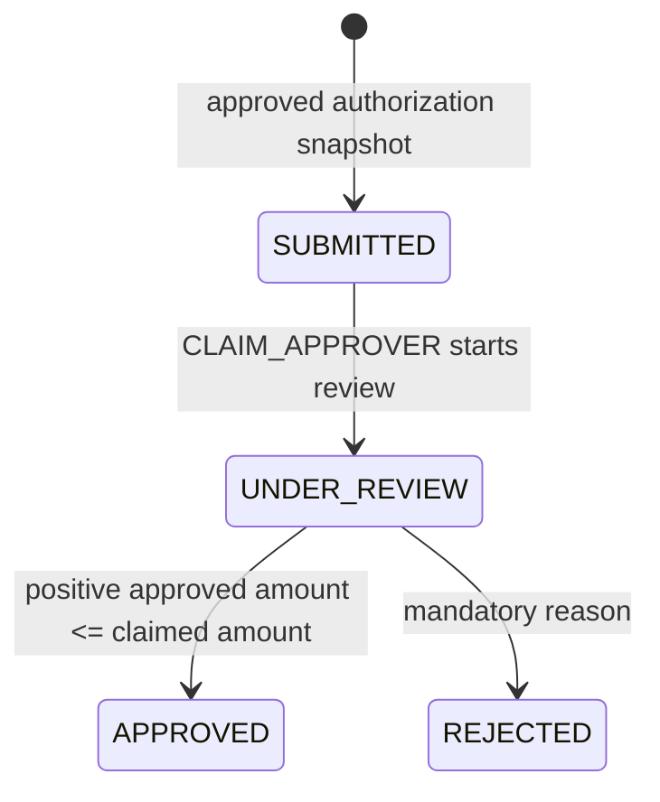
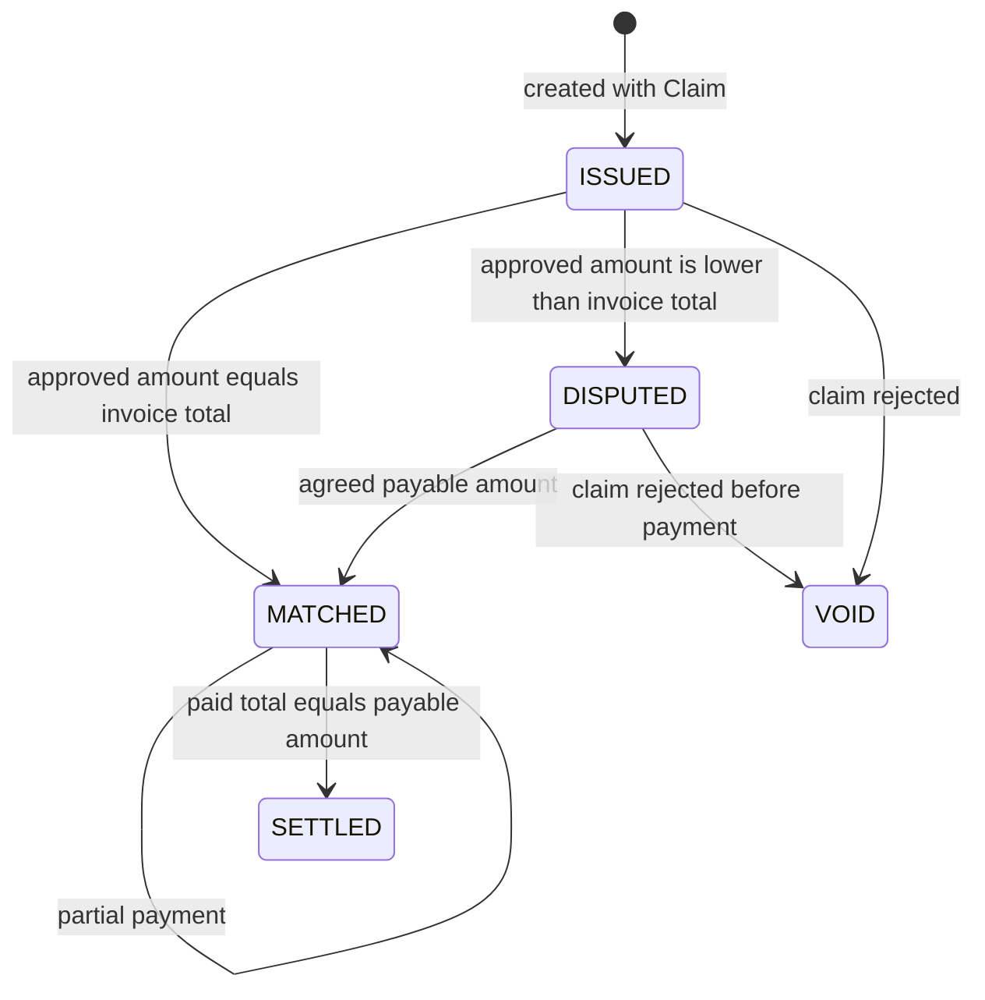
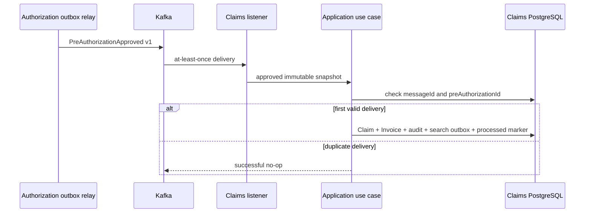

# Claims and Billing Service business analysis

This document explains the implemented claim adjudication, invoice
reconciliation, payment, and settlement workflows. It records existing behavior
and does not propose additional product scope.

## Purpose and ownership

Claims and Billing Service owns claims, invoices, payments, financial
reconciliation, settlement state, processed Kafka message identities, local
audit evidence, and claim-search publication intent. It does not read Policy or
Authorization databases.

Authorization owns the medical/coverage approval. Claims/Billing receives an
immutable approved snapshot and becomes authoritative only for adjudication and
financial lifecycle data. Search remains a derived read model.

## Actors and capabilities

| Actor | Implemented capability |
| --- | --- |
| `HOSPITAL_USER` | Manually create a claim from its own approved pre-authorization; read only its provider-owned claim/invoice |
| `CLAIM_APPROVER` | Start review, approve or reject claims; read claims/invoices |
| `INSURANCE_SPECIALIST` | Resolve invoice disputes, record payments, read claims/invoices |
| `SYSTEM_ADMIN` | Resolve disputes, record payments, query minimized audit evidence, read claims/invoices |
| Kafka approval consumer | Idempotently create one Claim and Invoice from an approved Authorization event |

Provider ownership comes from the verified JWT for interactive hospital
operations. A provider identifier supplied by a browser cannot override the
signed identity.

## Ubiquitous language

| Term | Meaning |
| --- | --- |
| Claim | Request to adjudicate the financial amount associated with an approved healthcare service |
| Claimed amount | Amount submitted for adjudication; positive and currency-bound |
| Approved amount | Amount accepted by the claim approver; positive and not greater than the claimed amount |
| Invoice | Provider financial record issued with a claim |
| Payable amount | Reconciled amount the insurer agrees to pay |
| Dispute | Invoice total and approved claim amount differ |
| Payment | Immutable reference, amount, and timestamp recorded against a matched invoice |
| Settlement | Sum of payments exactly reaches the payable amount |
| Processed message | Durable idempotency marker for one Kafka event identity |

## Claim lifecycle

There is no direct submission-to-decision shortcut, reopening, cancellation, or
arbitrary status update. A second or out-of-order decision is a conflict.

## Invoice lifecycle

Payments require a matched invoice, unique normalized payment references, the
same currency, and a cumulative amount not greater than the payable amount.
Settlement is derived by the aggregate; clients cannot set it directly.

## Event-driven creation

Only `APPROVED` events create financial records. Unsupported versions and
unreadable payloads are retried with a bounded policy and then routed to the
topic DLT. The owner transaction prevents a created claim without its invoice,
audit evidence, projection intent, or idempotency marker.

## Adjudication and reconciliation

| Claim decision | Invoice result | Explanation |
| --- | --- | --- |
| approved amount equals invoice total | `MATCHED` | payment may begin immediately |
| approved amount below invoice total | `DISPUTED` | specialist/admin must agree a payable amount |
| claim rejected | `VOID` | unpaid issued/disputed invoice is cancelled |

Claim approval and invoice reconciliation are one application operation and one
local transaction. This is not distributed ACID: Authorization approval occurred
earlier and Kafka provides eventual consistency between bounded contexts.

## Failure and consistency semantics

| Situation | Expected result |
| --- | --- |
| unapproved/missing authorization on manual path | fail closed; claim is not created |
| hospital provider mismatch | `403`; no disclosure or mutation |
| duplicate pre-authorization claim | conflict; unique database rule protects races |
| decision outside legal state | `409`; first committed state remains authoritative |
| approval above claimed amount or currency mismatch | validation failure; no mutation |
| payment before match, duplicate reference, or overpayment | rejected; invoice remains unchanged |
| duplicate Kafka event | one Claim/Invoice; later delivery is a no-op |
| invalid Kafka payload/version | bounded retry then DLT |
| Search unavailable | financial transaction commits with recoverable projection outbox |

JPA optimistic versions protect concurrent aggregate writes. Database unique
constraints protect pre-authorization, invoice-number, and payment-reference
identities where two requests race below the application pre-check.

## Audit and privacy boundary

The local append-only journal records controlled aggregate type, action,
status change, actor/role or system-event origin, provider scope, correlation
identifier, and timestamp. It excludes member, policy, service, monetary,
payment-reference, token, request-body, and free-text rejection data.

`SYSTEM_ADMIN` audit queries are bounded and remain service-local. This avoids a
shared audit database that would violate data ownership.

## Verified checkpoint

The complete service suite currently passes 51 tests. Evidence covers aggregate
rules, use-case authorization, provider ownership, atomic state/audit/search
outbox writes, JPA persistence and optimistic locking, Kafka duplicate delivery
and DLT routing, REST contracts, Spring wiring, and ArchUnit boundaries.

## Explicit scope boundaries

- No external payment provider or banking settlement integration is implemented.
- Approved coverage is not reserved by Policy Service.
- Manual claim creation remains supported although Kafka is the normal path.
- Search is eventually consistent and never authoritative for payments.
- This is portfolio-grade correctness evidence, not measured production throughput.
- Backup, disaster recovery, and real financial compliance certification are outside scope.

See the [component architecture](../architecture/claims-billing-service.md) and
[local verification guide](../development/claims-billing-service-local-verification.md).
